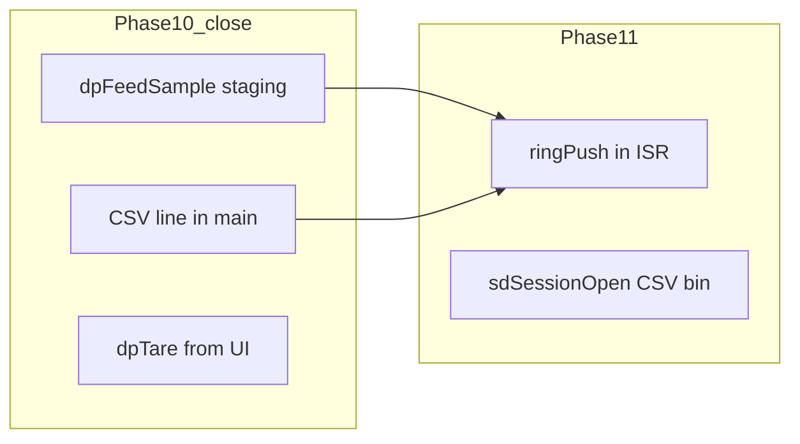

# Close Phase 10 and Stage for Phase 11

## Scope boundary

**In scope for this closure:** Items that complete the **decimation + calibration + record assembly** story from [phase_10_decimation_implementation_e82462a5.plan.md](.cursor/plans/phase_10_decimation_implementation_e82462a5.plan.md) and [phase_10b_cal_sd_partitions_751257fe.plan.md](.cursor/plans/phase_10b_cal_sd_partitions_751257fe.plan.md), aligned with the **historical** [phase_10_decimation_force_records.plan.md](.cursor/plans/phase_10_decimation_force_records.plan.md) where still valid, while preparing a clean handoff to [phase_11_dual_file_logging.plan.md](.cursor/plans/phase_11_dual_file_logging.plan.md).

**Explicitly deferred to Phase 11 (not part of Phase 10 “code complete”):**

- 256 KB `circular_buffer` / ISR `ringPush`, `sdmmc_fatfs` session lifecycle, `logStart` state machine, NeoPixel logging colors, 1 Hz `binMetaRecord_t` injection to ring.
- **Creating** `1:LOG_*.bin` / `0:LOG_*.csv` on SD — the master plan currently lists “binary log file on partition 2” under Phase 10b success criteria ([snazzy-petting-mountain.md](.cursor/plans/snazzy-petting-mountain.md) ~1179), but the same work is specified in detail under Phase 11 (`sd_session_open`, prealloc, headers). **Recommendation:** Treat **session file creation** as **Phase 11** to avoid two implementations; Phase 10b remains **partitions + `.cal` + boot + force pipeline**.

---

## 1. CSV line format (closes force_records + e82462a5 gaps)

**Goal:** `$ ,<time_ms>,<load_N>,#\r\n` produced in **main loop** (ISR-safe: no `snprintf` with `%f` in ISR per BLOCKER 2 in force_records plan).

**Implementation sketch:**

- Add `g_dpStagedCsv[40]` (or similar) + `g_dpStagedCsvLen` in [Core/Src/data_processing.c](Core/Src/data_processing.c) / [Core/Inc/data_processing.h](Core/Inc/data_processing.h), or keep formatting entirely in [Core/Src/main.c](Core/Src/main.c) after `g_dpPendingForceRecord` is handled.
- After `dpFillImu(&g_dpStagedForce)` (existing order in `main.c`), format CSV from `g_dpStagedForce.timestampMs` and `g_dpStagedForce.forceN` using **main-context** `snprintf` or a small fixed-point formatter if you want to avoid float printf entirely.
- **Phase 11 hook:** Document that Phase 11 will **copy these bytes** into the CSV SPSC ring (see Phase 11 “CSV line buffer”); no file I/O in Phase 10.

---

## 2. Tare command stub (force_records + master plan)

**Goal:** User can zero force without reflash.

- Add a **single VT220 key** (e.g. `T` or `t`) in [Core/Src/debug_ui.c](Core/Src/debug_ui.c) `uiProcessInput()` (or the existing input path) that calls `dpTare()` when `calLoaded` is true — pass a flag or call from `main.c` after `uiProcessInput` returns a tare request if you need to avoid pulling `calLoaded` into `debug_ui`.
- Prefer **minimal coupling:** e.g. `debug_ui` exposes `uiConsumeTareRequest(void)` or `main` checks a `volatile uint8_t` set by UI. Match existing UI patterns in the file.

---

## 3. MBR partition-2 type byte (10b vs current firmware)

**Issue:** [main.c](Core/Src/main.c) comment references `0x83` but assigns `0x1B` (Hidden FAT32).

**Decision (pick one in implementation):**

- **Option A:** Set `fmtWork[MBR_PART2_TYPE_OFFSET] = 0x83U` to match [phase_10b](.cursor/plans/phase_10b_cal_sd_partitions_751257fe.plan.md) and master plan Windows behavior notes.
- **Option B:** Keep `0x1B` and **fix comments + master plan** to describe Hidden FAT32 and validation steps on your Windows version.

Do not leave comment and value diverged.

---

## 4. Documentation and plan file hygiene

| Item | Action |
|------|--------|
| [phase_10_decimation_force_records.plan.md](.cursor/plans/phase_10_decimation_force_records.plan.md) | Add one-line banner: superseded by `e82462a5` + 10b for implementation; optionally set frontmatter todos to `cancelled` or mirror `e82462a5` so it is not mistaken for active work. |
| [Core/Src/app_state.c](Core/Src/app_state.c) / [Core/Inc/app_state.h](Core/Inc/app_state.h), [Core/Src/battery_monitor.c](Core/Src/battery_monitor.c) | Replace stale “config.txt” references with **`.cal` / `calibrationGet()`** where applicable (comments only). |
| [Core/Inc/data_processing.h](Core/Inc/data_processing.h) | Short `@note` on IMU: filled in main via `dpFillImu()` (deadlock mitigation), not ISR — so Phase 11 ring push order is **after** IMU fill for a consistent record. |

**Gain DOE** (10b §5b): Remains **factory procedure** — document in master plan as “verification / factory” not blocking firmware closure.

---

## 5. Phase 11 readiness checklist (no Phase 11 code yet)

- **Stable wire types:** [Core/Inc/log_record.h](Core/Inc/log_record.h) — `binAdcRecord_t`, `binForceRecord_t`, `binMetaRecord_t`, `binFileHeader_t`, `crc16Ccitt()`.
- **Producer rates:** 8 kHz ADC, 500 Hz force; CSV string aligned with force records.
- **Handoff contract:** Phase 11 `wire-isr-to-ring` will replace pending-flag pattern in `dpFeedSample()` and main drain; CSV moves from staged buffer to CSV ring — document one paragraph in `data_processing.h` or a short `PHASE11.md` comment block **only if** you want a single source of truth (optional; avoid new markdown files if you prefer inline `@note` only).

---

## 6. Verification (you build in STM32CubeIDE; no agent build)

- Serial: `DECIM: ADC=8000/s FORCE=500/s`, `[P10b]` / `[CAL]` lines, `miss=0` trend over 60 s.
- CSV: spot-check formatted lines on UART or debugger buffer (if you printf debug) — optional.
- Tare: unloaded cell → `T` → force near zero.
- **10b Windows / MBR:** after choosing 0x83 vs 0x1B, re-run the checklist row in master plan.

---

## 7. Update [snazzy-petting-mountain.md](.cursor/plans/snazzy-petting-mountain.md) (after you approve this plan)

Apply edits in one pass:

1. **Phase 10** — Mark firmware items **complete** with date; leave **hardware validation** items (known mass ±0.5 N, 60 s soak) as optional checkboxes or “verified on request” if not yet run.
2. **Phase 10b** — Move **“Binary log file created on partition 2”** (line ~1179) to **Phase 11** (or add cross-reference: “session binary file creation → Phase 11”) so it is not a duplicate gate.
3. **Naming** — Align master plan struct names with code (`binAdcRecord_t` / `binForceRecord_t` camelCase) in the Phase 10 section for consistency.
4. **MBR** — Match master text to the chosen Option A or B.
5. **Prerequisite line** (10b “Phase 10 must be fully closed”) — Rephrase to: Phase 10 **decimation + records** closed; 10b can ship after that (already done in your timeline).

---

## Files likely touched (implementation phase)

- [Core/Src/main.c](Core/Src/main.c) — CSV format after force pending; optional one-line debug of CSV.
- [Core/Src/data_processing.c](Core/Src/data_processing.c) / [Core/Inc/data_processing.h](Core/Inc/data_processing.h) — staged CSV globals and/or `dpFormatForceCsv()`.
- [Core/Src/debug_ui.c](Core/Src/debug_ui.c) / [Core/Inc/debug_ui.h](Core/Inc/debug_ui.h) — tare key or request flag.
- [Core/Src/main.c](Core/Src/main.c) — MBR byte + comment consistency.
- Stale comment files: `app_state`, `battery_monitor`.
- Plan markdown: `phase_10_decimation_force_records.plan.md`, `snazzy-petting-mountain.md`.
