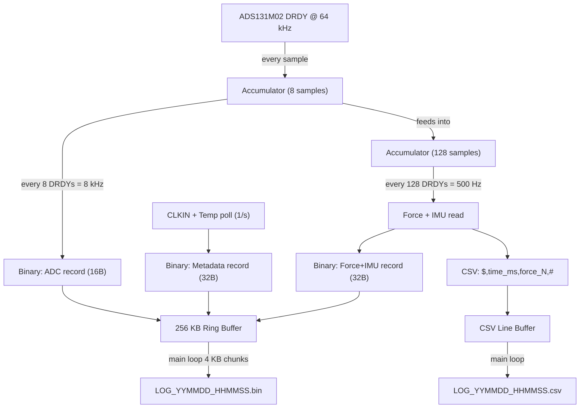

# Dual-File Logging Architecture

This plan defines the data format specification and architecture for the SD logging pipeline. It updates Phase 10 (decimation), Phase 11 (logging pipeline), and adds temperature sensing to Phase 9 (battery). **No code changes now** -- this is a design doc to guide future phases.

## Data Flow



## Two-Stage Decimation

The 64 kHz DRDY ISR accumulates raw ADC values into two cascaded stages:

- **Stage 1 (every 8 DRDYs = 8 kHz):** Sum of 8 raw CH1/CH2 values. Output as a binary ADC record. Reset partial accumulator.
- **Stage 2 (every 128 DRDYs = 500 Hz):** Sum of 128 raw values (= 16 stage-1 sums). Compute force_N, read IMU. Output a binary Force+IMU record, and a CSV line containing only timestamp and force (`$,time_ms,load_N,#`).

The binary ADC records contain the **raw 8-sample sum** (not divided), preserving full precision for post-processing. Dividing by 8 is trivial on the PC side.

## File 1: CSV (500 SPS, immediate consumption)

**Filename:** `LOG_YYMMDD_HHMMSS.csv`

**Header (comment lines, skipped by parser):**
```
# CLKIN=8190457 Hz, DAC=983, SYSCLK=75000000 Hz
# sensitivity=2.000 uV/N, tare=0.000 N, gains=1/1
```

**Data lines (500/s), framed with `$` and `#` delimiters:**
```
$,0,+0.000,#
$,2,+0.001,#
$,4,+0.003,#
$,6,-0.002,#
```

Each line: `$,<time_ms>,<load_N>,#\r\n`

- `$` = start-of-record marker
- `time_ms` = milliseconds since logging start (integer)
- `load_N` = force in Newtons (signed float, variable precision)
- `#` = end-of-record marker
- Approximately 22 bytes/line, 500 lines/s = **~11 KB/s**
- Simple framed format for direct consumption by external tools/parsers

## File 2: Binary (8 kHz ADC + 500 Hz Force/IMU + 1 Hz metadata)

**Filename:** `LOG_YYMMDD_HHMMSS.bin`

### Binary File Header (64 bytes)

```c
typedef struct __attribute__((packed)) {
    uint32_t magic;             // 'LDCL' = 0x4C44434C
    uint16_t version;           // Format version (1)
    uint16_t header_size;       // sizeof(bin_file_header_t)
    uint32_t clkin_hz;          // Measured CLKIN at session start
    uint32_t sysclk_hz;         // SYSCLK frequency
    uint16_t ltc_dac;           // Trimmed DAC value
    uint16_t adc_osr;           // ADC oversampling ratio (128)
    uint16_t adc_record_rate;   // 8000
    uint16_t force_record_rate; // 500
    float    sensitivity;       // uV/N from config.txt
    float    tare_offset;       // N from config.txt
    uint8_t  adc_gain_ch1;      // ADS131M02 gain setting
    uint8_t  adc_gain_ch2;
    uint8_t  imu_odr;           // LSM6DSV ODR setting (500 Hz)
    uint8_t  imu_fs_accel;      // Full-scale accel (16g)
    uint32_t rtc_epoch;         // RTC time at start (seconds since 2000-01-01)
    uint8_t  fw_version[8];     // e.g., "v0.5.0\0\0"
    uint8_t  reserved[12];      // Pad to 64 bytes
    uint16_t crc16;             // CRC of bytes 0..61
} bin_file_header_t;            // 64 bytes
```

### Record Type 0x01: ADC (16 bytes, 8000/s = 128 KB/s)

```c
typedef struct __attribute__((packed)) {
    uint8_t  type;              // 0x01
    uint8_t  flags;             // bit 0: ADS CRC OK, bit 1: overflow
    uint16_t seq_lo;            // Low 16 bits of 8 kHz counter
    int32_t  sum_ch1;           // Sum of 8 raw 24-bit ADC samples
    int32_t  sum_ch2;           // Sum of 8 raw 24-bit ADC samples
    uint16_t crc16;             // CRC of bytes 0..13
} bin_adc_record_t;             // 16 bytes
```

### Record Type 0x02: Force+IMU (32 bytes, 500/s = 16 KB/s)

```c
typedef struct __attribute__((packed)) {
    uint8_t  type;              // 0x02
    uint8_t  validity;          // Existing validity flags
    uint16_t seq_lo;            // Low 16 bits of 500 Hz counter
    uint32_t timestamp_ms;      // ms since logging start
    float    force_N;           // Computed ratiometric force
    int16_t  accel_x;           // LSM6DSV raw
    int16_t  accel_y;
    int16_t  accel_z;
    int16_t  gyro_x;
    int16_t  gyro_y;
    int16_t  gyro_z;
    int32_t  sum_ch1_128;       // Full 128-sample ADC sum (for recalculation)
    uint16_t crc16;             // CRC of bytes 0..29
} bin_force_record_t;           // 32 bytes
```

### Record Type 0x03: Metadata (32 bytes, 1/s = 32 B/s)

```c
typedef struct __attribute__((packed)) {
    uint8_t  type;              // 0x03
    uint8_t  reserved;
    uint16_t second_num;        // Seconds since logging start
    uint32_t clkin_hz;          // Measured CLKIN this second
    int16_t  mcu_temp_x10;     // MCU die temp x10 (235 = 23.5 C)
    uint16_t battery_mv;        // Battery voltage in mV
    uint32_t drdy_total;        // Cumulative DRDY count
    uint32_t miss_total;        // Cumulative missed DRDYs
    uint32_t overflow_total;    // Cumulative ring overflows
    uint16_t ads_status;        // Last ADS131M02 STATUS word
    uint16_t padding;
    uint16_t crc16;
} bin_meta_record_t;            // 32 bytes
```

## SD Throughput Budget

- Binary ADC records: 8,000 x 16B = **128.0 KB/s**
- Binary Force records: 500 x 32B = **16.0 KB/s**
- Binary Metadata: 1 x 32B = **0.03 KB/s**
- CSV lines: 500 x ~22B = **~11 KB/s**
- **Total: ~155 KB/s** (62% of the proven 250 KB/s ceiling)

Comfortable margin for FAT write stalls and USB CDC overhead.

### Ring Buffer Sizing

- Binary data rate: ~144 KB/s
- Target: 1+ second of buffering to absorb worst-case FAT write stalls
- Buffer size: **256 KB** (power-of-2 for efficient wrap-around masking)
- Actual hold time: ~1.8 seconds at full rate
- RAM budget: 640 KB total, ~100 KB estimated current use, 256 KB ring buffer, ~280 KB remaining

## File Sizes (1-hour session)

- Binary: ~518 MB/hour (144 KB/s x 3600s)
- CSV: ~40 MB/hour (11 KB/s x 3600s)
- Total: ~558 MB/hour -- fits on a 64 GB card for ~114 hours

## MCU Temperature Sensor (Phase 9 addition)

The STM32H562 has an internal temperature sensor on ADC1 channel VSENSE. Currently Phase 9 only does battery voltage via ADC1. Add temperature reading to the same polling cycle:

- Read ADC1 VSENSE channel once per second (alongside battery reading)
- Apply calibration from factory-programmed values at `TEMPSENSOR_CAL1_ADDR` and `TEMPSENSOR_CAL2_ADDR`
- Store as `int16_t mcu_temp_x10` (tenths of a degree C)
- Expose via `uint16_t batt_get_mcu_temp_x10(void)` for the metadata record

## Impact on Master Plan Phases

- **Phase 9 (Battery):** Add MCU temperature sensor polling to the ADC1 cycle. Expose `batt_get_mcu_temp_x10()`.
- **Phase 10 (Decimation):** Implement two-stage boxcar (8-sample and 128-sample). Output both ADC and Force records.
- **Phase 11 (Logging):** Open two files simultaneously. Interleave binary record types in the ring buffer using the `type` byte to distinguish them. CSV writes from a separate small line buffer. Metadata record injected once per second from main loop.
- **Phase 12 (Soak Test):** Validate both files. Python validator for binary CRC checks. CSV spot-check in Excel/matplotlib.

## Python Post-Processing (deliverable with Phase 12)

A minimal `decode_bin.py` script that:
1. Reads the binary header, prints session info
2. Demuxes records by type byte
3. Outputs separate CSVs: `_adc_8k.csv`, `_force_500.csv`, `_meta.csv`
4. Validates all CRC16 values, reports corruption count
5. Reconstructs exact timestamps using the per-second CLKIN values
