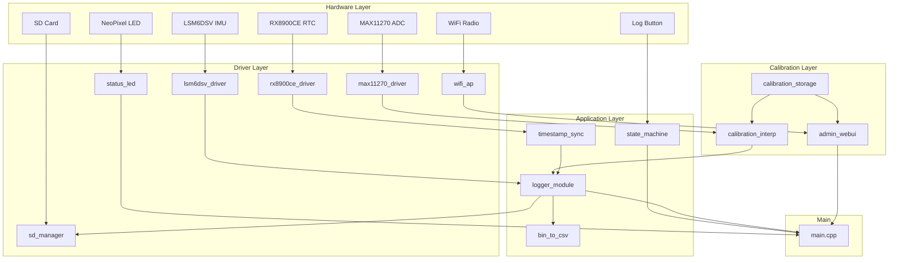
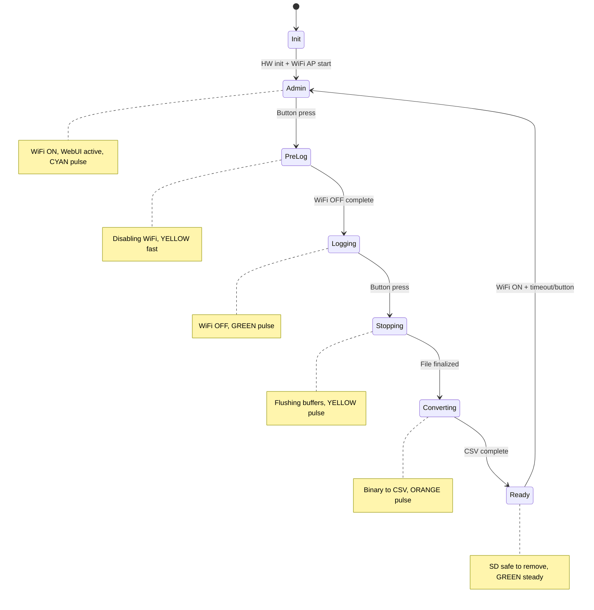
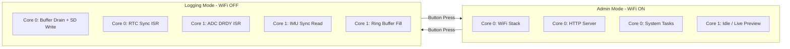

# ESP32-S3 Load Cell Data Logger Implementation Plan

## Architecture Overview



---

## Project Structure

```javascript
Loadcell_Datalogger_V1/
├── platformio.ini
├── src/
│   ├── main.cpp                    # Entry point, state machine integration
│   ├── pin_config.h                # All GPIO definitions
│   ├── drivers/
│   │   ├── max11270_driver.h/.cpp  # SPI ADC driver
│   │   ├── lsm6dsv_driver.h/.cpp   # I2C IMU driver
│   │   ├── rx8900ce_driver.h/.cpp  # I2C RTC driver
│   │   ├── sd_manager.h/.cpp       # SDMMC management
│   │   └── status_led.h/.cpp       # NeoPixel control
│   ├── calibration/
│   │   ├── calibration_storage.h/.cpp   # NVS persistence
│   │   ├── calibration_interp.h/.cpp    # uV->kg interpolation
│   │   └── loadcell_types.h             # Data structures
│   ├── network/
│   │   ├── wifi_ap.h/.cpp          # AP mode management
│   │   └── admin_webui.h/.cpp      # HTTP server + REST API
│   ├── logging/
│   │   ├── binary_format.h         # Log file structures
│   │   ├── logger_module.h/.cpp    # Acquisition + buffered writes
│   │   ├── bin_to_csv.h/.cpp       # Post-process converter
│   │   └── timestamp_sync.h/.cpp   # RTC 1Hz discipline
│   └── app/
│       └── state_machine.h/.cpp    # System state management
├── data/                           # WebUI static files (SPIFFS)
│   ├── index.html
│   ├── style.css
│   └── app.js
└── Datasheets/                     # Reference documentation
```

---

## Pin Configuration Summary

| Function | GPIO | Notes ||----------|------|-------|| LOG_START Button | 2 | Active HIGH, external pulldown || SD_CLK | 4 | SDMMC 4-bit || SD_CMD | 5 | SDMMC || SD_D0-D3 | 6-9 | SDMMC data lines || SD_CD | 10 | Card detect, active LOW || ADC_MISO | 12 | MAX11270 SPI || ADC_MOSI | 13 | MAX11270 SPI || ADC_SYNC | 14 | MAX11270 || ADC_RSTB | 15 | MAX11270, active LOW || ADC_RDYB | 16 | MAX11270, active LOW (data ready) || ADC_CS | 17 | MAX11270, active LOW || ADC_SCK | 18 | MAX11270 SPI clock || NEOPIXEL | 21 | Status LED || RTC_FOUT | 33 | 1Hz sync from RX8900CE || RTC_INT | 34 | RTC interrupt || IMU_INT1 | 39 | LSM6DSV interrupt 1 || IMU_INT2 | 40 | LSM6DSV interrupt 2 || I2C_SDA | 41 | Shared I2C bus || I2C_SCL | 42 | Shared I2C bus |---

## Per-Loadcell Calibration System

### Data Model

```cpp
// loadcell_types.h
struct CalibrationPoint {
    float load_kg;      // Known load in kg
    float output_uV;    // Measured output in µV
};

struct LoadcellCalibration {
    char id[32];                    // Unique ID: "TC023L0-000025"
    char model[16];                 // "TC023L0"
    char serial[16];                // "000025"
    float capacity_kg;              // 2000.0
    float excitation_V;             // 10.0
    float sensitivity_mVV;          // Optional: mV/V rating
    uint8_t num_points;             // Number of calibration points
    CalibrationPoint points[16];    // Up to 16 cal points
};
```


### Storage Layout (NVS)

- Namespace: `loadcell_cal`
- Keys:
- `active_id` - Currently selected loadcell ID string
- `lc_count` - Number of stored loadcells
- `lc_0`, `lc_1`, ... - Serialized LoadcellCalibration blobs

### Interpolation Strategy

Linear interpolation between adjacent calibration points:

1. Convert raw ADC counts to µV using known reference/gain
2. Find bracketing points in the curve
3. Interpolate: `load_kg = load_a + (uV - uV_a) * (load_b - load_a) / (uV_b - uV_a)`
4. Clamp to valid range (0 to capacity)

---

## Admin WebUI

### WiFi AP Configuration

- SSID: `LoadcellLogger-XXXX` (last 4 hex of MAC)
- Password: None (open network - physical access = admin)
- IP: `192.168.4.1`

### REST API Endpoints

| Method | Endpoint | Description ||--------|----------|-------------|| GET | `/api/loadcells` | List all stored loadcells || GET | `/api/loadcells/{id}` | Get specific loadcell with curve || POST | `/api/loadcells` | Create new loadcell calibration || PUT | `/api/loadcells/{id}` | Update loadcell calibration || DELETE | `/api/loadcells/{id}` | Delete loadcell || GET | `/api/active` | Get active loadcell ID || PUT | `/api/active` | Set active loadcell ID || GET | `/api/status` | Get system status (for live view) |

### WebUI Features

- List/select stored loadcells
- Add new loadcell with metadata entry
- Edit calibration points (tabular input)
- Import/paste calibration data
- Set active loadcell for logging
- View current ADC reading + converted load (live)

---

## State Machine




### State Descriptions

| State | WiFi | Cores | NeoPixel | Description ||-------|------|-------|----------|-------------|| **Admin** | ON | C0: WiFi/WebUI, C1: Idle | Cyan pulse | Default state, WebUI accessible || **PreLog** | Turning OFF | Transitioning | Yellow fast | Shutting down WiFi stack || **Logging** | OFF | C0: SD writes, C1: ADC+IMU | Green pulse | Active data acquisition || **Stopping** | OFF | Flushing | Yellow pulse | Draining buffers, closing file || **Converting** | OFF | C0: CSV gen | Orange pulse | Binary to CSV conversion || **Ready** | OFF | Idle | Green steady | SD safe to remove |---

## Binary Log Format

### File Header (64 bytes)

```cpp
struct LogFileHeader {
    uint32_t magic;              // 0x4C434C47 "LCLG"
    uint16_t version;            // Format version
    uint16_t header_size;        // 64
    uint32_t sample_rate_hz;     // e.g., 64000
    uint32_t imu_rate_hz;        // e.g., 1000
    uint64_t start_timestamp_us; // RTC-synced epoch microseconds
    char loadcell_id[32];        // Active loadcell ID
    uint8_t reserved[12];
};
```


### Data Records

```cpp
struct LoadcellSample {         // 8 bytes per sample
    uint32_t timestamp_offset_us; // Offset from start
    int32_t raw_adc;              // 24-bit ADC value (sign-extended)
};

struct IMUSample {              // 16 bytes per sample
    uint32_t timestamp_offset_us;
    int16_t accel_x, accel_y, accel_z;
    int16_t gyro_x, gyro_y, gyro_z;
};
```

---

## Dual-Core Architecture (WiFi-Off During Logging)

### Mode-Based Core Allocation



| Mode | Core 0 | Core 1 ||------|--------|--------|| **Admin** | WiFi + WebUI + System | Idle / optional live ADC preview || **Logging** | SD writes, RTC sync, State machine | ADC ISR, IMU sync, Ring buffer || **Converting** | CSV generation | Idle |

### Timing Budget at 64ksps

- **Sample interval**: 15.625 us
- **SPI read** (24-bit @ 4MHz): ~8 us
- **Ring buffer push**: ~1-2 us
- **Headroom**: ~5-6 us per sample

### IMU Synchronization Strategy

IMU (LSM6DSV) reads are synchronized with ADC:

- **Decimation ratio**: 1 IMU sample per 64 ADC samples
- **Effective IMU rate**: 64000 / 64 = 1000 Hz (1 kHz)
- **Trigger**: After every 64th ADC sample, read IMU in same Core 1 context
- **Timestamp**: Shared with corresponding ADC sample for perfect alignment
```cpp
// Pseudocode for synchronized sampling
volatile uint32_t adc_sample_count = 0;
const uint32_t IMU_DECIMATION = 64;

void IRAM_ATTR adc_drdy_isr() {
    int32_t adc_raw = read_adc_fast();
    uint32_t timestamp = get_rtc_synced_time_us();
    ring_buffer_push(adc_raw, timestamp);
    
    adc_sample_count++;
    if ((adc_sample_count % IMU_DECIMATION) == 0) {
        // Read IMU immediately (same ISR context, deterministic timing)
        imu_sample_t imu = read_imu_fast();
        ring_buffer_push_imu(imu, timestamp);
    }
}
```


### Ring Buffer Architecture

```mermaid
flowchart LR
    subgraph core1 [Core 1 - Producer]
        ISR[ADC DRDY ISR] --> RB[Ring Buffer 32KB]
    end
    
    subgraph core0 [Core 0 - Consumer]  
        RB --> DRAIN[Buffer Drain Task]
        DRAIN --> BUF1[Write Buffer A 8KB]
        DRAIN --> BUF2[Write Buffer B 8KB]
        BUF1 --> SD[SD Card]
        BUF2 --> SD
    end
```


- **Ring buffer**: 32KB lock-free SPSC (single-producer single-consumer)
- **Write buffers**: Double-buffered 8KB each
- **Throughput**: 64000 samples × 8 bytes = 512 KB/s sustained

## Key Implementation Notes

1. **Hot Path Optimization**: During logging, only raw ADC values are written. Conversion to kg happens during CSV export.
2. **WiFi Disabled During Logging**: `WiFi.mode(WIFI_OFF)` before logging starts; re-enabled after conversion completes.
3. **DRDY-Driven Acquisition**: MAX11270 RDYB triggers high-priority ISR on Core 1, ensuring no missed samples.
4. **IMU Sync in ISR**: Every 64th ADC sample triggers IMU read in same ISR for aligned timestamps.
5. **Timestamp Discipline**: RTC 1Hz edge (GPIO33) captures ESP32 microsecond counter; all sample times interpolated from anchors.
6. **Double Buffering**: While one 8KB buffer writes to SD, the other fills from ring buffer.
7. **Safe SD Removal**: After CSV conversion, unmount filesystem and indicate "safe to remove" via NeoPixel.
8. **Core Pinning**: Use `xTaskCreatePinnedToCore()` to lock tasks to specific cores.

---