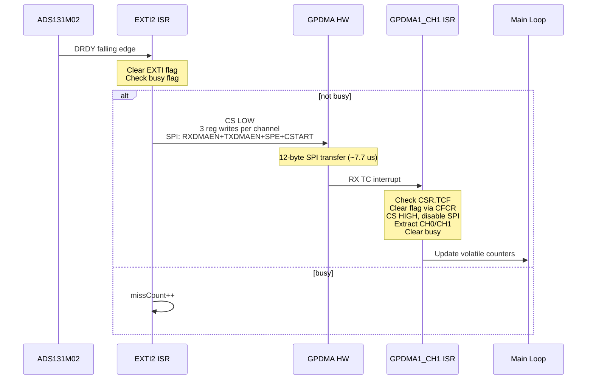

# Fix Phase 7: Register-Level DMA, TIM3 Prescaler, Diagnostics

## Root Cause Analysis

**Issue 1 -- 75% DMA miss rate (21K captures/s instead of 64K/s)**

`HAL_SPI_TransmitReceive_DMA()` on the STM32H5 GPDMA is extremely heavy per-invocation (~40 us overhead). The function:
- Locks the SPI handle, checks state, configures 8+ hspi fields
- Calls `HAL_DMA_Start_IT` TWICE (RX then TX), each of which: locks DMA handle, checks state, calls `DMA_SetConfig`, enables 5+ interrupt flags, enables channel
- Configures SPI registers (DMA enable, TSIZE, error interrupts, SPE, CSTART)

Total cycle: ~47 us per DMA, far exceeding the 15.625 us DRDY period. The fix is to bypass the HAL for the hot-path and write GPDMA registers directly.

**Issue 2 -- TIM3 prescaler stuck at 249**

`__HAL_TIM_SET_PRESCALER` writes the shadow PSC register. The actual prescaler value only loads at the next Update Event. Since we never generate one, the CubeMX prescaler of 249 persists. Fix: force a UEV via EGR after writing PSC.

**Issue 3 -- DRDY_SW = 85K/s instead of 64K/s**

Each successful DMA read causes DRDY to go HIGH (first SCLK), then LOW again when the FIFO has buffered data. This creates one extra EXTI2 falling edge per DMA completion: 64K (real) + 21K (re-triggers) = 85K. Once the DMA cycle drops below 15.625 us, the FIFO drains instantly and this effect disappears. Expected DRDY_SW after fix: ~64K/s.

## Fix 1 -- TIM3 Prescaler (trivial)

In [Core/Src/diag_timers.c](Core/Src/diag_timers.c), `diagDrdyInit()`, after `__HAL_TIM_SET_PRESCALER(&htim3, 0)`:

```c
htim3.Instance->EGR = TIM_EGR_UG;
__HAL_TIM_CLEAR_FLAG(&htim3, TIM_FLAG_UPDATE);
```

## Fix 2 -- Register-Level DMA Restart (main fix)

Replace `HAL_SPI_TransmitReceive_DMA` + `HAL_SPI_TxRxCpltCallback` with direct GPDMA register writes. Per the RM0481, after a DMA_NORMAL transfer completes:
- CCR.EN auto-clears; all other CCR/CTR1/CTR2 bits persist
- CSAR/CDAR hold their **original** values (not modified by transfer)
- CBR1.BNDT is decremented to 0 (must reload)
- TC flag is set in CSR

So the minimal restart is: clear flags (CFCR), reload count (CBR1), re-enable (CCR.EN) -- **3 register writes per channel**.

### Data flow after fix



### Estimated timing after fix

- EXTI ISR (flag clear + busy check + 11 register writes): ~1.5 us
- SPI hardware transfer (12 bytes at 12.5 MHz): ~7.7 us
- RX DMA complete ISR (flag check + 5 reg writes + data extract): ~1.5 us
- **Total: ~10.7 us** (margin: 4.9 us = 31%)

### Implementation in [Core/Src/adc_ads131m02.c](Core/Src/adc_ads131m02.c)

Add `extern DMA_HandleTypeDef` for both channels. Add two new functions and one init helper:

**`adsDmaSetup()`** -- called once from `ads131m02StartContinuous()`:
- Set CSAR/CDAR on both channels (addresses are persistent but set them for clarity)
- Set `TCIE` in RX channel CCR (transfer complete interrupt enable)
- Disable SPI, clear SPI flags, write `TSIZE = 12`

**`adsFastStart()`** -- called from EXTI2 ISR (replaces `HAL_SPI_TransmitReceive_DMA`):

```c
static inline void adsFastStart(void)
{
    GPIOA->BSRR = (uint32_t)ADC_CS_Pin << 16;   /* CS LOW           */

    GPDMA1_Channel1->CFCR = 0x7FU;               /* RX: clear flags  */
    GPDMA1_Channel1->CBR1 = ADS_FRAME_BYTES;     /* RX: reload count */
    GPDMA1_Channel0->CFCR = 0x7FU;               /* TX: clear flags  */
    GPDMA1_Channel0->CBR1 = ADS_FRAME_BYTES;     /* TX: reload count */

    SET_BIT(GPDMA1_Channel1->CCR, DMA_CCR_EN);   /* RX: enable       */
    SET_BIT(GPDMA1_Channel0->CCR, DMA_CCR_EN);   /* TX: enable       */

    SET_BIT(SPI1->CFG1, SPI_CFG1_RXDMAEN | SPI_CFG1_TXDMAEN);
    SET_BIT(SPI1->CR1, SPI_CR1_SPE);
    SET_BIT(SPI1->CR1, SPI_CR1_CSTART);
}
```

**`adsFastComplete()`** -- called from GPDMA1_CH1 ISR (replaces `HAL_SPI_TxRxCpltCallback`):

```c
static inline int adsFastComplete(void)
{
    if (!(GPDMA1_Channel1->CSR & DMA_CSR_TCF))
        return 0;                                 /* not our TC       */

    GPDMA1_Channel1->CFCR = DMA_CFCR_TCF;        /* clear RX TC flag */
    GPDMA1_Channel0->CFCR = 0x7FU;               /* clear TX flags   */

    GPIOA->BSRR = ADC_CS_Pin;                    /* CS HIGH          */

    CLEAR_BIT(SPI1->CR1, SPI_CR1_SPE);
    CLEAR_BIT(SPI1->CFG1, SPI_CFG1_RXDMAEN | SPI_CFG1_TXDMAEN);
    SPI1->IFCR = 0x1FF8U;                        /* clear SPI flags  */

    /* extract CH0/CH1, update stats, clear busy */
    ...
    adsDmaBusy = 0;
    return 1;
}
```

### Wire ISRs in [Core/Src/stm32h5xx_it.c](Core/Src/stm32h5xx_it.c) (USER CODE sections)

**EXTI2** -- bypass HAL entirely:

```c
/* USER CODE BEGIN EXTI2_IRQn 0 */
extern void adsFastDrdyHandler(void);
adsFastDrdyHandler();
return;
/* USER CODE END EXTI2_IRQn 0 */
```

**GPDMA1_Channel1** -- intercept RX TC before HAL:

```c
/* USER CODE BEGIN GPDMA1_Channel1_IRQn 0 */
extern int adsFastDmaCompleteHandler(void);
if (adsFastDmaCompleteHandler()) return;
/* USER CODE END GPDMA1_Channel1_IRQn 0 */
```

### HAL state fixup in `ads131m02StopContinuous()`

After stopping the fast path and before blocking register writes (polarity test MUX flips), reset HAL state machines:

```c
hspi1.State = HAL_SPI_STATE_READY;
hspi1.hdmarx->State = HAL_DMA_STATE_READY;
hspi1.hdmatx->State = HAL_DMA_STATE_READY;
```

Remove the old `HAL_GPIO_EXTI_Falling_Callback` and `HAL_SPI_TxRxCpltCallback` overrides from `adc_ads131m02.c` (no longer needed since ISRs are wired directly).

## Fix 3 -- 1 Hz Diagnostic Print (cosmetic)

In [Core/Src/main.c](Core/Src/main.c), change DMA and miss to show deltas per second (same as DRDY_SW/HW), not cumulative totals.

## Expected Output After Fix

```
DIAG: TIM3 DRDY edge counter started (TI1FP1/PB4)
=== ADC POLARITY TEST (60 s) ===
[TEST  1] CH0=+test CH1=-test n=63900 | CH0: min=+1078xxx max=+1082xxx avg=+1079xxx | ...
...
ADC: DRDY_SW=64000 DRDY_HW=64000 DMA=64000 miss=0 CH0=xxx CH1=xxx
```

Sample count per window jumps from ~21,333 to ~64,000. Miss count drops to 0.

## Fix 4 -- DRDY_FMT A/B Test (after zero-miss DMA verified)

New function in [Core/Src/adc_ads131m02.c](Core/Src/adc_ads131m02.c) and declaration in the header:

```c
void ads131m02DrdyFmtTest(uint32_t armSeconds);
```

**Arm A — Level mode (DRDY_FMT=0, current default):**
1. `ads131m02StopContinuous()`, write `MODE = ADS_MODE_INIT & ~1` (bit 0 = 0)
2. Clear stats, snapshot HW edge counter baseline
3. `ads131m02StartContinuous()`, delay `armSeconds * 1000` ms
4. `ads131m02StopContinuous()`, snapshot all stats + HW edges

**Arm B — Pulse mode (DRDY_FMT=1):**
1. Write `MODE = ADS_MODE_INIT | 1` (bit 0 = 1)
2. Clear stats, snapshot HW edge counter baseline
3. `ads131m02StartContinuous()`, delay `armSeconds * 1000` ms
4. `ads131m02StopContinuous()`, snapshot all stats + HW edges

**Cleanup:** Revert to level mode, `ads131m02StartContinuous()`

**Pulse width concern:** `tw(DRL) = 4 × tCLKIN = 488 ns`. EXTI should catch this (AHB=250 MHz → 4 ns sampling). TIM3 input filter (`CCMR1.IC1F`) must be 0 (no filtering) to count the narrow pulses — verify in `diagDrdyInit()`.

**Serial output:**

```
=== DRDY_FMT A/B TEST (20 s) ===
[A] DRDY_FMT=0 (level), 10 s:
  DRDY_SW=640012  DRDY_HW=640008  DMA=640012  miss=0
[B] DRDY_FMT=1 (pulse), 10 s:
  DRDY_SW=640006  DRDY_HW=640006  DMA=640006  miss=0
Reverted to DRDY_FMT=0 (level)
=== END A/B TEST ===
```

**What we learn:**

- Level: `DRDY_SW >= DRDY_HW` if any re-triggers still occur (fast DMA should eliminate these)
- Pulse: `DRDY_SW == DRDY_HW` guaranteed (no re-trigger mechanism)
- If both show miss=0 and similar DMA counts, level mode is preferred (more forgiving of timing jitter)
- If level shows nonzero extra EXTI overhead, pulse mode saves CPU cycles

**Call site in `main.c`**, after the polarity test and before the main `while(1)` loop:

```c
ads131m02DrdyFmtTest(10);  /* 10 s per arm */
```

## Naming Convention Compliance

This plan has been retroactively updated to use camelCase naming per [`.cursor/rules/commenting-and-naming.mdc`](../rules/commenting-and-naming.mdc). Project functions and locals use camelCase; globals use a `g_` prefix plus camelCase in firmware. HAL, CMSIS, and CubeMX-generated identifiers are left unchanged in snippets that reference them.
