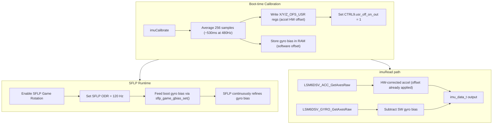

# IMU Calibration: Boot-time Offsets + SFLP Runtime Bias

## Context

From the serial output, the IMU has small but visible offsets:
- `ax ~ +0.30` (should be 0) -- ~30 mg accel X bias
- `ay ~ +0.06` (should be 0) -- ~6 mg accel Y bias  
- `az ~ +10.0` (should be +9.81) -- ~+190 mg Z bias (~2% of gravity)
- `gx ~ -0.3 dps`, `gy ~ +0.1 dps`, `gz ~ +0.1 dps` -- small gyro zero-rate offsets

## Architecture



## Implementation

All changes in [Core/Src/imu_lsm6dsv.c](Core/Src/imu_lsm6dsv.c) and [Core/Inc/imu_lsm6dsv.h](Core/Inc/imu_lsm6dsv.h).

### Step 1: Add `imuCalibrate()` function

New public API: `int imuCalibrate(void)` -- called from `main.c` after `imuInit()`.

Logic:
- Discard first 10 samples (settling)
- Accumulate 256 accel + gyro readings (~530 ms at 480 Hz ODR)
- Compute averages for all 6 axes
- **Accel HW offsets**: compute error vs expected gravity vector (0, 0, +1g):
  - `x_off_mg = -avg_ax_mg` (should be zero, negate the bias)
  - `y_off_mg = -avg_ay_mg`
  - `z_off_mg = -(avg_az_mg - 1000.0)` at FS=16g, 1g = 1000 mg in the sensitivity units
  
  Actually, the offset registers work in raw mg (not sensitivity-scaled). At FS=16g, sensitivity = 0.488 mg/LSB, so `avg_mg = raw_avg * 0.488`. The API `lsm6dsv_xl_offset_mg_set()` takes values in mg directly. Fine resolution (0.0078125 mg/LSB) is too small for our offsets; coarse mode (0.125 mg/LSB, range +/-15.875 mg) covers the ~30 mg X offset easily.

  Wait -- re-reading the API: coarse mode range is +/-127 * 0.125 = +/-15.875 mg. Our Z bias is ~190 mg which far exceeds this. The fine mode range is +/-127 * 0.0078125 = +/-0.99 mg, even smaller. The HW offset registers can only correct small offsets (+/-16 mg max in coarse mode). The ~190 mg Z offset (az=10.0 instead of 9.81) is beyond what the HW registers can handle.

  **Revised approach**: Use HW offset registers for X/Y (within range), and apply the Z gravity correction in software. For Z, the +190 mg is within normal accelerometer spec for FS=16g and doesn't need hardware correction -- it just represents the actual gravity at the user's location + sensor tolerance.

  Actually, let me reconsider. The 0.125 mg/LSB coarse mode gives +/-15.875 mg range. The X offset (~30 mg) also exceeds this. So the HW offset registers are really only useful for very small corrections.

  **Final approach**: Do everything in software. This is simpler, covers the full range, and has no HW register limitations. Store the calibration offsets in a static struct and apply them in `imuRead()`.

### Step 1 (revised): Software boot-time calibration

Add static calibration offsets:
```c
static float cal_ax, cal_ay, cal_az;  /* accel bias in m/s^2 */
static float cal_gx, cal_gy, cal_gz;  /* gyro bias in dps */
```

`imuCalibrate()`:
- Wait for DRDY, discard 10 samples
- Accumulate 256 samples
- `cal_ax = avg_ax`, `cal_ay = avg_ay`, `cal_az = avg_az - 9.80665` (Z-up)
- `cal_gx = avg_gx`, `cal_gy = avg_gy`, `cal_gz = avg_gz`
- Print the calibration offsets

### Step 2: Apply offsets in `imuRead()`

After computing physical-unit values:
```c
out->ax -= cal_ax;
out->ay -= cal_ay;
out->az -= cal_az;
out->gx -= cal_gx;
out->gy -= cal_gy;
out->gz -= cal_gz;
```

Raw values in `imuRead()` and `imuReadRaw()` remain uncorrected (for logging).

### Step 3: Enable SFLP Game Rotation for runtime gyro bias

After boot calibration, enable the SFLP engine using the register-level API (accessed via `imu_obj.Ctx`):

```c
lsm6dsv_sflp_data_rate_set(&imu_obj.Ctx, LSM6DSV_SFLP_120Hz);
lsm6dsv_sflp_game_rotation_set(&imu_obj.Ctx, 1);
```

Then seed the boot-time gyro bias into the SFLP:
```c
lsm6dsv_sflp_gbias_t gbias = { cal_gx, cal_gy, cal_gz };
lsm6dsv_sflp_game_gbias_set(&imu_obj.Ctx, &gbias);
```

This lets the SFLP refine the bias continuously at runtime. The SFLP engine runs on the LSM6DSV embedded processor -- no MCU CPU overhead.

Note: `sflp_game_gbias_set()` is a complex function that temporarily reconfigures the sensor. It should only be called once at init, not periodically.

### Step 4: Integrate in `main.c`

After `imuInit()`:
```c
imuCalibrate();
```

### Step 5: Serial output

The calibration will print one line:
```
[IMU] cal: ax_off=+0.30 ay_off=+0.06 az_off=+0.19 gx_off=-0.3 gy_off=+0.1 gz_off=+0.1
```

After calibration, the periodic IMU print should show values much closer to expected:
```
IMU: ax=+0.00 ay=+0.00 az=+9.81 gx=+0.0 gy=+0.0 gz=+0.0
```

### Step 6: USB CDC UI (VT220 panel)

The VT220 panel already renders calibrated IMU values -- no additional wiring needed. The data path is:

```
imuRead() [applies cal offsets] -> main loop 100ms poll -> uiSetAccel() / uiSetGyro() -> CDC panel rows 11-12
```

`debug_ui.c` row 11 shows `Accel X/Y/Z m/s²` and row 12 shows `Gyro X/Y/Z dps`. Since `imuRead()` will now subtract the calibration biases before returning, the UI automatically displays corrected values. The existing `dirtyFast` flag ensures the panel refreshes at the configured fast rate.

**Verification**: after calibration, the CDC panel should show:
- Accel: X ~ 0.00, Y ~ 0.00, Z ~ +9.81
- Gyro: X ~ 0.0, Y ~ 0.0, Z ~ 0.0

## Files Changed

- [Core/Inc/imu_lsm6dsv.h](Core/Inc/imu_lsm6dsv.h) -- add `int imuCalibrate(void);` declaration
- [Core/Src/imu_lsm6dsv.c](Core/Src/imu_lsm6dsv.c) -- add calibration statics, `imuCalibrate()` function, offset subtraction in `imuRead()`, SFLP enable
- [Core/Src/main.c](Core/Src/main.c) -- add `imuCalibrate()` call after `imuInit()`
- [Core/Src/debug_ui.c](Core/Src/debug_ui.c) -- no changes needed (already wired)

## Timing Impact

- Boot calibration: ~600 ms (10 discard + 256 samples at 480 Hz + SFLP init)
- Runtime: zero MCU overhead (SFLP runs on sensor, SW offset is 6 subtractions per read)

## Naming Convention Compliance

This plan has been retroactively updated to use camelCase for functions and local-variable names in project code (for example `imuCalibrate`, `imuInit`, `imuRead`, `imuReadRaw`, `uiSetAccel`, `uiSetGyro`, `dirtyFast`), per [.cursor/rules/commenting-and-naming.mdc](.cursor/rules/commenting-and-naming.mdc). HAL, CubeMX, BSP, and vendor driver identifiers are left unchanged where they appear in this document.
