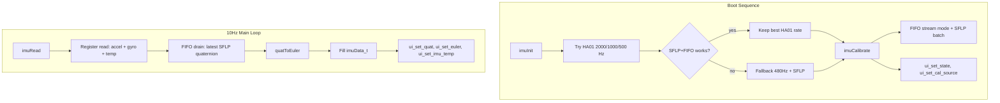

# IMU: SFLP Quaternion, Euler, Temperature, HA01 ODR Testing

## 0. Naming Convention & Doxygen Compliance

Per `.cursor/rules/commenting-and-naming.mdc` and Phase 14 incremental rule ("if a file is substantially rewritten, apply the standard at that time"), apply naming and commenting fixes **first**, before any functional changes.

### Renames (all call sites in main.c updated)

| Current (snake_case) | New (camelCase) |
|---|---|
| `imu_data_t` | `imuData_t` |
| `imu_init()` | `imuInit()` |
| `imu_calibrate()` | `imuCalibrate()` |
| `imu_read()` | `imuRead()` |
| `imu_read_raw()` | `imuReadRaw()` |
| `imu_get_grav_axis()` | `imuGetGravAxis()` |
| `imu_get_cal_offsets()` | `imuGetCalOffsets()` |

Struct member names (`ax`, `ay`, `drift_x`, `raw_ax`, etc.) stay as-is — they are already camelCase or short enough to not warrant change.

Static internal variables (`cal_ax`, `drift_x`, `grav_tag`, `drift_last_tick`, etc.) follow camelCase: `calAx`, `driftX`, `gravTag`, `driftLastTick`.

### Doxygen

Add to [Core/Inc/imu_lsm6dsv.h](Core/Inc/imu_lsm6dsv.h) and [Core/Src/imu_lsm6dsv.c](Core/Src/imu_lsm6dsv.c):
- `@file` header with `@brief`, `@details`, `@author Madhu`, `@date`
- `@brief`, `@param[in/out]`, `@return` on every public function
- `@note` for hardware quirks (HA01 ODR, SFLP FIFO, half-precision encoding)
- `@see` LSM6DSV datasheet references where appropriate
- No narration comments

All **new** functions added in this plan (`halfToFloat`, `quatToEuler`, FIFO drain, temp read) will be written with Doxygen from the start.

## 1. ODR Alignment Problem and HA01 Solution

Standard LSM6DSV ODRs (480, 960, 1920...) share no common factor with 500 SPS. The HA01 mode provides exactly 500 Hz, 1000 Hz, 2000 Hz, 4000 Hz — all clean multiples of 500.

- The BSP `LSM6DSV_ACC_SetOutputDataRate()` does NOT support HA01 enums
- Must bypass BSP and call low-level: `lsm6dsv_xl_data_rate_set(&imu_obj.Ctx, LSM6DSV_ODR_HA01_AT_500Hz)`
- SFLP max rate is 480 Hz (standard domain) — may or may not work with HA01 accel/gyro ODR

**Test strategy**: In `imuInit()`, try HA01 rates from 2000 Hz downward. After each, verify SFLP game rotation still enables and FIFO produces tagged quaternion samples. Print result. Keep the highest working rate. If all HA01 rates fail SFLP, fall back to 480 Hz standard.

## 2. SFLP Quaternion via FIFO

The SFLP game rotation vector is ONLY available through the FIFO. Each entry is 3 half-precision (float16) values: qx, qy, qz. Derive qw = sqrt(1 - x^2 - y^2 - z^2).

### FIFO Setup (in `imuCalibrate()`, after enabling SFLP)

```c
lsm6dsv_fifo_mode_set(&imu_obj.Ctx, LSM6DSV_STREAM_MODE);
lsm6dsv_fifo_sflp_raw_t sflp_batch = { .game_rotation = 1, .gravity = 0, .gbias = 0 };
lsm6dsv_fifo_sflp_batch_set(&imu_obj.Ctx, sflp_batch);
```

### FIFO Drain (in `imuRead()`, after accel/gyro register reads)

```c
lsm6dsv_fifo_status_t fifo_st;
lsm6dsv_fifo_status_get(ctx, &fifo_st);
while (fifo_st.fifo_level > 0) {
    lsm6dsv_fifo_out_raw_t raw;
    lsm6dsv_fifo_out_raw_get(ctx, &raw);
    if (raw.tag == LSM6DSV_SFLP_GAME_ROTATION_VECTOR_TAG) {
        // decode 3x half-precision from raw.data[0..5]
        // keep latest qx, qy, qz
    }
    fifo_st.fifo_level--;
}
```

At 120 Hz SFLP and 10 Hz drain, expect ~12 entries per drain. FIFO is 512 deep — no overflow risk.

### Half-Precision to Float Decoder

The driver has `npy_float_to_half()` (static in `lsm6dsv_reg.c`) but no reverse. We write a minimal `halfToFloat()` in [Core/Src/imu_lsm6dsv.c](Core/Src/imu_lsm6dsv.c):

```c
static float halfToFloat(uint16_t h)
{
    uint32_t sign = (h & 0x8000u) << 16;
    uint32_t exp  = (h >> 10) & 0x1F;
    uint32_t frac = h & 0x03FFu;
    if (exp == 0) {
        if (frac == 0) { /* +/- zero */
            union { uint32_t u; float f; } r = { .u = sign };
            return r.f;
        }
        /* denorm -> renormalize */
        while (!(frac & 0x0400u)) { frac <<= 1; exp--; }
        exp++; frac &= 0x03FFu;
    } else if (exp == 31) {
        exp = 255; /* inf/nan */
    } else {
        exp += 112; /* bias adjust: 127 - 15 */
    }
    union { uint32_t u; float f; } r = { .u = sign | (exp << 23) | (frac << 13) };
    return r.f;
}
```

## 3. Quaternion to Euler

Standard aerospace convention (ZYX intrinsic = XYZ extrinsic):

```c
static void quatToEuler(float w, float x, float y, float z,
                          float *roll, float *pitch, float *yaw)
{
    float sinr = 2.0f * (w * x + y * z);
    float cosr = 1.0f - 2.0f * (x * x + y * y);
    *roll  = atan2f(sinr, cosr) * (180.0f / 3.14159265f);

    float sinp = 2.0f * (w * y - z * x);
    if (sinp >= 1.0f)       *pitch = 90.0f;
    else if (sinp <= -1.0f) *pitch = -90.0f;
    else                    *pitch = asinf(sinp) * (180.0f / 3.14159265f);

    float siny = 2.0f * (w * z + x * y);
    float cosy = 1.0f - 2.0f * (y * y + z * z);
    *yaw   = atan2f(siny, cosy) * (180.0f / 3.14159265f);
}
```

Add to `imuData_t`:
```c
float qw, qx, qy, qz;          /* SFLP game rotation quaternion */
float roll, pitch, yaw;         /* Euler degrees from quaternion */
```

## 4. IMU Die Temperature

Register read via `lsm6dsv_temperature_raw_get()`. Sensitivity: 256 LSB/degC, offset: 25 degC.

```c
int16_t temp_raw;
lsm6dsv_temperature_raw_get(&imu_obj.Ctx, &temp_raw);
out->tempC = 25.0f + (float)temp_raw / 256.0f;
```

Add `float tempC;` to `imuData_t`.

## 5. Serial Print Overhaul: Silence ADC, Expand IMU

In [Core/Src/main.c](Core/Src/main.c), the 1-second ADC stats `printf` block (lines 291-296) currently prints:
```
ADC: sw=63988 hw=63988 ok=63989 miss=0 err=0 exti=259 dma=308
```
**Remove this printf entirely.** Keep the ADC UI feed calls (`ui_set_drdy_hz`, `ui_set_adc_counts`, `ui_set_adc_ring`, `ui_set_vratio`) — just silence the serial line.

Replace the existing 1-second IMU print with two detailed lines covering all IMU data:
```
IMU: ax=%+.2f ay=%+.2f az=%+.2f gx=%+.1f gy=%+.1f gz=%+.1f T=%+.1fC
     q=%+.4f,%+.4f,%+.4f,%+.4f rpy=%+.1f,%+.1f,%+.1f d=%+.2f,%+.2f,%+.2f
```

Example output (board flat, stationary):
```
  15300 IMU: ax=+0.01 ay=-0.00 az=+9.81 gx=+0.0 gy=+0.0 gz=-0.0 T=+27.3C
       q=+0.9999,+0.0012,-0.0005,+0.0003 rpy=+0.14,-0.06,+0.03 d=+0.01,+0.02,-0.01
```

This gives full IMU diagnostic visibility on every 1-second tick with no ADC noise.

## 6. State and Cal Source UI Fields

In [Core/Src/main.c](Core/Src/main.c):
- After all init completes (before main loop): `ui_set_state("RUN");`
- After `imuCalibrate()`: `ui_set_cal_source("SFLP+SW");`

## 7. UI Panel Updates

### New/modified rows in [Core/Src/debug_ui.c](Core/Src/debug_ui.c)

Current IMU header (row 10):
```
  IMU (LSM6DSV 480Hz LP1)      Grav: +Z
```
Becomes (reflects actual ODR after HA01 test):
```
  IMU (LSM6DSV 500Hz HA01 LP1) Grav: +Z
```

Add 1 new row for temperature between Euler and the SYSTEM divider. PANEL_ROWS goes from 23 to 24. Row map:

- Row 10: IMU header + grav + ODR
- Row 11: Accel
- Row 12: Gyro
- Row 13: Drift
- Row 14: CalOf
- Row 15: Quat (now live from SFLP)
- Row 16: Euler (now live from quaternion)
- Row 17: **NEW** `Temp: +25.3 C`
- Row 18: divider
- Row 19-23: SYSTEM section (shifted +1)
- Row 24: bottom border

New setter: `ui_set_imu_temp(float deg_c)` in [Core/Inc/debug_ui.h](Core/Inc/debug_ui.h).

### main.c wiring (10 Hz loop)

```c
ui_set_accel(imu.ax, imu.ay, imu.az);
ui_set_gyro(imu.gx, imu.gy, imu.gz);
ui_set_imu_drift(imu.drift_x, imu.drift_y, imu.drift_z);
ui_set_quat(imu.qw, imu.qx, imu.qy, imu.qz);
ui_set_euler(imu.roll, imu.pitch, imu.yaw);
ui_set_imu_temp(imu.tempC);
```

## 8. Software Quaternion Integration (Fallback + Test)

If SFLP FIFO never produces tagged quaternion samples (HA01 incompatibility or other issue), implement a simple complementary filter as fallback:

```c
/* In imuRead(), after calibrated accel/gyro are available */
float dt = ...; /* from drift integration, already computed */
/* Integrate gyro into quaternion via small-angle approximation */
float hw = 0.5f * dt;
float dqw = 1.0f, dqx = hw * gx_rad, dqy = hw * gy_rad, dqz = hw * gz_rad;
/* Multiply current quat by delta quat, renormalize */
```

This path is only activated if SFLP FIFO readout fails during the ODR test phase. The serial log will indicate which path is active.

## 9. Data Flow



## 10. Visualizer Streaming Mode (Firmware)

Add a compile-time toggle at the top of [Core/Src/main.c](Core/Src/main.c):

```c
/* Uncomment to enable visualizer streaming (disables VT220 panel) */
// #define VIZ_STREAM
```

When `VIZ_STREAM` is defined:
- **Skip** all VT220 UI calls: `ui_draw_panel()`, `ui_update_fields()`, `ui_process_input()`
- **Increase** IMU poll rate from 10 Hz (100ms) to 20 Hz (50ms)
- **Every poll**, emit a single CSV line over serial (gets CDC via `_write`):

```
$IMU,<ms>,<ax>,<ay>,<az>,<gx>,<gy>,<gz>,<qw>,<qx>,<qy>,<qz>,<roll>,<pitch>,<yaw>,<dx>,<dy>,<dz>,<temp>,<grav>\r\n
```

Example:
```
   3500 $IMU,3500,+0.01,-0.00,+9.81,+0.0,+0.0,-0.0,+0.9999,+0.0012,-0.0005,+0.0003,+0.14,-0.06,+0.03,+0.01,+0.02,-0.01,+27.3,+Z
```

The `_write` timestamp prefix is fine — the visualizer matches `$IMU` anywhere in the line.

Implementation in main.c main loop:

```c
#ifdef VIZ_STREAM
    static uint32_t lastViz;
    uint32_t nowViz = HAL_GetTick();
    if (nowViz - lastViz >= 50) {
        lastViz = nowViz;
        imuData_t imu;
        if (imuRead(&imu) == 0) {
            printf("$IMU,%lu,%+.3f,%+.3f,%+.3f,%+.1f,%+.1f,%+.1f,"
                   "%+.5f,%+.5f,%+.5f,%+.5f,%+.2f,%+.2f,%+.2f,"
                   "%+.3f,%+.3f,%+.3f,%+.1f,%s\r\n",
                   (unsigned long)nowViz,
                   (double)imu.ax, (double)imu.ay, (double)imu.az,
                   (double)imu.gx, (double)imu.gy, (double)imu.gz,
                   (double)imu.qw, (double)imu.qx, (double)imu.qy, (double)imu.qz,
                   (double)imu.roll, (double)imu.pitch, (double)imu.yaw,
                   (double)imu.driftX, (double)imu.driftY, (double)imu.driftZ,
                   (double)imu.tempC, imuGetGravAxis());
        }
    }
#else
    /* ... normal VT220 UI + 1Hz print path ... */
#endif
```

The ADC 1-second stats block stays active regardless (it feeds the UI and doesn't print when `VIZ_STREAM` is defined).

## 11. Visualizer Rewrite ([Tools/imu_visualizer.py](Tools/imu_visualizer.py))

Complete rewrite of the visualizer to match our `$IMU` CSV protocol.

### Protocol Parser

```python
_IMU_RE = re.compile(
    r'\$IMU,(\d+),'                          # timestamp ms
    r'([^,]+),([^,]+),([^,]+),'              # ax, ay, az
    r'([^,]+),([^,]+),([^,]+),'              # gx, gy, gz
    r'([^,]+),([^,]+),([^,]+),([^,]+),'      # qw, qx, qy, qz
    r'([^,]+),([^,]+),([^,]+),'              # roll, pitch, yaw
    r'([^,]+),([^,]+),([^,]+),'              # drift_x, drift_y, drift_z
    r'([^,]+),'                              # temp
    r'(\S+)'                                 # grav axis
)
```

### 3D Rotation from Quaternion (not Euler)

Replace `rotation_matrix(yaw, pitch, roll)` with direct quaternion-to-rotation-matrix:
```python
def quat_to_rotmat(w, x, y, z):
    return np.array([
        [1-2*(y*y+z*z),  2*(x*y-w*z),    2*(x*z+w*y)],
        [2*(x*y+w*z),    1-2*(x*x+z*z),  2*(y*z-w*x)],
        [2*(x*z-w*y),    2*(y*z+w*x),    1-2*(x*x+y*y)]
    ])
```

### Display Layout

```
+---------------------------------------------------+
|         3D PCB with body-frame axes (X/Y/Z)       |
|         Gravity arrow (world -Z or detected axis) |
|         Color-coded face labels: +X, -X, etc.     |
+---------------------------------------------------+
| Grav: +Z | Temp: 27.3C | ACal: SFLP+SW           |
+---------------------------------------------------+
| [====Yaw gauge====] [====Pitch gauge====] [====Roll gauge====] |
+---------------------------------------------------+
| Accel: +0.01, -0.00, +9.81 m/s^2  |a|=1.000g     |
| Gyro:  +0.0,  +0.0,  -0.0 dps                    |
| Drift: +0.01, +0.02, -0.01 deg                    |
| Quat:  +0.9999, +0.0012, -0.0005, +0.0003        |
+---------------------------------------------------+
```

Key features:
- **Quaternion-based rotation** — no gimbal lock, smoother than Euler
- **Gravity axis badge** — shows detected axis ("+Z", "-X", etc.) with color coding
- **Temperature gauge** — real-time die temperature
- **Drift panel** — cumulative drift on all 3 axes with color warning if growing
- **Accel magnitude** — computed as `|a| = sqrt(ax^2+ay^2+az^2) / 9.80665` in g-units
- **Connection status** — live/disconnected indicator
- **Auto-detect STM32 CDC port** (same as original)

### Test Matrix

The user will test 3 orientations by rebooting:
- **Z-up**: board flat, component side up. Expect `grav=+Z`, `az ~ +9.81`, roll/pitch ~ 0
- **X-up**: board on edge, X pointing up. Expect `grav=+X`, `ax ~ +9.81`, pitch ~ +90
- **Y-up**: board on edge, Y pointing up. Expect `grav=+Y`, `ay ~ +9.81`, roll ~ +90

For each test, verify:
1. `grav` field matches physical orientation
2. Calibrated non-gravity axes read ~ 0
3. Quaternion produces correct 3D rotation in visualizer
4. Euler angles match expected values
5. Drift stays near zero when stationary

## Files Changed

- [Core/Inc/imu_lsm6dsv.h](Core/Inc/imu_lsm6dsv.h) — Doxygen `@file` header, rename `imu_data_t` -> `imuData_t`, rename all function declarations to camelCase, add quat/euler/tempC fields
- [Core/Src/imu_lsm6dsv.c](Core/Src/imu_lsm6dsv.c) — Doxygen `@file` header + all functions, rename to camelCase, rename static vars to camelCase, HA01 ODR test, FIFO setup, FIFO drain, `halfToFloat`, `quatToEuler`, temp read, software quat fallback
- [Core/Inc/debug_ui.h](Core/Inc/debug_ui.h) — add `ui_set_imu_temp()`
- [Core/Src/debug_ui.c](Core/Src/debug_ui.c) — PANEL_ROWS=24, temperature row, shift SYSTEM rows
- [Core/Src/main.c](Core/Src/main.c) — update all IMU call sites to camelCase, silence ADC printf, expand IMU 1Hz print, wire quat/euler/temp UI setters, state + cal source, `#ifdef VIZ_STREAM` block with 20Hz CSV output
- [Tools/imu_visualizer.py](Tools/imu_visualizer.py) — full rewrite: `$IMU` CSV parser, quaternion-based 3D rotation, expanded status panels
- `#include <math.h>` added to imu_lsm6dsv.c for `atan2f`, `asinf`, `sqrtf`
