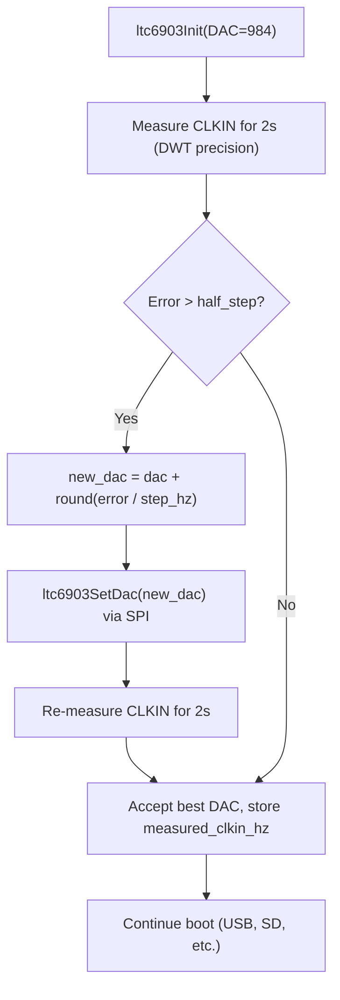

# LTC6903 Boot Auto-Trim and Rate Logging

## Why the decimation chain is safe

The ADS131M02 outputs one sample per 128 CLKIN cycles (OSR=128, HR mode). The firmware boxcar accumulates exactly 128 DRDY interrupts, then outputs one decimated sample. Both are integer sample-count divisions, not time-gated. The chain:


- If CLKIN = 8,192,000 Hz exactly: output = 500.000 SPS
- If CLKIN = 8,200,606 Hz (current measured): output = 500.524 SPS
- If CLKIN = 8,190,000 Hz: output = 499.878 SPS

Every decimated sample always contains exactly 128 ADC readings regardless of CLKIN. The only thing that changes is the *time* between output samples. For a timestamped data logger this is fine, but trimming closer to 8,192,000 is better for round numbers and cleaner FFTs.

## The DAC granularity constraint

Each LTC6903 DAC step changes output frequency by approximately:

```
step_hz ≈ f_out / (2078 + DAC) ≈ 8,192,000 / 3062 ≈ 2,675 Hz
```

So the **best achievable accuracy is ±1,337 Hz** (~half a DAC step). That maps to ±10.4 SPS in the decimated output. We cannot hit exactly 500.000 SPS — we pick the closest DAC value.

## Auto-trim algorithm

Runs once at boot, between `ltc6903Init()` and USB CDC init (before `diagClkinStabilityTest`):



Typically converges in 1-2 iterations. Total added boot time: ~4-6 seconds.

## Files to modify

### 1. [Core/Inc/osc_ltc6903.h](Core/Inc/osc_ltc6903.h)

Add new API:
- `int ltc6903SetDac(uint16_t dac)` -- reprogram the LTC6903 with a specific DAC value (same SPI mode-switch dance)
- `uint32_t ltc6903GetMeasuredHz(void)` -- return the post-trim measured CLKIN
- `uint16_t ltc6903GetDac(void)` -- return current DAC value

### 2. [Core/Src/osc_ltc6903.c](Core/Src/osc_ltc6903.c)

- Extract the SPI write sequence into a shared helper `ltc6903SpiWrite(uint16_t word)`
- Implement `ltc6903SetDac()` which builds the word from the current OCT + new DAC + CNF, then calls the helper
- Add `static uint32_t g_measuredHz` updated by the trim function
- Add `int ltc6903AutoTrim(void)` which:
  1. Enables DWT_CYCCNT if not already
  2. Measures CLKIN for 2 seconds using DWT (same snap_counters approach from diag_timers.c, but inlined/called via a helper)
  3. Computes error vs 8,192,000
  4. If error > half_step (~1337 Hz), computes new DAC, clamps to 0-1023, reprograms
  5. Re-measures for 2 seconds to confirm
  6. Stores the final measured frequency in `g_measuredHz`
  7. Prints a summary (original DAC, trimmed DAC, before/after frequency, final error)

### 3. [Core/Src/diag_timers.c](Core/Src/diag_timers.c) / [Core/Inc/diag_timers.h](Core/Inc/diag_timers.h)

- Expose `diagClkinMeasureHz(uint32_t durationMs)` -- a blocking function that measures CLKIN with DWT precision over the given duration and returns the frequency. This is the core measurement primitive used by both auto-trim and the stability test.

### 4. [Core/Src/main.c](Core/Src/main.c) -- USER CODE BEGIN 2

Updated init sequence:
```
ltc6903Init();           // Program initial DAC=984
diagClkinInit();        // Start TIM8 counter
ltc6903AutoTrim();      // Measure + nudge DAC + re-measure (~4-6s)
// ... USB CDC init ...
diagClkinStabilityTest(60);  // TEMPORARY: 60s test (remove later)
```

Note: `ltc6903AutoTrim()` needs TIM8 running (for edge counting), so it must come after `diagClkinInit()`. USB is not up yet, so printf output goes to USART1 only (which is fine for debug).

### 5. Data file header (Phase 11, future)

The measured CLKIN value (`ltc6903GetMeasuredHz()`) will be written to every data file header, allowing exact sample-rate calibration in post-processing.

## Key design decisions

- **Trim once at boot, not continuously.** The 4,730 Hz spread over 60s is combined HSI+LTC drift. Over a 2ms boxcar window (128 samples at 64 kHz), the frequency is essentially constant. Continuous trimming would introduce step discontinuities that are worse than smooth drift.
- **Measure with DWT, not HAL_GetTick.** 13 ns resolution eliminates the quantization noise that caused the original ±10 kHz readings.
- **Target 8,192,000 as seen from SYSCLK.** Since the firmware uses SYSCLK-derived timing for everything, matching CLKIN to what SYSCLK "thinks" 8.192 MHz is makes the boxcar output as close to 500 SPS as possible from the firmware's perspective.
- **Keep the stability test temporarily.** After trim, run the 60s test to verify the trimmed result. Remove once satisfied.

## Naming Convention Compliance

This plan has been retroactively updated to use camelCase naming for project functions and local-style identifiers described in the document (for example `ltc6903AutoTrim`, `diagClkinMeasureHz`, `durationMs`, `measuredHz`). HAL/CubeMX identifiers (such as `HAL_GetTick`) are left unchanged. The authoritative rules live in [.cursor/rules/commenting-and-naming.mdc](.cursor/rules/commenting-and-naming.mdc).
