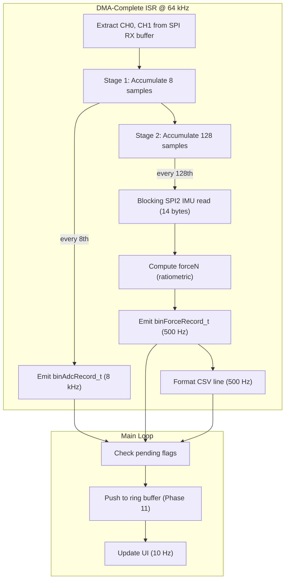

# Phase 10 — Two-Stage Decimation, Force Calculation, and Record Assembly

**Reference:** [Master plan Phase 10](/.cursor/plans/snazzy-petting-mountain.md) (line 931)

## Current State

- **ADC DMA hot path** is fully operational at 64 kSPS, zero misses (Phase 7 ✅)
- **IMU** reads at 480 Hz via blocking SPI2 (Phase 8 ✅)
- **FatFS** is operational with DMA-based SD writes (Phase 4 ✅)
- **No `log_record.h`** exists — record struct definitions are only in the master plan
- **No `data_processing.c/.h`** exists — decimation logic is not yet implemented
- **No `calibration.c/.h`** exists — no config.txt parser
- **DMA-complete ISR** (`ads_fast_dma_complete_handler`) currently only extracts CH0/CH1 raw values and updates stats — no decimation or record assembly
- **CSV format** defined in master plan: `$,<time_ms>,<load_N>,#\r\n`
- **Ring buffer** for SD writes is Phase 11 — this phase outputs records to staging variables (pending flags)

## Architecture



**Key constraint:** Stage 1 and Stage 2 decimation run **inside the DMA-complete ISR**. The ISR must complete within the 15.625 µs DRDY period. At 250 MHz SYSCLK, the ISR currently takes ~3 µs. Adding accumulation adds ~0.5 µs. The IMU SPI2 read (~28 µs at 5 MHz) only happens every 128th call (500 Hz), and it occurs **after** the ADC record is emitted, so the next DRDY can preempt it. This is safe because EXTI2 has higher priority than any SPI2 blocking call.

## Naming Convention Compliance

This phase’s new C code follows project naming rules:

- `#define` constants and `enum` values: `UPPER_SNAKE_CASE` (for example `REC_TYPE_ADC`, `CAL_SRC_SD_FILE`).
- `const` variables: `UPPER_SNAKE_CASE`.
- Functions: `camelCase` with a lowercase module prefix where applicable (for example `dpInit()`, `calibrationLoad()`, `crc16Ccitt()`).
- Local variables: `camelCase` (for example `forceN`, `stage1Count`).
- Global variables: `g_` prefix plus `camelCase` (for example `g_dpPendingAdcRecord`, `g_dpStagedAdc`).
- Struct / typedef names: `camelCase_t` (for example `calConfig_t`, `binForceRecord_t`).
- Struct members: `camelCase` (for example `.sensitivityUvPerN`, `.tareOffsetN`).
- Do **not** rename HAL- or CubeMX-generated identifiers.

Record layout and on-disk binary formats remain compatible with the master plan; only C identifiers and Doxygen file headers are normalized here.

## Implementation Steps

### 1. Create `Core/Inc/log_record.h`

All packed struct definitions exactly as specified in the master plan. This header is shared between:
- ISR context (record assembly)
- Main loop (ring buffer push, SD write)
- Python post-processor (`decode_bin.py` in Phase 12)

```c
/**
 * @file    log_record.h
 * @brief   Packed binary record types, magic, and CRC16-CCITT for SD logging.
 * @details Defines on-disk structs shared by ISR assembly, main/SD path, and
 *          offline decode tools; keeps wire format stable across phases.
 * @author  Madhu
 * @date    2026-04-12
 */

#ifndef LOG_RECORD_H
#define LOG_RECORD_H

#include <stdint.h>

/* ── Record type tags ─────────────────────────────────── */
#define REC_TYPE_ADC    0x01
#define REC_TYPE_FORCE  0x02
#define REC_TYPE_META   0x03

/* ── Binary file magic ────────────────────────────────── */
#define BIN_FILE_MAGIC  0x4C44434CUL  /* 'LDCL' */
#define BIN_FORMAT_VER  1

/* ── Validity flags (binForceRecord_t.validity) ───────── */
#define VALIDITY_ADC_OK       0x01
#define VALIDITY_IMU_OK       0x02
#define VALIDITY_BATT_FRESH   0x04
#define VALIDITY_NO_OVERFLOW  0x08
#define VALIDITY_ADS_CRC_OK   0x10
#define VALIDITY_CAL_DEFAULT  0x20

/* ... packed struct typedefs per master plan ... */
/* binFileHeader_t (64B), binAdcRecord_t (16B),
   binForceRecord_t (32B), binMetaRecord_t (32B) */

uint16_t crc16Ccitt(const uint8_t *data, uint32_t len);

#endif
```

**CRC16-CCITT** implementation: polynomial 0x1021, init 0xFFFF, no final XOR. ~20 cycles per byte at 250 MHz. For a 16-byte ADC record (14 data bytes), CRC takes ~280 cycles = 1.1 µs. Acceptable in ISR context at 8 kHz rate.

### 2. Create `Core/Src/calibration.c` / `Core/Inc/calibration.h`

**Config file format** (`config.txt` on SD root):
```ini
sensitivityUvPerN = 2.0
adcGainCh1         = 1
adcGainCh2         = 1
offsetCh1           = 0
offsetCh2           = 0
tareOffsetN        = 0.0
battDividerRatio   = 0.5
preallocMb          = 64
enableAdcCrc       = 0
allowLogOnUsb     = 1
```

**Public API:**
```c
/**
 * @file    calibration.h
 * @brief   Load and access calibration and logging options from SD or defaults.
 * @details Parses config.txt via FatFS, tracks whether values came from SD,
 *          flash, or defaults; exposes read-only calConfig_t for dpInit and UI.
 * @author  Madhu
 * @date    2026-04-12
 */

typedef struct {
    float    sensitivityUvPerN;
    uint8_t  adcGainCh1;
    uint8_t  adcGainCh2;
    int32_t  offsetCh1;
    int32_t  offsetCh2;
    float    tareOffsetN;
    float    battDividerRatio;
    uint32_t preallocMb;
    uint8_t  enableAdcCrc;
    uint8_t  allowLogOnUsb;
} calConfig_t;

typedef enum { CAL_SRC_DEFAULT, CAL_SRC_SD_FILE, CAL_SRC_FLASH } calSource_t;

int           calibrationLoad(void);      /* Try SD, then Flash, then defaults */
calSource_t   calibrationGetSource(void);
const calConfig_t *calibrationGet(void);
void          calibrationSetTare(float tareN);
```

**Parser design:**
- Uses FatFS `f_open("0:config.txt", ...)` / `f_gets()` line-by-line
- Simple `key = value` parsing with `sscanf` or `strtof`/`strtol`
- Unknown keys silently ignored (forward-compatible)
- Missing keys use hardcoded defaults
- Print each loaded key-value pair to serial

### 3. Create `Core/Src/data_processing.c` / `Core/Inc/data_processing.h`

**Public API:**
```c
void dpInit(const calConfig_t *cal);
void dpFeedSample(int32_t ch0, int32_t ch1, uint16_t adsStatus);

/* Flags polled by main loop */
volatile uint8_t g_dpPendingAdcRecord;
volatile uint8_t g_dpPendingForceRecord;

/* Staging areas read by main loop */
binAdcRecord_t   g_dpStagedAdc;
binForceRecord_t g_dpStagedForce;
char             g_dpStagedCsv[32];
uint8_t          g_dpStagedCsvLen;

/* Tare */
void dpTare(void);
void dpSetTareOffset(float offsetN);

/* Latest force for UI (read from main loop) */
float dpGetLatestForceN(void);
```

**Decimation state (module-static):**
```c
static int64_t  accCh08;       /* Stage 1: 8-sample accumulator */
static int64_t  accCh18;
static uint32_t stage1Count;    /* 0..7 → emit ADC record at 8 */
static int64_t  accCh0128;     /* Stage 2: 128-sample accumulator */
static int64_t  accCh1128;
static uint32_t stage2Count;    /* 0..15 → emit Force record at 16 (= 128 raw) */
static uint16_t adcSeq;         /* 8 kHz sequence counter */
static uint16_t forceSeq;       /* 500 Hz sequence counter */
static uint32_t logStartTick;  /* HAL_GetTick() at session start */
```

**`dpFeedSample()` — called from DMA-complete ISR at 64 kHz:**

```
1. accCh08 += ch0;  accCh18 += ch1;  stage1Count++
2. if (stage1Count == 8):
   a. Assemble binAdcRecord_t with sum_ch0/ch1 (not divided)
   b. Compute CRC16, set pending flag
   c. accCh0128 += accCh08;  accCh1128 += accCh18
   d. stage2Count++
   e. Reset stage1 accumulators
   f. if (stage2Count == 16):
      - Read IMU via blocking SPI2 (14 bytes, ~28 µs)
      - Compute forceN = ratiometric formula
      - Assemble binForceRecord_t
      - Format CSV: snprintf(csv, "$,%lu,%+.3f,#\r\n", time_ms, forceN)
      - Compute CRC16, set pending flag
      - Reset stage2 accumulators
```

**Ratiometric force formula:**
```c
float forceN = ((float)accCh0128 / (float)accCh1128)
              * (3.3f / cal->sensitivityUvPerN) * 1e6f
              - cal->tareOffsetN;
```

**IMU read at decimation boundary:** The blocking SPI2 read takes ~28 µs. During this time, 1–2 DRDY edges will fire. Since EXTI2 (priority 0) preempts the DMA-complete ISR context where the IMU read runs, those DRDYs are serviced normally — the IMU read just gets interrupted and resumed. This is safe because SPI2 is polling-based (no DMA), and the SPI2 hardware handles the clock pause transparently.

### 4. Wire into DMA-Complete ISR

In `adc_ads131m02.c`, inside `ads_fast_dma_complete_handler()`, after extracting CH0/CH1:

```c
/* Feed decimation pipeline (Phase 10) */
dpFeedSample(ch0_signed, ch1_signed, adsStatusWord);
```

This single function call is the entry point — all decimation, record assembly, and CSV formatting happen inside `dpFeedSample()`.

### 5. Integrate into `main.c`

**USER CODE BEGIN 2** (after FatFS mount):
```c
calibrationLoad();
dpInit(calibrationGet());
ui_set_cal_source(calibrationGetSource() == CAL_SRC_SD_FILE ? "SD-FILE" : "DEFAULT");
```

**USER CODE BEGIN 3** (main loop, 1-second block):
```c
/* Decimation rate diagnostic */
printf("DECIM: ADC=%lu/s FORCE=%lu/s\r\n", adcRecordsPerSec, forceRecordsPerSec);
```

**Main loop** (every iteration):
```c
/* Check for pending records — will be pushed to ring buffer in Phase 11 */
if (g_dpPendingAdcRecord) {
    g_dpPendingAdcRecord = 0;
    /* Phase 11: ring_push(&g_dpStagedAdc, sizeof(g_dpStagedAdc)); */
}
if (g_dpPendingForceRecord) {
    g_dpPendingForceRecord = 0;
    /* Phase 11: ring_push(&g_dpStagedForce, sizeof(g_dpStagedForce)); */
    /* Phase 11: csv_push(g_dpStagedCsv, g_dpStagedCsvLen); */
}
```

**UI update** (~10 Hz):
```c
ui_set_force(dpGetLatestForceN());
```

## Potential Blockers / Gotchas

### BLOCKER 1: ISR Execution Time Budget

**Risk:** Adding `dpFeedSample()` to the DMA-complete ISR increases its execution time. The 64 kHz path (simple accumulation) adds ~0.3 µs. The 8 kHz path (ADC record assembly + CRC16) adds ~2 µs. The 500 Hz path (IMU read + force calc + CSV format) adds ~35 µs. If the 500 Hz path exceeds the DRDY period, subsequent DRDYs will be missed.

**Resolution:**
- The 500 Hz path runs every 128th DRDY. During its ~35 µs execution, 2–3 DRDYs will fire.
- EXTI2 (priority 0) preempts the DMA-complete ISR continuation, so those DRDYs start their own DMA transfers immediately.
- The DMA-complete callback for those preempting transfers runs after the 500 Hz path returns, so no misses occur.
- **Critical requirement:** The DMA-complete ISR must be re-entrant with respect to EXTI2. This is already the case — EXTI2 starts a new DMA transfer independently, and the DMA-complete callback is a separate ISR entry.
- Monitor `miss_count` — if it increases during force-record boundaries, the ISR is too slow. Mitigation: move IMU read and CSV formatting to the main loop (deferred processing).

### BLOCKER 2: `snprintf` in ISR Context

**Risk:** `snprintf()` for CSV formatting uses the C library, which may not be ISR-safe (heap allocation, reentrancy). With newlib-nano, `snprintf` for `"$,%lu,%+.3f,#\r\n"` calls `_dtoa_r` which uses malloc.

**Resolution:**
- **Do NOT use `snprintf` with `%f` in ISR context.** Instead, use a lightweight fixed-point formatter:
  ```c
  /* Convert float to "+12.345" without printf */
  static int fmtForce(char *buf, float val) { ... }
  ```
- Or: defer CSV formatting to the main loop. The ISR sets `g_dpPendingForceRecord = 1` and stores `forceN`. The main loop calls `snprintf` when it picks up the pending record. This is safer and keeps ISR time minimal.
- **Recommended approach:** Defer CSV formatting to main loop. The ISR only populates the binary record and the raw `forceN` value.

### BLOCKER 3: Floating-Point in ISR on Cortex-M33

**Risk:** Cortex-M33 has optional FPU. If the FPU is enabled (it is on STM32H562), floating-point operations in ISR are safe as long as the FPU context is saved/restored. The NVIC handles this automatically with lazy stacking (`FPCCR.LSPEN`).

**Resolution:**
- STM32H562 FPU is enabled by default in `SystemInit()`. Lazy stacking is enabled by default.
- The force calculation (`float forceN = ...`) is safe in ISR context.
- Lazy FPU stacking adds ~12 cycles (one-time) when a float operation first occurs in an ISR. This is negligible.
- **Verify:** Check that `SCB->CPACR` has bits [23:20] set (FPU enabled). Print in boot diagnostics.

### BLOCKER 4: Record Staging Race Condition

**Risk:** The ISR writes `g_dpStagedAdc` and then sets `g_dpPendingAdcRecord = 1`. The main loop reads the flag, then reads the record. If a new ISR fires between the flag check and the record read, the record could be overwritten.

**Resolution:**
- At 8 kHz ADC record rate, the main loop has 125 µs to read each record before the next one overwrites it. At 250 MHz, the main loop iterates in ~10–50 µs, so this is generally safe.
- For robustness, use **double buffering**: two staging slots, ISR writes to slot `write_idx`, main loop reads from `read_idx`, and they alternate. The pending flag becomes a count.
- Alternatively, accept that the staging area is a "latest value" latch — if the main loop falls behind, it skips records. This is acceptable in Phase 10 because the ring buffer (Phase 11) is the real consumer. Phase 10 just verifies the decimation rates.

### BLOCKER 5: Calibration File Parsing Failure

**Risk:** If `config.txt` is malformed (wrong encoding, BOM, trailing whitespace, extra spaces around `=`), the parser silently uses defaults. The user won't know their calibration didn't load.

**Resolution:**
- Print every parsed key-value pair: `printf("CAL: %s = %s\r\n", key, value_str);`
- Print a summary: `printf("CAL: loaded %d/%d keys from SD\r\n", loaded, total);`
- If 0 keys loaded from a file that exists, warn: `printf("CAL: WARNING — config.txt exists but no keys parsed\r\n");`
- Handle common format issues: trim leading/trailing whitespace, skip BOM bytes, accept both `\r\n` and `\n` line endings.

### GOTCHA 6: `int64_t` Accumulator for 128-Sample Sum

**Risk:** Each raw ADC sample is 24-bit signed (max ±8,388,607). Summing 128 samples: max = 128 × 8,388,607 = 1,073,741,696 — fits in `int32_t` (max 2,147,483,647). However, for Stage 2 which sums 16 Stage-1 sums (each up to 8 × 8,388,607 = 67,108,856): 16 × 67,108,856 = 1,073,741,696 — still fits in `int32_t`.

**Resolution:**
- Use `int64_t` for both accumulators as a safety margin. The cost is negligible (one extra register on Cortex-M33 for 64-bit add).
- The `sum_ch1` and `sum_ch2` fields in `binAdcRecord_t` are `int32_t` (fits the 8-sample sum). The `sum_ch1_128` field in `binForceRecord_t` is `int32_t` (fits the 128-sample sum).

### GOTCHA 7: `forceN` Division by Zero

**Risk:** If CH2 (excitation sense) reads zero (disconnected loadcell, broken wire), the ratiometric formula divides by zero → `+inf` or NaN.

**Resolution:**
- Check `accCh1128` (CH2 sum) before dividing: if abs < threshold (e.g., < 1000 counts), set `forceN = 0.0f` and set `VALIDITY_ADC_OK` flag to 0.
- Display `"---"` on VT220 UI when force is invalid.

### GOTCHA 8: Tare During Active Sampling

**Risk:** `dpTare()` reads the current 500 Hz force value and stores it as `tareOffsetN`. If called during a transient (loadcell being loaded), the tare offset is wrong.

**Resolution:**
- `dpTare()` should average N consecutive force readings (e.g., 50 readings = 100 ms) before setting the offset. This smooths out noise and transients.
- Alternatively, tare stores the current single reading with a warning: `"Tare set to %.3f N — hold loadcell steady for best results"`.
- Tare can only be called from IDLE state (Phase 11 state machine enforces this).

### GOTCHA 9: CRC16 Computation Cost at 8 kHz

**Risk:** CRC16-CCITT over 14 bytes of a `binAdcRecord_t` takes ~280 cycles at 250 MHz = 1.1 µs. At 8 kHz, this is 8.8 ms/s of ISR time. Acceptable but not negligible.

**Resolution:**
- Use a table-driven CRC16 (256-byte lookup table). This reduces per-byte cost from ~20 cycles to ~8 cycles, cutting CRC time to ~0.4 µs per record.
- Gate CRC computation behind `enableAdcCrc` flag from config.txt. If disabled, write 0x0000 as CRC (post-processor can still validate record integrity via sequence numbers).
- **Default:** `enableAdcCrc = 0` during development (skip CRC). Enable for production soak tests.

## Key Files

| Action | File | CubeMX-Safe? |
|--------|------|-------------|
| **Create** | `Core/Inc/log_record.h` | Yes — new file |
| **Create** | `Core/Src/calibration.c` / `Core/Inc/calibration.h` | Yes — new files |
| **Create** | `Core/Src/data_processing.c` / `Core/Inc/data_processing.h` | Yes — new files |
| **Edit** | `Core/Src/adc_ads131m02.c` (add `dpFeedSample()` call in ISR) | Yes — USER CODE / new file code |
| **Edit** | `Core/Src/main.c` (USER CODE sections) | Yes |
| **Edit** | `Core/Src/debug_ui.c` (force display, cal source) | Yes — new file |

## Success Criteria (from master plan)

- [ ] `binAdcRecord_t` emitted exactly **8000 times/second** (measure over 10 s)
- [ ] `binForceRecord_t` emitted exactly **500 times/second** (measure over 10 s)
- [ ] Decimation ratio verified: every force record contains the sum of exactly 128 raw samples (= 16 ADC records)
- [ ] Unloaded loadcell shows force approximately **0 N** after tare
- [ ] Known calibration weight (e.g., 1 kg = 9.81 N) reads **9.81 ± 0.5 N**
- [ ] config.txt changes (different sensitivity) take effect after SD card re-insert + reboot
- [ ] VT220 UI Force field updates at 10 Hz or less showing stable reading
- [ ] Serial terminal shows: `CAL: loaded from SD, sensitivity=2.000 uV/N`
- [ ] Serial terminal shows (periodic): `DECIM: ADC=8000/s FORCE=500/s`
- [ ] CSV line format verified: `$,<time_ms>,<load_N>,#` with correct framing
- [ ] All above verified with zero DRDY misses over 60 s
