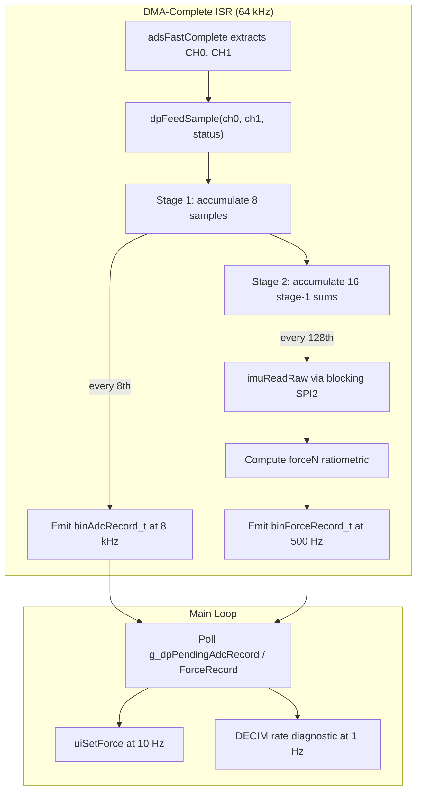

# Phase 10 — Two-Stage Decimation, Force Calculation, and Record Assembly

**Phase Jump Acknowledgment:** Phase 9 closure is pending due to external hardware dependencies. This one-time jump to Phase 10 is approved by the user.

**Supersession (Phase 10b):** Production calibration is **not** loaded from `config.txt`. [Phase 10b](phase_10b_cal_sd_partitions_751257fe.plan.md) replaces the text parser with binary **`.cal`** files on the SYSCAL volume, VT220 cell selection, **`cellCorrFactor`**, **`CH1_DIV_RATIO`** in the force equation, and **`ads131m02SetGain()`** after a successful cal load. This Phase 10 plan remains the historical spec for decimation/ISR/data_processing architecture; treat **`calibration.c`** / boot integration descriptions as superseded where they conflict with Phase 10b.

## Architecture Overview



## Key Design Decisions

**1. CSV formatting deferred to main loop (not ISR).** Per BLOCKER 2 in the phase plan, `snprintf` with `%f` calls `_dtoa_r` which uses malloc — not ISR-safe with newlib-nano. The ISR stores `forceN` in the binary record; the main loop formats CSV when it picks up the pending flag.

**2. CRC16 gated by `enableAdcCrc` config flag.** Default OFF during development (`enableAdcCrc = 0` writes 0x0000). Table-driven CRC16-CCITT (256-byte LUT) used when enabled, keeping ISR cost under 0.5 us per record.

**3. Single-buffer "latest value" staging** (not double-buffered). At 8 kHz the main loop has 125 us to read each ADC record. Phase 11's ring buffer is the real consumer; Phase 10 just validates rates. Acceptable to skip records if the main loop falls behind.

**4. Naming follows project conventions** — `camelCase` functions, `camelCase_t` structs, `UPPER_SNAKE_CASE` defines, `g_` prefix for globals. Master plan uses `snake_case` struct names; we normalize to `camelCase_t` per `.cursor/rules/commenting-and-naming.mdc`.

## Files to Create

### 1. [Core/Inc/log_record.h](Core/Inc/log_record.h) (new)

Packed struct definitions matching the master plan's binary format, with naming normalized:

- `binFileHeader_t` (64 B) — magic `0x4C44434C`, version, cal snapshot, CRC16
- `binAdcRecord_t` (16 B) — type `0x01`, flags, seq, sumCh0/Ch1 (8-sample), CRC16
- `binForceRecord_t` (32 B) — type `0x02`, validity, seq, timestampMs, forceN, IMU raw 6-axis, sumCh0_128, CRC16
- `binMetaRecord_t` (32 B) — type `0x03`, secondNum, clkinHz, mcuTemp, battery, DRDY/miss/overflow totals, CRC16
- Record type tags: `REC_TYPE_ADC 0x01`, `REC_TYPE_FORCE 0x02`, `REC_TYPE_META 0x03`
- Validity flags: `VALIDITY_ADC_OK`, `VALIDITY_IMU_OK`, etc.
- `crc16Ccitt()` prototype

The CRC16 implementation (table-driven, poly 0x1021, init 0xFFFF) goes in a small `crc16Ccitt()` function body in this header as `static inline` to avoid a separate .c file for 20 lines.

### 2. [Core/Inc/calibration.h](Core/Inc/calibration.h) + [Core/Src/calibration.c](Core/Src/calibration.c) (new)

**Header** defines:
- `calConfig_t` struct — `sensitivityUvPerN`, `adcGainCh1/Ch2`, `offsetCh1/Ch2`, `tareOffsetN`, `battDividerRatio`, `preallocMb`, `enableAdcCrc`, `allowLogOnUsb` (Phase 10b adds `cellCorrFactor` and binary **`.cal`** API — see [Phase 10b](phase_10b_cal_sd_partitions_751257fe.plan.md))
- `calSource_t` enum — `CAL_SRC_DEFAULT`, `CAL_SRC_SD_FILE`, `CAL_SRC_FLASH`
- `calibrationLoad()`, `calibrationGetSource()`, `calibrationGet()`, `calibrationSetTare()`

**Source** (initial Phase 10 deliverable):
- Hardcoded defaults (sensitivity=2.0, gains=1, offsets=0, tare=0, preallocMb=64, enableAdcCrc=0, allowLogOnUsb=1)
- FatFS-based parser: `f_open("0:config.txt")`, bulk read / line split, `key = value` parsing *(removed in Phase 10b — replaced by `calibrationLoadFromCal()`)*

**Post–Phase 10b:** no `config.txt` on production cards; factory **`Tools/write_cal.py`** must match firmware **`crc16Ccitt()`** (table in `log_record.h`).

### 3. [Core/Inc/data_processing.h](Core/Inc/data_processing.h) + [Core/Src/data_processing.c](Core/Src/data_processing.c) (new)

**Header** declares:
- `dpInit(const calConfig_t *cal)` — store cal pointer, reset accumulators, capture `logStartTick`
- `dpFeedSample(int32_t ch0, int32_t ch1, uint16_t adsStatus)` — ISR entry point
- `dpTare()` — latch current force as tare offset
- `dpSetTareOffset(float offsetN)` — explicit tare value
- `dpGetLatestForceN()` — for UI polling
- Staging globals: `g_dpStagedAdc`, `g_dpStagedForce`, `g_dpStagedCsv[32]`, `g_dpStagedCsvLen`
- Pending flags: `g_dpPendingAdcRecord`, `g_dpPendingForceRecord`

**Source** implements:
- Module-static accumulators: `accCh0_8`, `accCh1_8` (int64_t), `stage1Count` (0..7)
- Stage 2 accumulators: `accCh0_128`, `accCh1_128` (int64_t), `stage2Count` (0..15)
- Sequence counters: `adcSeq` (16-bit, 8 kHz), `forceSeq` (16-bit, 500 Hz)
- `dpFeedSample()` logic:
  1. Accumulate into stage 1. At count==8: assemble `binAdcRecord_t`, optional CRC, set pending flag, feed stage 2.
  2. At stage2Count==16 (every 128 raw samples): call `imuReadRaw()` for 6-axis, compute `forceN` via ratiometric formula with division-by-zero guard, assemble `binForceRecord_t`, set pending flag. **CSV formatting NOT done here** — deferred to main loop.
- Ratiometric formula (derived from bridge physics — full derivation in Phase 10b plan Section 5):
  ```
  forceN = (accCh0_128 / accCh1_128)                    // ≈ V_bridge / V_ch1_actual
         * (3.3f * CH1_DIV_RATIO * 1e6f                 // V_exc × divider × µV→V
            / (cal->sensitivityUvPerN                    // cell sensitivity (µV/N)
               * cal->cellCorrFactor))                   // per-cell correction
         - cal->tareOffsetN;                             // runtime zero offset
  ```
- `CH1_DIV_RATIO = (33.0f / 133.0f)` — hardware constant from AFE R6/(R3+R6) divider, defined in `data_processing.h`. CH1 sees `3.3 V × 0.2481 = 0.819 V`, not the full excitation. Without this term, force reads ~4× too low.
- Division-by-zero guard: if `|accCh1_128| < 1000`, set forceN = 0.0f, clear `VALIDITY_ADC_OK`

## Files to Edit

### 4. [Core/Src/adc_ads131m02.c](Core/Src/adc_ads131m02.c) — wire `dpFeedSample()`

In `adsFastComplete()`, after line 429 (`adsDmaBusy = 0;`), before the function closes, add:

```c
dpFeedSample(ch0, ch1, (uint16_t)((adsRxDma[0] << 8) | adsRxDma[1]));
```

This single call is the entry point — all decimation and record assembly happens inside `dpFeedSample()`. The include for `data_processing.h` is added at the top of the file.

### 5. [Core/Src/main.c](Core/Src/main.c) — integration

**USER CODE BEGIN Includes:** Add `#include "calibration.h"` and `#include "data_processing.h"`.

**USER CODE BEGIN 2** (after SD mount, before `ads131m02StartContinuous()`): Integrate calibration + `dpInit` per boot policy. **Phase 10 (original):** `calibrationLoad()` + `dpInit(calibrationGet())` + UI cal source. **Phase 10b:** dual-partition mount, optional first-boot format + MBR patch, `calScanFiles` / `calSelectViaUi` / `calibrationLoadFromCal`, then `ads131m02SetGain` + `dpInit` + `ads131m02StartContinuous` only if `CAL_SRC_SD_FILE` — see [Phase 10b §6](phase_10b_cal_sd_partitions_751257fe.plan.md).

**Main loop (USER CODE BEGIN 3):** Add:
- Pending record drain (clear flags, placeholder for Phase 11 ring push)
- Decimation rate diagnostic at 1 Hz (ADC records/s, force records/s)
- Force UI update at 10 Hz: `uiSetForce(dpGetLatestForceN())`
- CSV formatting in main loop context when force record is pending

### 6. [Core/Src/debug_ui.c](Core/Src/debug_ui.c) — no changes needed

The UI already has `uiSetForce()`, `uiSetCalSource()`, and the panel rows for force and cal source. These will be fed from the new main loop code. No structural changes to the UI module.

## Implementation Order

The files must be created/edited in dependency order so the code compiles at each step:

1. **log_record.h** — no dependencies, all other new files include it
2. **calibration.h/.c** — depends on FatFS and log_record.h
3. **data_processing.h/.c** — depends on log_record.h, calibration.h, imu_lsm6dsv.h
4. **adc_ads131m02.c edit** — depends on data_processing.h
5. **main.c edit** — depends on calibration.h, data_processing.h

## Verification (user builds manually)

After all files are created/edited, the user should build in STM32CubeIDE. Expected serial output (Phase 10 baseline; **Phase 10b** changes cal lines to `.cal` load / `SN:` / fault paths):
- `CAL: loaded from SD, sensitivity=2.000 uV/N` (or `CAL: using defaults`) — *superseded by Phase 10b `.cal` load*
- `DECIM: ADC=8000/s FORCE=500/s` at 1 Hz
- Force field on VT220 UI updates at 10 Hz
- Zero DRDY misses over 60 s (verify `missCount` unchanged)
