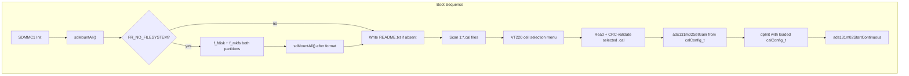

# Phase 10b -- Dual-Partition SD, Binary Calibration Files, and Cell Selection

**Prerequisite:** Phase 10 must be fully closed before implementation begins. This phase modifies `calibration.h/.c`, `data_processing.c`, `debug_ui.c`, `main.c`, `adc_ads131m02.c/.h`, `ffconf.h`, `fatfs.c`, `sd_diskio.c`, and creates new files. No Phase 10 design decisions are altered -- only extended.

## Architecture



## 1. FatFS Multi-Partition Configuration

### Changes to [Middlewares/Third_Party/FatFs/src/ffconf.h](Middlewares/Third_Party/FatFs/src/ffconf.h)

- `FF_MULTI_PARTITION` : `0` --> `1`
- `FF_VOLUMES` : `1` --> `2`

### Changes to [FATFS/App/fatfs.c](FATFS/App/fatfs.c)

Add the `VolToPart[]` mapping required by `FF_MULTI_PARTITION`:

```c
PARTITION VolToPart[FF_VOLUMES] = {
    {0, 1},   /* "0:" → physical drive 0, partition 1 (LOGGER) */
    {0, 2},   /* "1:" → physical drive 0, partition 2 (SYSCAL) */
};
```

Add second FATFS object and path:

```c
FATFS SysCalFatFS;
char  SysCalPath[] = "1:/";
```

**`MX_FATFS_Init()` must not mount any volume.** It initialises the FatFS objects and disk layer only — **remove all `f_mount` calls** from `MX_FATFS_Init()` (CubeMX USER CODE if present).

Add a single custom function to `fatfs.c`:

```c
FRESULT sdMountAll(void);
```

**`sdMountAll()`** performs in order:

1. `f_mount(&FatFS, "0:", 1)`
2. `f_mount(&SysCalFatFS, "1:", 1)`
3. If **either** returns **`FR_NO_FILESYSTEM`**, return **`FR_NO_FILESYSTEM`** to the caller.
4. On both mounts succeeding, return **`FR_OK`**.

**`main.c`** calls **`sdMountAll()`** inside the first-boot detection block. That block calls **`sdMountAll()`** and branches on **`FR_NO_FILESYSTEM`**: if so, run **`f_fdisk`**, **`f_mkfs`** (both partitions), volume labels, then call **`sdMountAll()`** again to mount the freshly created volumes. After format, only **`sdMountAll()`** performs mounts — eliminates double-mount and partial-format ambiguity.

**Ordering note:** Invoke **`sdMountAll()`** after SDMMC/media ready and after **`MX_FATFS_Init()`** has run (objects initialised, no mounts yet).

Declare **`FRESULT sdMountAll(void);`** in **`FATFS/App/fatfs.h`** (USER CODE) so **`main.c`** can call it.

### Changes to [FATFS/Target/sd_diskio.c](FATFS/Target/sd_diskio.c)

No changes needed. The `disk_*` functions receive `pdrv == 0` for the physical drive regardless of logical volume. FatFS maps logical volumes to physical drives + partition numbers internally via `VolToPart[]`.

## 2. First-Boot Auto-Format

### FatFS version gate (`f_fdisk` and `f_mkfs` — same `ff.c` string, one check)

1. Open `Middlewares/Third_Party/FatFs/src/ff.c` and read the version string at the top **once**. Use it for **both** `f_fdisk` partition sizing **and** the `f_mkfs` API variant.
2. **`f_fdisk`:** If the version is **R0.15 or later**, `sizes[] = {50, 50, 0, 0}` (percentage). If **earlier than R0.15**, use explicit sector counts:

```c
/* 64 GB card ≈ 125,829,120 sectors × 512 B. Split 50/50. */
const LBA_t sizes[] = {62914560, 62914560, 0, 0};
```

3. **`f_mkfs` API gate** (apply the **same** version check — do not assume one branch for fdisk and another for mkfs without verifying):

   - **R0.14b and earlier** (5-argument form):

```c
f_mkfs("0:", FM_FAT32, 0, fmtWork, sizeof(fmtWork));
f_mkfs("1:", FM_FAT32, 0, fmtWork, sizeof(fmtWork));
```

   - **R0.15 and later** (4-argument form, `MKFS_PARM` struct):

```c
const MKFS_PARM mp = {FM_FAT32, 0, 0, 0, 0};
f_mkfs("0:", &mp, fmtWork, sizeof(fmtWork));
f_mkfs("1:", &mp, fmtWork, sizeof(fmtWork));
```

4. Record the **confirmed FatFS version** in a code comment **beside the `f_fdisk` call** and **beside the `f_mkfs` call(s)** (same version string referenced in both places).

Detect whether the SD card has the expected dual-partition layout:

```c
/* First-boot: sdMountAll() — if FR_NO_FILESYSTEM, f_fdisk + f_mkfs then sdMountAll() again.
 * Use static BYTE fmtWork[4096] for f_fdisk/f_mkfs. */
```

**First-boot / format sequence** (all main-loop context, UART progress output):

1. `fr = sdMountAll();`
2. If **`fr == FR_OK`**: both volumes mounted — **skip** steps 3–6 (no format).
3. If **`fr == FR_NO_FILESYSTEM`**: run partition creation and format:
   - `f_fdisk(0, sizes, fmtWork)` — use `sizes[]` per **`f_fdisk`** branch in **FatFS version gate** above.
   - `f_mkfs` for `"0:"` and `"1:"` using the **`f_mkfs` API branch** (5-arg vs `MKFS_PARM` 4-arg) from the **same** `ff.c` version check.
   - `f_setlabel("0:LOGGER")` and `f_setlabel("1:SYSCAL")`
   - `sdMountAll()` again to mount the freshly created volumes
   - `printf("[SD] format complete: LOGGER + SYSCAL\r\n")`
4. If **`fr`** is another error (not `FR_OK` / not `FR_NO_FILESYSTEM`), handle as fault per project policy (do not format blindly).

**Work buffer:** file-scope static only — never stack:

```c
static BYTE fmtWork[4096];
```

Use `fmtWork` for every `f_fdisk` / `f_mkfs` call in the first-boot format sequence.

**README.txt** on partition 1 (created if absent on every boot):

```
This SD card is used by the H562 Parachute Datalogger.
Data files appear here automatically after each logging session.
Do not modify or delete any files on this card.
If the card stops working, contact your equipment provider.
```

Written via `f_open("0:README.txt", FA_CREATE_NEW | FA_WRITE)` -- `FA_CREATE_NEW` fails silently if file already exists.

## 3. Binary Calibration File Format (.cal)

Location: `1:<serialNumber>.cal` (e.g. `1:10326.cal`)

### Packed struct: `calFile_t` (64 bytes)

```
Offset  Field               Type        Bytes
------  ------------------  ----------  -----
 0      magic               uint32_t    4       0x43414C31 ('CAL1')
 4      serialNumber        uint32_t    4
 8      version             uint16_t    2       (1)
10      pad                 uint8_t[2]  2       alignment padding, write 0x0000
12      sensitivityUvPerN   float       4
16      adcGainCh1          float       4
20      adcGainCh2          float       4
24      offsetCh1           float       4
28      offsetCh2           float       4
32      tareOffsetN         float       4       (always 0.0 in file)
36      battDividerRatio    float       4
40      preallocMb          float       4
44      enableAdcCrc        float       4
48      allowLogOnUsb       float       4
52      cellCorrFactor      float       4
56      reserved            uint8_t[6]  6       (zero-filled)
62      crc16               uint16_t    2       CRC16-CCITT of bytes 0..61 (includes pad)
------                                  ----
Total                                   64
```

All calConfig_t fields are serialised as `float` in declaration order, regardless of their in-memory type. The firmware deserialiser reads each float and casts to the target type. `tareOffsetN` is always 0.0 in the file (runtime-only via tare button).

### New define and struct in [Core/Inc/calibration.h](Core/Inc/calibration.h)

```c
#define CAL_FILE_MAGIC  0x43414C31UL  /* 'CAL1' */
#define CAL_FILE_VER    1

typedef struct __attribute__((packed)) {
    uint32_t magic;               /* offset  0 */
    uint32_t serialNumber;        /* offset  4 */
    uint16_t version;             /* offset  8 */
    uint8_t  pad[2];              /* offset 10 — alignment padding, write as 0x0000 */
    float    sensitivityUvPerN;   /* offset 12 */
    float    adcGainCh1;          /* offset 16 */
    float    adcGainCh2;          /* offset 20 */
    float    offsetCh1;           /* offset 24 */
    float    offsetCh2;           /* offset 28 */
    float    tareOffsetN;         /* offset 32 */
    float    battDividerRatio;    /* offset 36 */
    float    preallocMb;          /* offset 40 */
    float    enableAdcCrc;        /* offset 44 */
    float    allowLogOnUsb;       /* offset 48 */
    float    cellCorrFactor;      /* offset 52 */
    uint8_t  reserved[6];         /* offset 56 — zero-filled */
    uint16_t crc16;               /* offset 62 */
} calFile_t;  /* 64 bytes */
```

### New field in `calConfig_t`

Add after `allowLogOnUsb`:

```c
float    cellCorrFactor;   /**< Per-cell sensitivity correction (default 1.0) */
```

Update hardcoded defaults: `.cellCorrFactor = 1.0f`.

### Gain fields in `calConfig_t` (float)

Declare both as **`float`** (not `uint8_t`):

```c
float adcGainCh1;   /**< ADS131M02 CH0 gain: 1/2/4/8/16/32/128 stored as float */
float adcGainCh2;   /**< ADS131M02 CH1 gain: always 1.0f */
```

Defaults: `adcGainCh1 = 1.0f`, `adcGainCh2 = 1.0f`. Factory `.cal` files and `write_cal.py` store them as floats in `calFile_t` as already specified.

### New field: active serial number

```c
static uint32_t g_calSerial;  /* selected cell serial, 0 = none */
uint32_t calibrationGetSerial(void);
```

### Public API (calibration module)

```c
void calScanFiles(void);
void calibrationGetEntries(const calEntry_t **entries, uint8_t *count);
```

### Public API (debug UI)

Declare in [Core/Inc/debug_ui.h](Core/Inc/debug_ui.h):

```c
uint32_t calSelectViaUi(void);
```

## 4. Rewritten `calibrationLoad()`

The existing config.txt text parser (`parseBuffer`, `applyKeyValue`, `trimWhitespace`, `skipBom`) is **deleted entirely**. Replaced by binary .cal file reader:

```c
int calibrationLoadFromCal(uint32_t serialNumber);
```

**Logic:**

1. Build path: `snprintf(path, sizeof(path), "1:%lu.cal", (unsigned long)serialNumber)`
2. `f_open` + `f_read` 64 bytes into a stack `calFile_t`
3. Validate `magic == CAL_FILE_MAGIC`
4. Validate `version == CAL_FILE_VER`
5. Compute CRC16 over bytes **0..61 inclusive** (covers the 2-byte `pad` at offsets 10–11), compare with `.crc16`
6. On any failure: return error code, do NOT fall back to defaults. Print specific fault to UART.
7. On success: deserialise floats into `g_cal` with appropriate casts, store serial number, set `g_calSource = CAL_SRC_SD_FILE`. Print each value.

The old `calibrationLoad(void)` signature is kept but its body becomes: orchestration only — **`main.c`** calls **`calScanFiles()`**, **`calSelectViaUi()`** (in `debug_ui.c`), then **`calibrationLoadFromCal(selectedSerial)`**. The original text parser code is removed.

**Failure behavior:** On CRC failure, missing file, or no selection -- set `g_calSource = CAL_SRC_DEFAULT` but **do not start acquisition**. Set app state to `STATE_ERROR`, trigger LED fault pattern via `ledStatusSetSys(LED_SYS_FAULT)`, print to UART, and show error on VT220 panel. The main loop continues running (USB, UART, LEDs) but `ads131m02StartContinuous()` is never called.

## 5. Force Formula Update

### Hardware constant in `data_processing.h`

Add to `Core/Inc/data_processing.h`:

```c
/**
 * @brief CH1 excitation-sense voltage divider ratio.
 * @details The AFE uses a 100 kΩ (R3) / 33 kΩ (R6) divider on the CH1 path.
 *          AIN1_P sees 3.3 V × (33/133) = 0.819 V at full excitation, within
 *          the ADS131M02 ±1.2 V input range at gain = 1.
 *          This is a fixed hardware constant — not a calibration parameter.
 */
#define CH1_DIV_RATIO  (33.0f / 133.0f)
```

### Derivation from first principles

**Physical setup:**

A Wheatstone bridge load cell is excited by `V_exc = 3.3 V`. The bridge produces a differential output proportional to applied force:

```
V_bridge = F × sensitivity                     ... (1)
```

where `sensitivity` is in µV/N (from the load cell datasheet / calibration certificate). Per-cell manufacturing variation is captured by `cellCorrFactor` (dimensionless, ~1.0), so the effective sensitivity is:

```
sensitivity_eff = sensitivity × cellCorrFactor  ... (2)
```

**What the ADC sees:**

- **CH0** (bridge sense): measures `V_bridge` directly (differential across the bridge).
- **CH1** (excitation sense): does **not** see `V_exc` directly. The AFE includes a 100 kΩ (R3) / 33 kΩ (R6) resistor divider, so AIN1_P sees:

```
V_ch1_actual = V_exc × R6 / (R3 + R6)
             = 3.3 V × 33 / 133
             = 3.3 V × CH1_DIV_RATIO
             ≈ 0.819 V                         ... (3)
```

**Ratiometric measurement:**

The ADS131M02 samples both channels simultaneously. After 128-sample boxcar accumulation (both channels summed identically), the ratio cancels gain, offset drift, and supply noise:

```
accCh0_128 / accCh1_128 ≈ V_bridge / V_ch1_actual
                        = V_bridge / (V_exc × CH1_DIV_RATIO)   ... (4)
```

**Solving for force:**

From (1): `F = V_bridge / sensitivity_eff`

Substituting (2) and rearranging (4) to get `V_bridge`:

```
V_bridge = (accCh0_128 / accCh1_128) × V_exc × CH1_DIV_RATIO  ... (5)
```

Therefore:

```
F = V_bridge / sensitivity_eff
  = (accCh0_128 / accCh1_128) × V_exc × CH1_DIV_RATIO / (sensitivity × cellCorrFactor)
```

Sensitivity is given in µV/N, so multiply by 1e6 to convert V to µV (or equivalently, divide sensitivity by 1e6 to get V/N):

```
F = (accCh0_128 / accCh1_128) × V_exc × CH1_DIV_RATIO × 1e6 / (sensitivity_µV_per_N × cellCorrFactor)
```

Subtract runtime tare offset:

```
forceN = (accCh0_128 / accCh1_128)
       × (V_exc × CH1_DIV_RATIO × 1e6 / (sensitivity_µV_per_N × cellCorrFactor))
       − tareOffsetN                                                    ... (6)
```

**Substituting constants:**

| Symbol | Value | Source |
|--------|-------|--------|
| `V_exc` | 3.3 V | Board supply rail |
| `CH1_DIV_RATIO` | 33 / 133 = 0.24812 | R6/(R3+R6) from AFE schematic |
| `sensitivity_µV_per_N` | 0.220919 µV/N | Load cell calibration certificate |
| `cellCorrFactor` | 0.973379 (SN 10326) | Per-cell factory calibration |

```
multiplier = 3.3 × (33/133) × 1e6 / (0.220919 × 0.973379)
           = 3.3 × 0.24812 × 1e6 / 0.21503
           = 818,797.5 / 0.21503
           ≈ 3,808,000
```

### Implementation in `data_processing.c`

In [Core/Src/data_processing.c](Core/Src/data_processing.c), the ratiometric formula changes from:

```c
rec.forceN = ((float)accCh0_128 / (float)accCh1_128)
             * (3.3f / pCal->sensitivityUvPerN) * 1e6f
             - pCal->tareOffsetN;
```

to:

```c
rec.forceN = ((float)accCh0_128 / (float)accCh1_128)
             * (3.3f * CH1_DIV_RATIO * 1e6f / (pCal->sensitivityUvPerN * pCal->cellCorrFactor))
             - pCal->tareOffsetN;
```

Each code term maps to the derivation:

| Code term | Derivation term | Equation |
|-----------|-----------------|----------|
| `(float)accCh0_128 / (float)accCh1_128` | `V_bridge / V_ch1_actual` | (4) |
| `3.3f` | `V_exc` | Board supply |
| `CH1_DIV_RATIO` | `R6 / (R3 + R6)` | (3) |
| `1e6f` | µV → V unit conversion | |
| `pCal->sensitivityUvPerN` | `sensitivity` in µV/N | (1) |
| `pCal->cellCorrFactor` | Per-cell correction | (2) |
| `pCal->tareOffsetN` | Runtime zero offset | (6) |

Two extra float multiplies vs. previous formula — no ISR timing impact.

## 5a. `ads131m02SetGain()` (gain not applied in `ads131m02Init()`)

Add to [Core/Inc/adc_ads131m02.h](Core/Inc/adc_ads131m02.h) and [Core/Src/adc_ads131m02.c](Core/Src/adc_ads131m02.c):

```c
void ads131m02SetGain(float ch0Gain, float ch1Gain);
```

Implementation writes the ADS131M02 gain register via SPI. **`ads131m02Init()`** must initialise the device with **gain = 1 on both channels** as a safe default and **must not** read `calConfig_t` or apply factory gains.

Inside **`ads131m02SetGain`**, cast explicitly before writing the hardware register (compiler-warning-free, explicit float→integer conversion):

```c
uint8_t g0 = (uint8_t)ch0Gain;
uint8_t g1 = (uint8_t)ch1Gain;
```

After `calibrationLoadFromCal()` succeeds, the boot sequence calls:

```c
ads131m02SetGain(calibrationGet()->adcGainCh1, calibrationGet()->adcGainCh2);
```

**before** `dpInit(calibrationGet())` and **before** `ads131m02StartContinuous()`.

## 5b. ADS131M02 CH0 Gain Selection DOE

### Background

CH1 (excitation sense) **must remain at gain = 1**. AIN1_P sees 0.819 V at 3.3 V excitation — already 68 % of the ±1.2 V full-scale. Any higher gain clips CH1.

CH0 (bridge sense) gain is determined by this one-time factory DOE. The ADS131M02 supports gains: 1, 2, 4, 8, 16, 32, 128 (no 64).

At 2000 kg FS, bridge output ≈ 2.166 µV/kg × 2000 kg = 4.33 mV differential:
- At gain = 128: 4.33 mV × 128 = 554 mV — 46 % of ±1200 mV full-scale, no clipping
- At gain = 32: 4.33 mV × 32 = 139 mV — 11.5 % of full-scale

### Test procedure

Test conditions:
- Apply loads at 0, 250, 500, 1000, 1500, 2000 kg (loading and unloading)
- Record 500 consecutive force records at each load point (1 second at 500 Hz)
- Repeat at CH0 gains: 1, 2, 4, 8, 16, 32, 128

Metrics to capture at each gain/load combination:
- Mean forceN
- RMS noise (σ of 500 samples)
- Peak-to-peak noise
- SNR (mean / RMS noise)
- Linearity R² across full load range
- Maximum residual from linear fit (kg)

### Pass criteria

- No clipping at any load point (check raw `accCh0_128` is not rail-stuck at ±2^23)
- RMS noise < 0.1 % FS (< 2 kg equivalent)
- R² > 0.9999
- Maximum residual < 5 kg across full range

### Outcome

The lowest gain meeting all pass criteria is the production gain. If gain = 128 is required to meet noise criteria, use gain = 128. `adcGainCh1` in `calConfig_t` stores the selected CH0 gain as **`float`**. `adcGainCh2` is **`1.0f`** (CH1 fixed at gain 1).

The DOE is run once at the factory during initial calibration. The result is written into the `.cal` file by `Tools/write_cal.py`. **When and how firmware applies gain:** see Section 5a (`ads131m02SetGain` after successful cal load; `ads131m02Init()` stays at gain 1/1). Gain is not adjustable at runtime after boot.

## 6. Boot-Time Cell Selection Menu

### Module ownership

**[Core/Src/calibration.c](Core/Src/calibration.c)** owns:

- **`void calScanFiles(void)`** — after **`1:`** is mounted, scan **`1:*.cal`** with `f_findfirst` / `f_findnext` (requires `FF_USE_FIND == 1` in `ffconf.h`). Populates module-static **`g_calEntries[CAL_MAX_CELLS]`** and **`g_calEntryCount`**.
- **`void calibrationGetEntries(const calEntry_t **entries, uint8_t *count)`** — exposes the scan result **read-only** to other modules (sets `*entries` / `*count`; no direct access to `g_calEntries` from outside **`calibration.c`**).

```c
#define CAL_MAX_CELLS  8
typedef struct {
    uint32_t serial;
    char     filename[16];
} calEntry_t;
/* g_calEntries, g_calEntryCount: static in calibration.c only */
```

**[Core/Src/debug_ui.c](Core/Src/debug_ui.c)** owns:

- **`uint32_t calSelectViaUi(void)`** — calls **`calibrationGetEntries()`** to build the VT220 menu, **blocks** until a valid digit key, **`HAL_IWDG_Refresh(&hiwdg)`** in the polling loop (as already specified), returns the **selected serial number** as the **function return value** (not via a shared global with **`calibration.c`**).

**No shared globals** between **`calibration.c`** and **`debug_ui.c`** beyond the getter API.

If exactly **one** `.cal` file is found, **`calSelectViaUi()`** may auto-return that serial without drawing a menu (same module policy as before). If **zero** files, return `0` or a sentinel and let **`calibrationLoadFromCal`** / fault path handle it (document in code).

### VT220 menu rendering

Repurpose the scrolling log region (rows 25-53) or overlay a modal block below the panel. Draw a simple numbered list:

```
  === SELECT LOAD CELL ===
  [1] SN 10326
  [2] SN 10426
  [3] SN 10526
  [4] SN 10626

  Press 1-4 to select:
```

### Input handling

Implement selection inside **`calSelectViaUi()`** in **`debug_ui.c`** (blocking until valid digit or auto-select single cell):

- Accept digit keys `'1'` through `'8'` mapping to the scanned list from **`calibrationGetEntries()`**
- On valid selection: return **`uint32_t` serial**; **`main.c`** then calls **`calibrationLoadFromCal(serial)`** — do not load `.cal` inside **`debug_ui.c`**
- On invalid key: ignore, wait for valid input
- Timeout: none (wait indefinitely -- the device cannot operate without calibration)
- Inside the **`calSelectViaUi()`** polling loop, call **`HAL_IWDG_Refresh(&hiwdg);`** each iteration. If IWDG is confirmed disabled in the project `.ioc`, this is effectively a no-op but **must remain** so a future hardware revision that enables IWDG does not reset during long cell selection.

### Integration with existing UI

- `uiSetCalSource()` already exists and accepts a string. After selection, call with e.g. `"SN:10326"` to show the active cell on the panel title row (row 21: `Cal: SN:10326`).
- No changes to the panel layout or row numbering.
- The selection menu is drawn BEFORE `uiDrawPanel()` in the boot sequence. Once selection completes, the normal panel is drawn and operation begins.

### Boot sequence change in [Core/Src/main.c](Core/Src/main.c)

In **`USER CODE BEGIN Includes`**, add:

```c
#include <stdbool.h>
```

Required for **`bool`**, **`true`**, **`false`** used by the **`calLoaded`** flag — do not rely on compiler or HAL headers pulling this in implicitly.

Current order (after SD mount):

```
calibrationLoad();
dpInit(calibrationGet());
uiSetCalSource(...);
...
ads131m02StartContinuous();
uiDrawPanel();
```

New order (first-boot / **`sdMountAll`**, README, cell scan/select, load `.cal`, then gated acquisition):

```
/* After MX_FATFS_Init() — no mounts there */
/* First-boot block: sdMountAll(); if FR_NO_FILESYSTEM → f_fdisk + f_mkfs + labels → sdMountAll(); */

writeReadmeIfAbsent();

/* Scan + select + load .cal */
calScanFiles();
uint32_t selectedSerial = calSelectViaUi();   /* blocks; HAL_IWDG_Refresh in poll loop */
calibrationLoadFromCal(selectedSerial);
```

**Fault path and main loop — no `goto mainLoop`:** use a boolean flag. `ads131m02SetGain`, `dpInit`, and `ads131m02StartContinuous` run **only** after a successful load (`CAL_SRC_SD_FILE`).

```c
bool calLoaded = false;

if (calibrationGetSource() == CAL_SRC_SD_FILE) {
    ads131m02SetGain(calibrationGet()->adcGainCh1, calibrationGet()->adcGainCh2);
    dpInit(calibrationGet());
    ads131m02StartContinuous();
    calLoaded = true;
} else {
    uiSetState("FAULT");
    ledStatusSetSys(LED_SYS_FAULT);
    printf("[CAL] FAULT: no valid cal loaded, acquisition halted\r\n");
}

while (1) {
    if (calLoaded) {
        /* pending record drain, force UI update, decimation diagnostic */
    }
    /* UI, LEDs, UART always execute regardless of calLoaded */
}
```

`calibrationLoadFromCal(selectedSerial)` must set `CAL_SRC_SD_FILE` only on success; on failure leave source non-SD so the `else` branch runs. `uiDrawPanel()` and other non-acquisition UI run in all cases inside the loop.

## 7. Binary Log Files on Partition 2

All binary log files go to `1:` (SYSCAL partition):

- Naming: `1:LOG_<bootSeconds>.bin` where `<bootSeconds>` is `HAL_GetTick()/1000` at session start, zero-padded to 10 digits.
- Pre-allocation: `f_lseek(&fil, preallocMb * 1024 * 1024)` then `f_lseek(&fil, 0)` per existing Phase 11 plan.
- File header: `binFileHeader_t` (64 B) written once at session start. Add `serialNumber` and `cellCorrFactor` to `binFileHeader_t.reserved` or extend it in a compatible way (version bump to 2).

### CSV export interface (defined, not implemented)

CSV files are written to `0:` (LOGGER partition) for user retrieval. Interface contract for a later phase:

```c
/* csv_export.h — interface only, not implemented in this phase */
int csvExportOpen(uint32_t sessionId);       /* creates 0:LOG_<id>.csv */
int csvExportWriteLine(const char *line, uint8_t len);
int csvExportClose(void);
```

Naming: `0:LOG_<bootSeconds>.csv` matching the binary file.

### Phase 11 ring buffer interface contract

Phase 11 will implement a 256 KB lock-free ring buffer. Interface this phase defines:

```c
/* ring_buffer.h — interface contract for Phase 11 */
int  ringInit(void);
int  ringPush(const void *data, uint16_t len);  /* ISR-safe producer */
int  ringDrain(uint8_t *dst, uint16_t maxLen);   /* main-loop consumer */
uint32_t ringGetOverflowCount(void);
uint32_t ringGetLevel(void);                     /* bytes pending */
```

The existing `g_dpPendingAdcRecord` / `g_dpPendingForceRecord` flags and `g_dpStagedAdc` / `g_dpStagedForce` staging areas remain as the handoff mechanism. Phase 11 replaces the flag-polling in main.c with `ringPush()` calls.

## 8. Python Factory Tool

### [Tools/write_cal.py](Tools/write_cal.py) (new file)

CLI usage:

```bash
python write_cal.py --serial 10326 \
    --sensitivity 0.220919 \
    --cellCorrFactor 0.973379 \
    --output 10326.cal
```

All other fields use defaults matching the firmware (gains=1.0, offsets=0.0, tare=0.0, battDiv=0.5, prealloc=64, adcCrc=0, logUsb=1). Optional CLI overrides for each.

Script structure:

- `struct.pack` with format **`<IIH2x11f6sH`**: little-endian `uint32` magic, `uint32` serial, `uint16` version, **2 pad bytes** (`2x` = zero), 11 floats, **6 reserved bytes** (`6s`), `uint16` CRC. Replaces the older `<IIH11f8sH` layout.
- Pack `pad` as `b'\x00\x00'`. CRC16-CCITT is computed over bytes **0..61 inclusive** (same as firmware: includes pad and all fields before `crc16`).
- CRC16-CCITT: poly 0x1021, init 0xFFFF, no final XOR -- identical to firmware `crc16Ccitt()`
- Assert output is exactly 64 bytes
- Print hex dump and field summary to stdout for verification

Provide a companion `Tools/gen_all_cals.sh` (or `.bat`) that calls `write_cal.py` four times with the factory values from the spec:

| SN | sensitivityUvPerN | cellCorrFactor |
|----|-------------------|----------------|
| 10326 | 0.220919 | 0.973379 |
| 10426 | 0.220919 | 1.018568 |
| 10526 | 0.220919 | 0.998026 |
| 10626 | 0.220919 | 1.010026 |

## 9. Files Summary

**New files:**

- `Tools/write_cal.py` -- Python factory .cal writer
- `Tools/gen_all_cals.sh` -- batch generator for all 4 cells

**Modified files:**

- `Middlewares/Third_Party/FatFs/src/ffconf.h` -- FF_MULTI_PARTITION=1, FF_VOLUMES=2, FF_USE_FIND=1
- `FATFS/App/fatfs.c` -- VolToPart[], `SysCalFatFS`, **`sdMountAll()`**; **`MX_FATFS_Init()`** — no `f_mount`
- `Core/Inc/calibration.h` -- `calFile_t`, `float` `adcGainCh1`/`adcGainCh2` in `calConfig_t`, `calibrationLoadFromCal`, `calibrationGetSerial`, **`calScanFiles`**, **`calibrationGetEntries`**, `calEntry_t`
- `Core/Src/calibration.c` -- binary .cal reader; **`calScanFiles`** + static `g_calEntries`; no scan globals exposed except via **`calibrationGetEntries`**
- `Core/Inc/data_processing.h` -- add CH1_DIV_RATIO hardware constant
- `Core/Src/data_processing.c` -- update force formula with CH1_DIV_RATIO and cellCorrFactor
- `Core/Inc/log_record.h` -- add serialNumber/cellCorrFactor to binFileHeader_t (or version bump)
- `Core/Src/adc_ads131m02.c` / `Core/Inc/adc_ads131m02.h` -- add `ads131m02SetGain()`; keep `ads131m02Init()` at gain 1/1 default only
- `Core/Inc/debug_ui.h` / `Core/Src/debug_ui.c` -- **`uint32_t calSelectViaUi(void)`** — menu + digit loop, **`HAL_IWDG_Refresh`**
- `Core/Src/main.c` -- **`#include <stdbool.h>`**; first-boot + **`sdMountAll`**; **`calScanFiles` / `calSelectViaUi` / `calibrationLoadFromCal`**, `calLoaded` fault gate (no `goto mainLoop`), call order per Section 6

## 10. Verification Checklist

- FatFS version: confirmed from `ff.c` header **once**; `f_fdisk` `sizes[]` matches R0.15+ percentage vs pre-R0.15 explicit LBA; **`f_mkfs`** uses matching API (5-arg R0.14b vs `MKFS_PARM` R0.15+); version noted in comment beside **`f_fdisk`** and **`f_mkfs`**
- **`MX_FATFS_Init()`**: no volume mounts; **`sdMountAll()`** is the only mount path; first-boot: **`sdMountAll` → format if `FR_NO_FILESYSTEM` → `sdMountAll` again**
- Format work buffer: `static BYTE fmtWork[4096]` file scope — not stack
- Partition detection: fresh SD card triggers auto-format; pre-formatted card mounts directly
- First-boot format: both partitions created, volume labels set, UART prints progress
- README.txt: created on first boot, not overwritten on subsequent boots
- .cal CRC validation: valid file loads correctly; file with flipped bit is rejected with UART error
- calConfig_t loading: all 11 fields (including cellCorrFactor) match the .cal file values; printf confirms each
- Force formula: with SN 10326 cal loaded, `3.3 * (33/133) * 1e6 / (0.220919 * 0.973379) ≈ 3,808,000` multiplier produces correct N
- CH1_DIV_RATIO: defined in `data_processing.h` as `(33.0f / 133.0f)`, not in calConfig_t or .cal files
- CH1 gain fixed at 1; `adcGainCh2 = 1.0f` in `calConfig_t` / `.cal` files
- CH0/CH1 gains: `ads131m02SetGain(float,float)` with explicit `(uint8_t)` cast inside driver; **`calConfig_t.adcGainCh1` / `adcGainCh2` are `float`**
- CH0 gain applied via `ads131m02SetGain(calibrationGet()->adcGainCh1, calibrationGet()->adcGainCh2)` after successful `calibrationLoadFromCal()` — **not** inside `ads131m02Init()`; verify via register readback or UART print
- Gain DOE pass criteria: no clipping, RMS noise < 0.1 % FS, R² > 0.9999, max residual < 5 kg
- Log file creation: binary log created on partition 2 with correct path
- UI cell selection: **`calScanFiles`** + **`calSelectViaUi()`** return serial; menu on boot; **`HAL_IWDG_Refresh`** in **`calSelectViaUi()`** poll loop; no cross-module scan globals except **`calibrationGetEntries`**
- Fault path: boot with no .cal files on card -> FAULT state, no ADC streaming, LED fault pattern; **`calLoaded` flag** — no `goto mainLoop`; main loop always runs UI/LEDs/UART
- `ads131m02Init()` leaves gain 1/1; `ads131m02SetGain` only after successful `calibrationLoadFromCal()`
- Multiple boots: cell selection required each time (not persisted)
