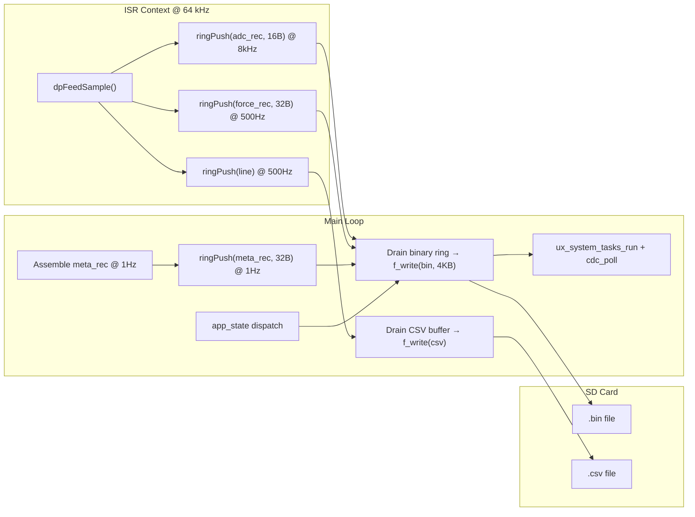

# Phase 11 — Dual-File Logging Pipeline

**Reference:** [Master plan Phase 11](/.cursor/plans/snazzy-petting-mountain.md) (line 989)

## Current State

- **Phase 10** delivers: `bin_adc_record_t` at 8 kHz, `bin_force_record_t` at 500 Hz, CSV lines at 500 Hz, and `binMetaRecord_t` from main loop — all as pending staging variables
- **FatFS** operational with DMA-based SD writes, proven at 250 KB/s ceiling (Phase 4 ✅)
- **SD benchmark:** 2 KB flush chunks give 46 ms worst-case write latency, 325 KB/s throughput at 25 MHz SDMMC
- **RAM budget:** 640 KB total, ~100 KB current use → 256 KB ring buffer leaves ~280 KB headroom
- **NeoPixel:** TIM2 CH1 configured in IOC, `MX_TIM2_Init()` exists but is commented out in `main.c`
- **logStart button:** PC4 / EXTI4 configured in IOC, EXTI4 NVIC priority already set to 8
- **No `circular_buffer.c/.h`** exists
- **No `sdmmc_fatfs.c/.h`** exists
- **`app_state.c/.h`** is a minimal stub from Phase 9 — needs full state machine

## Architecture



### Throughput Budget

| Stream | Rate | Record Size | Throughput |
|--------|------|-------------|------------|
| Binary ADC | 8,000/s | 16 B | 128.0 KB/s |
| Binary Force+IMU | 500/s | 32 B | 16.0 KB/s |
| Binary Metadata | 1/s | 32 B | ~0 KB/s |
| CSV lines | 500/s | ~22 B | ~11 KB/s |
| **Total** | | | **~155 KB/s** |

**62% of the proven 250 KB/s SD ceiling.** ~95 KB/s margin for FAT write stalls and USB CDC overhead.

### Ring Buffer Hold Time

- Binary data rate: ~144 KB/s
- Buffer size: 256 KB
- Hold time: **~1.78 seconds** at full rate
- Worst observed SD write stall: 49 ms (Phase 4 benchmark)
- Even a 500 ms stall would only fill ~72 KB of the 256 KB buffer

## Naming Convention Compliance

This phase’s new APIs and types follow the project naming rules:

- `#define` constants and `enum` values: `UPPER_SNAKE_CASE` (e.g. `RING_BIN_SIZE`, `REC_TYPE_META`).
- `const` variables: `UPPER_SNAKE_CASE`.
- Functions: `camelCase` (e.g. `ringPush`, `sdSessionOpen`, `dpFeedSample`).
- Local variables: `camelCase`.
- Global variables: `g_` prefix + `camelCase` (e.g. `g_binRing`, `g_csvRing`, `secondsSinceStart`).
- Struct / typedef names: `camelCase_t` (e.g. `ringBuf_t`, `sdSession_t`, `binMetaRecord_t`, `calConfig_t`, `binFileHeader_t`).
- Struct members: `camelCase` (e.g. `sdSession_t.binFile`, `binMetaRecord_t.secondNum`).
- Module prefix: lowercase on file names (e.g. `circular_buffer`, `sdmmc_fatfs`).
- **Do not rename** HAL / CubeMX identifiers (`hspi1`, `HAL_GPIO_ReadPin`, `FIL`, `f_open`, etc.).

New public headers should include a Doxygen `@file` block (see the `circular_buffer.h` snippet in implementation step 1).

## Implementation Steps

### 1. Create `Core/Src/circular_buffer.c` / `Core/Inc/circular_buffer.h`

**Design: Lock-free Single-Producer Single-Consumer (SPSC) ring buffer.**

```c
/**
 * @file    circular_buffer.h
 * @brief   Lock-free SPSC ring buffers for ISR-to-main SD logging.
 * @details Defines binary and CSV ring buffers, push/drain API for ADC/force/CSV paths and FatFS flush; consumed by main loop and ISR via dpFeedSample.
 * @author  Madhu
 * @date    2026-04-12
 */
#define RING_BIN_SIZE  (256U * 1024U)  /* 256 KB, power of 2 */
#define RING_BIN_MASK  (RING_BIN_SIZE - 1)

typedef struct {
    uint8_t  buf[RING_BIN_SIZE];
    volatile uint32_t head;       /* Written by ISR (producer) */
    volatile uint32_t tail;       /* Written by main loop (consumer) */
    volatile uint32_t overflow;   /* Incremented by ISR on full */
} ringBuf_t;
```

**Public API:**
```c
void     ringInit(ringBuf_t *rb);
uint32_t ringPush(ringBuf_t *rb, const void *data, uint32_t len);
uint32_t ringUsed(const ringBuf_t *rb);
uint32_t ringDrain(ringBuf_t *rb, uint8_t *dst, uint32_t max_len);
uint32_t ringDrainContiguous(ringBuf_t *rb, const uint8_t **ptr);
```

**Key design decisions:**
- **Power-of-2 size** for bitwise mask wrap-around (no modulo)
- **No locks** — ISR only writes `head`, main loop only writes `tail`. Memory barriers via `__DMB()` before and after pointer updates ensure visibility.
- **`ringPush()`** (ISR): copies data into buffer at `head`, advances `head`. If `RING_BIN_SIZE - ringUsed() < len`, increments `overflow` counter and **drops the record** (never blocks).
- **`ringDrain()`** (main loop): copies up to `max_len` bytes from `tail`, advances `tail`. Returns bytes copied.
- **`ringDrainContiguous()`** (main loop): returns a pointer to the contiguous readable region (up to wrap point) and its length. Avoids memcpy for `f_write()` — FatFS can write directly from the ring buffer.
- **256 KB buffer placement:** Declare as a global `static` in `circular_buffer.c`. The linker places it in main SRAM. At 640 KB SRAM, this uses 40% — acceptable.

**CSV line buffer** (separate, smaller):
```c
#define CSV_BUF_SIZE  1024U  /* 1 KB, ~46 CSV lines buffered */
#define CSV_BUF_MASK  (CSV_BUF_SIZE - 1)

static ringBuf_t g_csvRing;
```

Same SPSC ring design, 1 KB. At 500 Hz × ~22 bytes/line = 11 KB/s, this holds ~93 ms of CSV data.

### 2. Create `Core/Src/sdmmc_fatfs.c` / `Core/Inc/sdmmc_fatfs.h`

**Session lifecycle:**

```c
typedef struct {
    FIL      binFile;
    FIL      csvFile;
    uint32_t binBytesWritten;
    uint32_t csvBytesWritten;
    uint32_t sessionStartTick;
    char     binFilename[32];
    char     csvFilename[32];
    uint8_t  isOpen;
} sdSession_t;

int  sdSessionOpen(sdSession_t *s, const calConfig_t *cal);
int  sdSessionWriteBinChunk(sdSession_t *s, const uint8_t *data, uint32_t len);
int  sdSessionWriteCsvChunk(sdSession_t *s, const uint8_t *data, uint32_t len);
int  sdSessionClose(sdSession_t *s);
```

**`sdSessionOpen()`:**
1. Generate filename from RTC: `LOG_YYMMDD_HHMMSS.bin` / `.csv`
2. `f_open()` both files with `FA_CREATE_ALWAYS | FA_WRITE`
3. Pre-allocate binary file: `f_lseek(&binFile, prealloc_mb * 1024 * 1024); f_lseek(&binFile, 0);`
4. Pre-allocate CSV file: `f_lseek(&csvFile, prealloc_mb/4 * 1024 * 1024); f_lseek(&csvFile, 0);`
5. Write `binFileHeader_t` (64 bytes) to binary file
6. Write CSV header comment lines (`# CLKIN=... DAC=... SYSCLK=...`)
7. Print: `"LOG: started %s + .csv, prealloc=%luMB\r\n"`

**`sdSessionClose()`:**
1. `f_truncate()` both files to actual bytes written (releases pre-allocated space)
2. `f_close()` both files
3. Print summary: `"LOG: stopped, ADC=%lu FORCE=%lu META=%lu, %lu overflows\r\n"`

**`sdSessionWriteBinChunk()`:**
- Calls `f_write()` with the data pointer
- USB keepalive: call `ux_system_tasks_run()` between chunks if write took > 10 ms
- Track `binBytesWritten` for truncation

### 3. Expand `app_state.c` / `app_state.h`

**State machine:**
```
IDLE ──[logStart pressed]──→ LOGGING
  ↑                             │
  │    [logStart pressed]───────┘
  │    [SD error]───────────→ ERROR
  │                             │
  └────[acknowledged]───────────┘
```

**EXTI4 (logStart button) handler:**
```c
void HAL_GPIO_EXTI_Falling_Callback(uint16_t pin)
{
    if (pin == ADC_DRDY_Pin) { ads131m02DrdyIsr(); return; }
    if (pin == logStart_Pin) { appStateButtonIsr(); return; }
}
```

**Debounce:** Software debounce — ignore button presses within 300 ms of the last one. Use `HAL_GetTick()` delta.

**USB logging gate:** Check `batteryIsUsbConnected()` and `allow_log_on_usb` on IDLE→LOGGING transition. Reject with UI message if blocked.

### 4. Metadata Injection (1 Hz from main loop)

Every second during LOGGING state:
```c
binMetaRecord_t meta = {
    .type = REC_TYPE_META,
    .secondNum = secondsSinceStart,
    .clkinHz = diagClkinMeasureHz(),
    .mcuTempX10 = battGetMcuTempX10(),
    .batteryMv = (uint16_t)(batteryGetVoltage() * 1000.0f),
    .drdyTotal = stats->drdy_count,
    .missTotal = stats->miss_count,
    .overflowTotal = g_binRing.overflow,
    .adsStatus = ads131m02GetLastStatus(),
};
meta.crc16 = crc16Ccitt((uint8_t*)&meta, offsetof(binMetaRecord_t, crc16));
ringPush(&g_binRing, &meta, sizeof(meta));
```

### 5. Main Loop Flush Order

```c
/* 1. Drain binary ring buffer in 4 KB chunks */
while (ringUsed(&g_binRing) >= 4096 && session.isOpen) {
    const uint8_t *ptr;
    uint32_t avail = ringDrainContiguous(&g_binRing, &ptr);
    uint32_t chunk = (avail > 4096) ? 4096 : avail;
    sdSessionWriteBinChunk(&session, ptr, chunk);
    ringAdvanceTail(&g_binRing, chunk);
}

/* 2. Drain CSV buffer */
while (ringUsed(&g_csvRing) > 0 && session.isOpen) {
    const uint8_t *ptr;
    uint32_t avail = ringDrainContiguous(&g_csvRing, &ptr);
    sdSessionWriteCsvChunk(&session, ptr, avail);
    ringAdvanceTail(&g_csvRing, avail);
}

/* 3. USB polling */
ux_system_tasks_run();
cdc_poll();
```

### 6. NeoPixel Status

Enable `MX_TIM2_Init()` in `main.c`. Create or use existing `neopixel.c`:
- **IDLE:** Off (or slow blue breathe)
- **LOGGING:** Solid green
- **ERROR:** Solid red

NeoPixel uses TIM2 CH1 PWM + DMA, one-shot on state change only. Separate GPDMA channel, no contention with SPI1.

## Potential Blockers / Gotchas

### BLOCKER 1: 256 KB Ring Buffer SRAM Placement

**Risk:** The 256 KB ring buffer consumes 40% of the 640 KB SRAM. If the linker places it in the wrong SRAM region (e.g., SRAM3 which is only 64 KB on some H5 variants), it will overflow the section.

**Resolution:**
- STM32H562RGT has **640 KB contiguous SRAM** (SRAM1+SRAM2+SRAM3 mapped as one block at 0x20000000). No placement issues.
- Verify in the `.map` file after build: check that the `.bss` section fits within 640 KB including the ring buffer.
- **Stack/heap check:** With 256 KB ring + 16 KB heap + 8 KB stack + ~100 KB other BSS/data = ~380 KB. Leaves 260 KB free — plenty.

### BLOCKER 2: `f_write()` Blocking Duration

**Risk:** FatFS `f_write()` on FAT32 occasionally stalls for 40–50 ms during cluster allocation or FAT table updates. During a stall, the ring buffer fills at 144 KB/s. A 50 ms stall fills ~7.2 KB, well within the 256 KB buffer. But multiple back-to-back stalls could compound.

**Resolution:**
- Pre-allocate both files at session open using `f_lseek()` to the target size. This forces FAT cluster allocation upfront, eliminating mid-session FAT writes.
- After pre-allocation, `f_write()` only writes data clusters — no FAT updates until `f_close()` / `f_sync()`.
- Measure worst-case write time per chunk and report in metadata. If a write exceeds 100 ms, log a warning.
- **Fallback:** If pre-allocation fails (insufficient space), log without pre-allocation but warn the user.

### BLOCKER 3: USB Keepalive During Long SD Writes

**Risk:** If `f_write()` blocks for 40+ ms without calling `ux_system_tasks_run()`, the USB CDC may time out and de-enumerate. This was observed and solved in Phase 4 — but the solution (calling `ux_system_tasks_run` between SD ops) must be preserved.

**Resolution:**
- After each `f_write()` call, check elapsed time. If > 10 ms, call `ux_system_tasks_run()` and `cdc_poll()` before the next write.
- The flush loop already alternates: write binary chunk → write CSV chunk → USB poll. This naturally interleaves USB servicing.

### BLOCKER 4: Ring Buffer Overflow Detection vs Prevention

**Risk:** If the SD card has a severe stall (e.g., card wear-leveling, 500+ ms), the ring buffer fills and overflows. The ISR drops records silently, incrementing `overflow` counter. The binary file will have gaps in sequence numbers.

**Resolution:**
- The `overflow` counter is reported in metadata records and on the VT220 UI. The user sees it immediately.
- `decode_bin.py` (Phase 12) detects sequence number gaps and reports them.
- With 256 KB buffer and 144 KB/s data rate, the buffer holds 1.78 seconds. A stall would need to exceed this to cause overflow.
- **Mitigation:** If `ringUsed()` exceeds 75% (192 KB), set a "buffer pressure" flag and display warning on UI. This gives the user 0.4 seconds of advance warning.

### BLOCKER 5: Dual-File Write Ordering — FAT Corruption on Power Loss

**Risk:** If power is lost during logging, both files may be truncated or corrupted because `f_close()` was never called. FAT32 directory entries and FAT chain may be inconsistent.

**Resolution:**
- Call `f_sync()` periodically (every 10 seconds) on both files. This flushes the directory entry and FAT to the card, ensuring the file is recoverable up to the last sync point.
- `f_sync()` takes ~5–10 ms. At 10-second intervals, this is 0.1% overhead.
- **Trade-off:** More frequent syncs improve crash recovery but add SD write overhead. 10 seconds is a good balance.
- Post-crash: `chkdsk` or `fsck.vfat` on the SD card should recover the pre-allocated files with their data intact up to the last sync.

### GOTCHA 6: `ringDrainContiguous()` at Wrap Boundary

**Risk:** The contiguous readable region wraps around the buffer end. If `tail` is near the end and `head` has wrapped, `ringDrainContiguous()` returns only the bytes from `tail` to buffer end. The caller must call again to get the wrapped portion.

**Resolution:**
- The flush loop calls `ringDrainContiguous()` in a `while` loop. After each drain, it calls `ringAdvanceTail()`. The next iteration picks up the wrapped portion.
- **FatFS alignment:** `f_write()` accepts any buffer pointer and length. No alignment requirements beyond what the SD diskio DMA needs. The `sd_diskio.c` already handles unaligned buffers via a scratch buffer.

### GOTCHA 7: RTC Not Configured — Filename Timestamps

**Risk:** The filename format `LOG_YYMMDD_HHMMSS` requires RTC time. If RTC is not set (no battery-backed RTC, or first boot), the time defaults to 2000-01-01 00:00:00, producing `LOG_000101_000000.bin`.

**Resolution:**
- Accept default RTC time for Phase 11. The files are uniquely named by the sequence number if timestamps collide.
- Add an option to set RTC via USB CDC command (e.g., `SET_TIME 260411 142300`). This is a nice-to-have, not a blocker.
- Alternatively, use an incrementing session counter stored in Flash (e.g., `LOG_0001.bin`, `LOG_0002.bin`). But the master plan specifies timestamp format, so use it.

### GOTCHA 8: EXTI Callback Sharing Between DRDY and logStart

**Risk:** `HAL_GPIO_EXTI_Falling_Callback()` is a weak function. Phase 7 already overrides it for DRDY (EXTI2). Adding logStart (EXTI4) requires both pins to be handled in the same callback. If the callback is defined in `adc_ads131m02.c`, adding button handling there is a layering violation.

**Resolution:**
- Move the `HAL_GPIO_EXTI_Falling_Callback` to a central `isr_callbacks.c` file (or keep in `adc_ads131m02.c` with an `appStateButtonIsr()` call):
  ```c
  void HAL_GPIO_EXTI_Falling_Callback(uint16_t pin) {
      if (pin == ADC_DRDY_Pin) { ads131m02DrdyIsr(); }
      else if (pin == logStart_Pin) { appStateButtonIsr(); }
  }
  ```
- This is CubeMX-safe — it's application code in a new file, not in a CubeMX-generated file.

### GOTCHA 9: NeoPixel DMA Channel Conflict

**Risk:** NeoPixel uses TIM2 CH1 PWM + DMA. If it uses the same GPDMA channel as SPI1 (CH0/CH1), there will be a conflict.

**Resolution:**
- Check IOC: TIM2 DMA should be on a separate GPDMA channel (e.g., CH2 or CH3). Since SPI2 DMA was removed in Phase 0, CH2/CH3 may be available.
- If no DMA channel is assigned to TIM2, use a simple bitbang approach (GPIO toggle with precise timing via DWT delay). Less elegant but avoids DMA contention entirely.
- NeoPixel updates are one-shot (only on state change), so even bitbang is acceptable.

### GOTCHA 10: Session Close Must Be Atomic With State Transition

**Risk:** If the user presses logStart to stop logging, the state machine transitions to IDLE, but the ring buffer still has unwritten data. If the session is closed before draining, data is lost.

**Resolution:**
- On LOGGING→IDLE transition:
  1. Set state to `STATE_STOPPING` (new intermediate state)
  2. Stop feeding records to ring (disable decimation output)
  3. Drain remaining ring buffer to SD
  4. Write final metadata record
  5. Call `sdSessionClose()` (truncate + close)
  6. Set state to `STATE_IDLE`
- This ensures all buffered data reaches the SD card before files are closed.

## Key Files

| Action | File | CubeMX-Safe? |
|--------|------|-------------|
| **Create** | `Core/Src/circular_buffer.c` / `Core/Inc/circular_buffer.h` | Yes — new files |
| **Create** | `Core/Src/sdmmc_fatfs.c` / `Core/Inc/sdmmc_fatfs.h` | Yes — new files |
| **Create** | `Core/Src/neopixel.c` / `Core/Inc/neopixel.h` | Yes — new files |
| **Expand** | `Core/Src/app_state.c` / `Core/Inc/app_state.h` | Yes — new files |
| **Edit** | `Core/Src/data_processing.c` (replace staging flags with ringPush) | Yes — new file |
| **Edit** | `Core/Src/adc_ads131m02.c` (EXTI callback routing) | Yes — application code |
| **Edit** | `Core/Src/main.c` (USER CODE sections: flush loop, state dispatch, TIM2 enable) | Yes |
| **Edit** | `Core/Src/debug_ui.c` (log stats, overflow, written MB) | Yes — new file |

## Success Criteria (from master plan)

- [ ] `logStart` button press starts logging; green NeoPixel lights
- [ ] Two files created on SD: `LOG_YYMMDD_HHMMSS.bin` and `LOG_YYMMDD_HHMMSS.csv`
- [ ] Both files open on PC (no FAT corruption)
- [ ] Binary file starts with valid 64-byte header (magic = `LDCL`, CRC OK)
- [ ] Binary ADC record count = elapsed_seconds × 8000 ± 10
- [ ] Binary Force record count = elapsed_seconds × 500 ± 5
- [ ] Binary Metadata record count = elapsed_seconds ± 1
- [ ] CSV line count = elapsed_seconds × 500 ± 5
- [ ] Every CSV line matches format `$,<integer>,<float>,#`
- [ ] All binary records pass CRC16 check
- [ ] `overflow_count == 0` after 5-minute test
- [ ] Second `logStart` press stops logging; both files truncated and closed cleanly
- [ ] Serial terminal shows: `LOG: started LOG_260411_142300.bin + .csv, prealloc=64MB`
- [ ] Serial terminal shows: `LOG: stopped, ADC=2400000 FORCE=150000 META=300, 0 overflows`
- [ ] Logging works while USB CDC debug output is streaming simultaneously
- [ ] VT220 UI updates (force, IMU, system fields) continue during active logging
- [ ] SD throughput stays below 200 KB/s sustained (measured via write timing)
