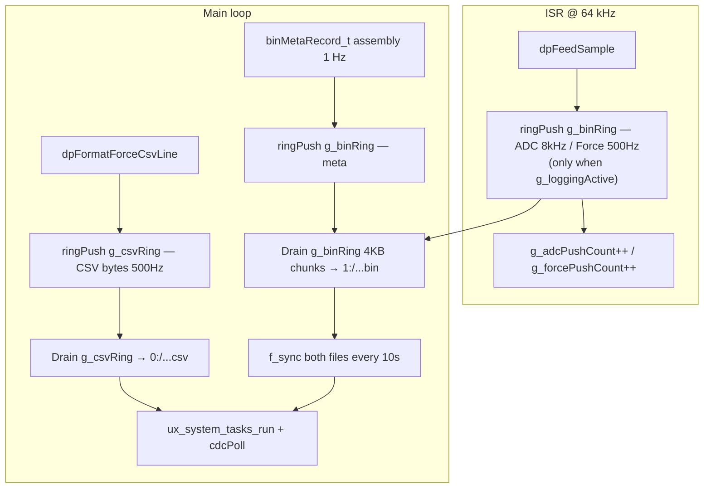

# Phase 11 Dual-File Logging — Implementation Plan

## Scope and authoritative sources

| Source | Role |
|--------|------|
| `phase_11_dual_file_logging.plan.md` | Ring buffer API, chunk sizes, flush order, gotchas (prealloc, `f_sync`, STOPPING state, EXTI layering) |
| `snazzy-petting-mountain.md` § Phase 11 | **Binary on `1:` (SYSCAL), CSV on `0:` (LOGGER)**; `preallocMb` from `calibrationGet()`; metadata fields; success criteria |
| `.cursor/rules/commenting-and-naming.mdc` | `@file` headers, public function Doxygen, naming (`camelCase`, `camelCase_t`, `g_`, `UPPER_SNAKE_CASE`); **do not rename** HAL/FatFS types (`FIL`, `f_open`, …) |
| `phase_14_doxygen_naming_pass.plan.md` | Treat new Phase 11 files as if Step 5 already applies: full headers + all public APIs documented; full naming audit of the repo waits until Phase 14 |
| `.cursor/rules/no-build.mdc` | Agent does **not** run compile/flash; after edits, **you** build in STM32CubeIDE and run hardware tests |

## Resolved deltas (do not re-open these)

1. **Dual volume paths (non-negotiable):** binary `1:/LOG_....bin`, CSV `0:/LOG_....csv`.
2. **API naming:** `camelCase` throughout — `sdSessionOpen`, `sdSessionClose`, etc.
3. **logStart EXTI edge:** `gpio.c` configures `logStart_Pin` as `GPIO_MODE_IT_RISING`. Implement `HAL_GPIO_EXTI_Rising_Callback` (not Falling). Do not copy the spec plan's "Falling" wording.
4. **NeoPixel:** `neopixel.c/.h` already exist. Extend/wire — do not create duplicate drivers. Resolve LED0 (battery, `led_status.c`) vs LED1 (logging state) priority.
5. **CRC helper:** `crc16Ccitt` is `static inline` in `log_record.h`. Use `offsetof(binMetaRecord_t, crc16)` with `<stddef.h>`.

## Architecture (data flow)



### Throughput budget

| Stream | Rate | Record size | Throughput |
|--------|------|-------------|------------|
| Binary ADC | 8,000/s | 16 B | 128.0 KB/s |
| Binary Force+IMU | 500/s | 32 B | 16.0 KB/s |
| Binary Metadata | 1/s | 32 B | ~0 KB/s |
| CSV lines | 500/s | ~22 B | ~11 KB/s |
| **Total** | | | **~155 KB/s** |

62% of the proven 250 KB/s SD ceiling. ~95 KB/s margin for FAT write stalls and USB CDC overhead.

### Ring buffer hold time

- Binary fill rate: ~144 KB/s
- Buffer size: 256 KB
- Hold time: **~1.78 s** at full rate
- Worst observed SD stall: 49 ms (Phase 4 benchmark) — well within budget

---

## Implementation sequence

### A. `Core/Src/circular_buffer.c` / `Core/Inc/circular_buffer.h` (new)

#### Ring buffer struct and sizes

```c
#define RING_BIN_SIZE  (256U * 1024U)   /* 256 KB, power of 2 */
#define RING_BIN_MASK  (RING_BIN_SIZE - 1U)
#define CSV_BUF_SIZE   (1024U)          /* 1 KB, power of 2 */
#define CSV_BUF_MASK   (CSV_BUF_SIZE - 1U)

typedef struct {
    uint8_t          buf[RING_BIN_SIZE];
    volatile uint32_t head;      /* written by ISR (producer) */
    volatile uint32_t tail;      /* written by main loop (consumer) */
    volatile uint32_t overflow;  /* incremented by ISR on full */
} ringBuf_t;
```

Separate `ringBuf_t g_csvRing` with `CSV_BUF_SIZE` / `CSV_BUF_MASK`. Both defined as file-scope non-static in `circular_buffer.c`, declared `extern` in `circular_buffer.h`.

#### Public API

```c
void     ringInit(ringBuf_t *rb);
uint32_t ringPush(ringBuf_t *rb, const void *data, uint32_t len);
uint32_t ringUsed(const ringBuf_t *rb);
uint32_t ringDrain(ringBuf_t *rb, uint8_t *dst, uint32_t maxLen);
uint32_t ringDrainContiguous(ringBuf_t *rb, const uint8_t **ptr);
void     ringAdvanceTail(ringBuf_t *rb, uint32_t n);
```

- **Power-of-2 size** for bitwise mask wrap-around (no modulo).
- **No locks.** ISR only writes `head`; main loop only writes `tail`. Use `__DMB()` before updating each index to ensure visibility across cores/pipeline.
- `ringPush` (ISR): copies data, advances `head`. If `RING_BIN_SIZE - ringUsed() < len`, increments `overflow` and drops the record. Never blocks.
- `ringDrainContiguous` (main loop): returns pointer to contiguous readable region up to wrap point, avoiding memcpy for `f_write`. Caller calls `ringAdvanceTail` after consuming.
- Document ISR vs main ownership in every public function's `@pre` / `@post` / `@note` Doxygen tags.

#### Logging gate flag

```c
/* In circular_buffer.c — non-static so other TUs can link it */
volatile bool g_loggingActive = false;
```

Declared `extern volatile bool g_loggingActive;` in `circular_buffer.h`.

**Contract:**
- `app_state` sets `g_loggingActive = true` on IDLE→LOGGING, **after** `sdSessionOpen` succeeds.
- `app_state` sets `g_loggingActive = false` as the **first** step of LOGGING→STOPPING, **before** draining the rings.
- While `false`, ISR must not push to `g_binRing`. Prevents filling the ring at ~144 KB/s during idle.

#### ISR push counters (session accounting without session pointer in ISR)

```c
/* In circular_buffer.c — non-static */
volatile uint32_t g_adcPushCount   = 0U;
volatile uint32_t g_forcePushCount = 0U;
```

Declared `extern` in `circular_buffer.h`. These are incremented in `dpFeedSample` on each successful `ringPush` when `g_loggingActive` is true. `sdSessionOpen` snapshots them as baselines; `sdSessionClose` computes session totals as deltas. `dpFeedSample` never touches `sdSession_t` directly.

#### Commenting

Full `@file` block and Doxygen on every public function per `commenting-and-naming.mdc`.

---

### B. `Core/Src/sdmmc_fatfs.c` / `Core/Inc/sdmmc_fatfs.h` (new)

#### `sdSession_t` struct

```c
typedef struct {
    FIL      binFile;
    FIL      csvFile;
    uint8_t  isOpen;
    char     binFilename[32];
    char     csvFilename[32];

    /* Byte counters (updated by write functions) */
    uint32_t binBytesWritten;
    uint32_t csvBytesWritten;

    /* Timing */
    uint32_t sessionStartTick;  /* HAL_GetTick() at open */
    uint32_t lastSyncTick;      /* HAL_GetTick() at last f_sync */

    /* Session-scoped baselines — snapshot at open, delta computed at close */
    uint32_t adcPushBase;       /* g_adcPushCount at open */
    uint32_t forcePushBase;     /* g_forcePushCount at open */
    uint32_t missCountBase;     /* ads131m02GetStats()->missCount at open */
    uint32_t overflowBase;      /* g_binRing.overflow at open */

    /* Session totals — computed at close from deltas */
    uint32_t adcCount;
    uint32_t forceCount;
    uint32_t metaCount;         /* incremented per meta record in main */
    uint32_t csvCount;          /* incremented per CSV line push in main */

    /* Write performance */
    uint32_t stallMaxMs;        /* max single f_write duration */
    uint32_t stallCount;        /* f_write calls > 10 ms */
    uint32_t ringPeakUsed;      /* max ringUsed() seen during session */
    uint32_t pressureEvents;    /* transitions into > 75% ring fill */
    uint32_t usbKeepaliveCount; /* ux_system_tasks_run calls mid-write */
    uint32_t syncCount;         /* f_sync calls completed */
} sdSession_t;
```

#### `sdSessionOpen(sdSession_t *s, const calConfig_t *cal)`

1. Build RTC-based filenames: `LOG_YYMMDD_HHMMSS.bin` / `.csv`.
2. Open `"1:/LOG_....bin"` and `"0:/LOG_....csv"` with `FA_CREATE_ALWAYS | FA_WRITE`. On partial failure, close whichever file opened and return error.
3. Pre-allocate using integer-safe arithmetic (`preallocMb` is `float`; cast before multiplying):
   ```c
   /* Binary — (uint32_t) cast forces integer arithmetic before FSIZE_t widening */
   f_lseek(&s->binFile,
       (FSIZE_t)((uint32_t)cal->preallocMb * 1024UL * 1024UL));
   f_lseek(&s->binFile, 0);

   /* CSV — same pattern, consistent parenthesis structure */
   f_lseek(&s->csvFile,
       (FSIZE_t)((uint32_t)cal->preallocMb / 4U * 1024UL * 1024UL));
   f_lseek(&s->csvFile, 0);
   ```
4. **Immediately after both files confirmed open**, snapshot all baselines:
   ```c
   s->sessionStartTick = HAL_GetTick();
   s->lastSyncTick     = s->sessionStartTick;
   s->adcPushBase      = g_adcPushCount;
   s->forcePushBase    = g_forcePushCount;
   s->missCountBase    = ads131m02GetStats()->missCount;
   s->overflowBase     = g_binRing.overflow;
   ```
5. Write `binFileHeader_t` (64 B) to binary file. Populate: magic, version 2, `cal->sensitivityUvPerN`, `cal->cellCorrFactor`, CLKIN Hz from `diagClkinGetHz()`, SYSCLK from `HAL_RCC_GetSysClockFreq()`, LTC DAC from `ltc6903GetDac()`, serial from `calibrationGetSerial()`, gain fields with explicit `(uint8_t)` casts. CRC16 over bytes 0..61.
6. Write CSV header comment lines (`# CLKIN=... DAC=... SYSCLK=... SN=...`).
7. Emit open print (see Exit Qualification section).

#### `sdSessionWriteBinChunk(sdSession_t *s, const uint8_t *data, uint32_t len)`

```c
uint32_t t0 = HAL_GetTick();
UINT bw;
f_write(&s->binFile, data, len, &bw);
s->binBytesWritten += bw;
uint32_t elapsed = HAL_GetTick() - t0;
if (elapsed > s->stallMaxMs) s->stallMaxMs = elapsed;
if (elapsed > 10U) {
    s->stallCount++;
    ux_system_tasks_run();
    cdcPoll();
    s->usbKeepaliveCount++;
}
```

Same pattern for `sdSessionWriteCsvChunk`.

#### `f_sync` — mandatory, every 10 s

Check after each drain pass or inside the write helpers:
```c
if (HAL_GetTick() - s->lastSyncTick >= 10000U) {
    f_sync(&s->binFile);
    f_sync(&s->csvFile);
    s->lastSyncTick = HAL_GetTick();
    s->syncCount++;
}
```

Not optional. Required for power-loss recovery (Phase 11 spec BLOCKER 5).

#### `sdSessionClose(sdSession_t *s)`

1. `f_truncate` both files to actual bytes written.
2. `f_close` both files.
3. Compute session totals and emit exit qualification report (see section below).
4. Clear `s->isOpen = 0`.

---

### C. `Core/Src/app_state.c` / `Core/Inc/app_state.h` (expand)

#### States

```
STATE_IDLE → STATE_LOGGING → STATE_STOPPING → STATE_IDLE
                            ↘ STATE_ERROR
```

`STATE_STOPPING` is mandatory between LOGGING and IDLE. Provides finite drain window.

#### EXTI button handler

`logStart_Pin` is configured as `GPIO_MODE_IT_RISING` in `gpio.c`. Implement the Rising callback:

```c
void HAL_GPIO_EXTI_Rising_Callback(uint16_t GPIO_Pin)
{
    if (GPIO_Pin == ADC_DRDY_Pin) { ads131m02DrdyIsr(); return; }
    if (GPIO_Pin == logStart_Pin) { appStateButtonIsr(); return; }
}
```

`appStateButtonIsr()` sets a `volatile bool g_buttonPressed = true` and nothing else. Main loop processes the flag with 300 ms debounce using `HAL_GetTick()` delta.

#### IDLE → LOGGING transition

1. Check `appStateCanStartLogging()` (`allowLogOnUsb` + `batteryIsUsbConnected()`). Reject with UI message if blocked.
2. Call `sdSessionOpen(&session, calibrationGet())`. On failure → `STATE_ERROR`.
3. Set `g_loggingActive = true` — ISR may now push to `g_binRing`.
4. Set `appState = STATE_LOGGING`.
5. Set NeoPixel LED1 solid green.

#### LOGGING → STOPPING transition (exact order — do not reorder)

1. `g_loggingActive = false` — ISR stops pushing ADC/Force immediately.
2. `appState = STATE_STOPPING`.
3. Main loop drains remaining `g_binRing` and `g_csvRing` to SD (finite — ISR no longer adds to binary ring; CSV is main-only).
4. `sdSessionClose(&session)`.
5. `appState = STATE_IDLE`.
6. Set NeoPixel LED1 off.

#### ERROR state

SD failures during open or write → `STATE_ERROR`. Set LED fault pattern via `ledStatusSetSys(LED_SYS_FAULT)`. Main loop continues running UI/LEDs/UART. User acknowledgement optional.

---

### D. `Core/Src/data_processing.c` (edit)

Replace `g_dpPendingAdcRecord` / `g_dpPendingForceRecord` staging flags with `ringPush` calls, gated on `g_loggingActive`. Preserve all record assembly and CRC logic unchanged.

```c
/* Inside dpFeedSample — ADC record path (runs at 8 kHz in ISR) */
if (g_loggingActive) {
    if (ringPush(&g_binRing, &adcRec, sizeof(adcRec))) {
        g_adcPushCount++;
    }
}

/* Inside dpFeedSample — force record path (runs at 500 Hz in ISR) */
if (g_loggingActive) {
    if (ringPush(&g_binRing, &forceRec, sizeof(forceRec))) {
        g_forcePushCount++;
    }
}
```

`dpFeedSample` never touches `sdSession_t`. Never pushes unconditionally — at 64 kHz ISR rate the ring fills in ~1.8 s without the gate.

CSV staging: main loop calls `dpFormatForceCsvLine` then pushes `g_dpStagedCsv` / `g_dpStagedCsvLen` to `g_csvRing`. Gate this push on `appStateIsLogging()` or equivalent state check.

---

### E. `Core/Src/main.c` (USER CODE edits)

#### Init (USER CODE BEGIN 2, after SD + cal loaded)

```c
ringInit(&g_binRing);
ringInit(&g_csvRing);
/* session handle is zero-initialised at file scope or memset to 0 */
```

Enable `MX_TIM2_Init()` if currently commented. Call `neoInit()` once.

#### Main loop flush order (STATE_LOGGING or STATE_STOPPING)

```c
/* 1. Drain binary ring in 4 KB chunks */
while (session.isOpen && ringUsed(&g_binRing) >= 4096U) {
    const uint8_t *ptr;
    uint32_t avail = ringDrainContiguous(&g_binRing, &ptr);
    uint32_t chunk = (avail > 4096U) ? 4096U : avail;
    sdSessionWriteBinChunk(&session, ptr, chunk);
    ringAdvanceTail(&g_binRing, chunk);
    /* f_sync check is inside sdSessionWriteBinChunk */

    /* Ring peak tracking */
    uint32_t used = ringUsed(&g_binRing);
    if (used > session.ringPeakUsed) session.ringPeakUsed = used;

    /* Buffer pressure (required — not optional) */
    static bool inPressure = false;
    if (!inPressure && used > (RING_BIN_SIZE * 3U / 4U)) {
        inPressure = true;
        session.pressureEvents++;
        printf("[RING] WARNING: buffer pressure %lu%%\r\n",
               (unsigned long)(used * 100U / RING_BIN_SIZE));
        uiLog("RING PRESSURE %lu%%", (unsigned long)(used * 100U / RING_BIN_SIZE));
    } else if (inPressure && used < (RING_BIN_SIZE / 2U)) {
        inPressure = false;
    }
}

/* During STATE_STOPPING: drain remainder completely regardless of 4KB threshold */
if (appState == STATE_STOPPING) {
    while (ringUsed(&g_binRing) > 0U) {
        const uint8_t *ptr;
        uint32_t avail = ringDrainContiguous(&g_binRing, &ptr);
        if (avail == 0U) break;
        sdSessionWriteBinChunk(&session, ptr, avail);
        ringAdvanceTail(&g_binRing, avail);
    }
}

/* 2. Drain CSV ring */
while (session.isOpen && ringUsed(&g_csvRing) > 0U) {
    const uint8_t *ptr;
    uint32_t avail = ringDrainContiguous(&g_csvRing, &ptr);
    sdSessionWriteCsvChunk(&session, ptr, avail);
    ringAdvanceTail(&g_csvRing, avail);
}

/* 3. USB keepalive */
ux_system_tasks_run();
cdcPoll();
```

#### 1 Hz metadata injection (STATE_LOGGING only)

```c
binMetaRecord_t meta = {
    .type         = REC_TYPE_META,
    .secondNum    = (uint32_t)((HAL_GetTick() - session.sessionStartTick) / 1000U),
    .clkinHz      = diagClkinGetHz(),
    .mcuTempX10   = battGetMcuTempX10(),
    .batteryMv    = (uint16_t)(batteryGetVoltage() * 1000.0f),
    .drdyTotal    = ads131m02GetStats()->drdyCount,
    .missTotal    = ads131m02GetStats()->missCount,
    .overflowTotal = g_binRing.overflow,
    .adsStatus    = ads131m02GetLastStatus(),
};
meta.crc16 = crc16Ccitt((uint8_t*)&meta, offsetof(binMetaRecord_t, crc16));
ringPush(&g_binRing, &meta, sizeof(meta));
session.metaCount++;
```

#### 1 Hz diagnostic UART print (STATE_LOGGING only — live running view)

```c
printf("LOG: t=%lus adc=%lu force=%lu ovf=%lu ring=%lu%% stall=%lums\r\n",
       (unsigned long)((HAL_GetTick() - session.sessionStartTick) / 1000U),
       (unsigned long)(g_adcPushCount   - session.adcPushBase),   /* live delta */
       (unsigned long)(g_forcePushCount - session.forcePushBase), /* live delta */
       (unsigned long)(g_binRing.overflow - session.overflowBase), /* session-scoped */
       (unsigned long)(ringUsed(&g_binRing) * 100U / RING_BIN_SIZE),
       (unsigned long)session.stallMaxMs);
```

Note: `session.adcCount` and `session.forceCount` are only computed at `sdSessionClose`.
The live print uses the running counter deltas directly. Do not use `session.adcCount`
or `session.forceCount` here — they are 0 throughout the session.

---

### Exit Qualification UART Report

Two UART prints required: session open and session close. A session passes only when
all thresholds are met. These are the Phase 11 exit criteria.

#### Session open print (inside `sdSessionOpen`, after files confirmed open)

```c
printf("LOG START: 1:/%s + 0:/%s\r\n", s->binFilename, s->csvFilename);
printf("LOG START: prealloc=%luMB bin, %luMB csv\r\n",
       (unsigned long)(uint32_t)cal->preallocMb,
       (unsigned long)((uint32_t)cal->preallocMb / 4U));
```

#### Session close print (inside `sdSessionClose`, after truncate and f_close)

```c
/* Compute session-scoped deltas — all baselines were snapshotted at open */
s->adcCount   = g_adcPushCount   - s->adcPushBase;
s->forceCount = g_forcePushCount - s->forcePushBase;
uint32_t sessionMiss     = ads131m02GetStats()->missCount - s->missCountBase;
uint32_t sessionOverflow = g_binRing.overflow - s->overflowBase;

uint32_t durS      = (HAL_GetTick() - s->sessionStartTick) / 1000U;
uint32_t adcRate   = durS ? s->adcCount   / durS : 0U;
uint32_t forceRate = durS ? s->forceCount / durS : 0U;
uint32_t csvRate   = durS ? s->csvCount   / durS : 0U;

printf("LOG STOP: dur=%lus ADC=%lu(%lu/s) FORCE=%lu(%lu/s)"
       " META=%lu(%lu/s) CSV=%lu(%lu/s)\r\n",
       (unsigned long)durS,
       (unsigned long)s->adcCount,   (unsigned long)adcRate,
       (unsigned long)s->forceCount, (unsigned long)forceRate,
       (unsigned long)s->metaCount,  (unsigned long)(durS ? s->metaCount / durS : 0U),
       (unsigned long)s->csvCount,   (unsigned long)csvRate);

printf("LOG STOP: bin=%luB csv=%luB ovf=%lu miss=%lu"
       " stall_max=%lums stall_n=%lu\r\n",
       (unsigned long)s->binBytesWritten,
       (unsigned long)s->csvBytesWritten,
       (unsigned long)sessionOverflow,
       (unsigned long)sessionMiss,
       (unsigned long)s->stallMaxMs,
       (unsigned long)s->stallCount);

printf("LOG STOP: ring_peak=%lu%% pressure_events=%lu"
       " usb_keepalive=%lu sync_count=%lu\r\n",
       (unsigned long)(s->ringPeakUsed * 100U / RING_BIN_SIZE),
       (unsigned long)s->pressureEvents,
       (unsigned long)s->usbKeepaliveCount,
       (unsigned long)s->syncCount);
```

#### Pass/fail evaluation (immediately after lines above)

```c
bool pass =
    (sessionOverflow == 0U)                          &&
    (sessionMiss     == 0U)                          &&
    (adcRate   >= 7900U && adcRate   <= 8100U)       &&
    (forceRate >= 490U  && forceRate <= 510U)        &&
    (csvRate   >= 490U  && csvRate   <= 510U)        &&
    (s->stallMaxMs < 200U)                           &&
    (s->ringPeakUsed < (RING_BIN_SIZE * 3U / 4U));

if (pass) {
    printf("LOG STOP: PASS\r\n");
} else {
    if (sessionOverflow != 0U)
        printf("LOG STOP: FAIL ovf=%lu\r\n",         (unsigned long)sessionOverflow);
    if (sessionMiss != 0U)
        printf("LOG STOP: FAIL miss=%lu\r\n",         (unsigned long)sessionMiss);
    if (adcRate < 7900U || adcRate > 8100U)
        printf("LOG STOP: FAIL adc_rate=%lu/s\r\n",  (unsigned long)adcRate);
    if (forceRate < 490U || forceRate > 510U)
        printf("LOG STOP: FAIL force_rate=%lu/s\r\n",(unsigned long)forceRate);
    if (csvRate < 490U || csvRate > 510U)
        printf("LOG STOP: FAIL csv_rate=%lu/s\r\n",  (unsigned long)csvRate);
    if (s->stallMaxMs >= 200U)
        printf("LOG STOP: FAIL stall_max=%lums\r\n", (unsigned long)s->stallMaxMs);
    if (s->ringPeakUsed >= (RING_BIN_SIZE * 3U / 4U))
        printf("LOG STOP: FAIL ring_peak=%lu%%\r\n",
               (unsigned long)(s->ringPeakUsed * 100U / RING_BIN_SIZE));
}
```

Pass thresholds summary:

| Metric | Pass condition |
|--------|---------------|
| sessionOverflow | == 0 |
| sessionMiss | == 0 |
| adcRate | 7900–8100 /s |
| forceRate | 490–510 /s |
| csvRate | 490–510 /s |
| stallMaxMs | < 200 ms |
| ringPeakUsed | < 75% of RING_BIN_SIZE |

---

### F. `Core/Src/debug_ui.c` (minor extension)

Master plan deferred status report fields (`vbat_v`, `soc_percent`) until Phase 11.
Extend UART/VT220 output when logging is active as required by the exit criteria log
lines above. At minimum, the VT220 panel should show current logging state (LOGGING /
STOPPING / IDLE) and ring pressure warning when active.

---

### G. STM32CubeIDE project

Add new `Core/Src` files (`circular_buffer.c`, `sdmmc_fatfs.c`) to the project.
STM32CubeIDE usually picks up new files automatically; if not, add via
Project > Properties > C/C++ Build > Source Location.
No automated build per no-build rule.

---

## Verification (manual — you run)

1. STM32CubeIDE build — zero errors, zero warnings on new files.
2. **Map file check:** confirm `.bss` section including 256 KB ring fits within
   640 KB SRAM. Expected: 256 KB ring + ~100 KB existing + 16 KB heap + 8 KB stack
   ≈ 380 KB. At least 260 KB free.
3. **5-minute session test:**
   - Press logStart. Confirm UART prints `LOG START: 1:/LOG_....bin + 0:/LOG_....csv`.
   - Confirm green NeoPixel LED.
   - Let run 5 minutes. Monitor 1 Hz `LOG:` lines — ovf should stay 0, ring% < 75%.
   - Press logStart again. Confirm UART prints `LOG STOP: PASS`.
   - Inspect SD card: binary on SYSCAL (1:), CSV on LOGGER (0:).
   - Binary file: valid 64-byte header (magic `LDCL`/`0x4C44434C`, CRC OK, version 2).
   - ADC record count ≈ 2,400,000 ± 8,000.
   - Force record count ≈ 150,000 ± 500.
   - Meta record count ≈ 300 ± 2.
   - CSV line count ≈ 150,000 ± 500.
   - Both files open cleanly on PC (no FAT corruption).
   - USB CDC debug output continued streaming throughout.
   - VT220 UI (force, IMU, battery) updated throughout.

---

## Phase 14 alignment

All new Phase 11 modules receive full Doxygen and correct naming now so Phase 14
Step 5 is a review, not a rewrite. Older file naming audit (Step 7) and
README/ARCHITECTURE docs (Step 8) remain out of scope until Phase 14.
