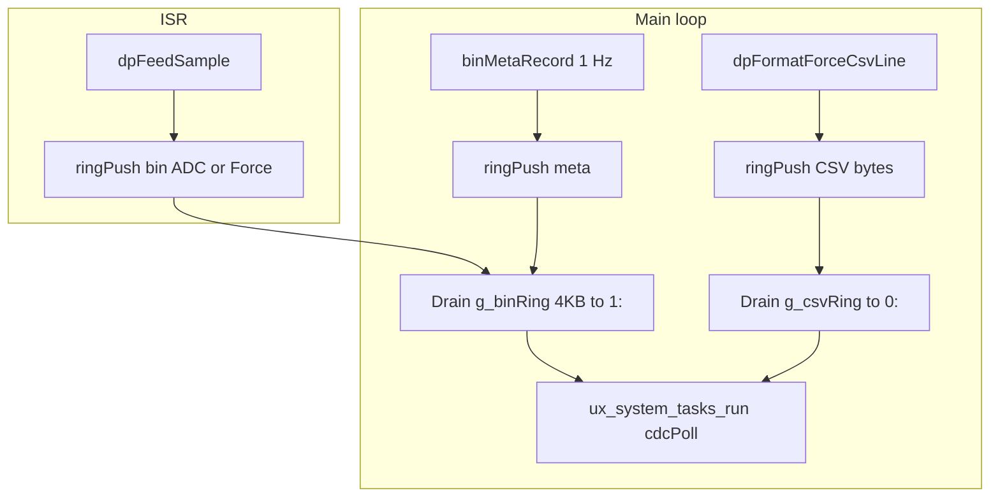

# Phase 11 Dual-File Logging — Implementation Plan

## Scope and authoritative sources

| Source | Role |
|--------|------|
| [phase_11_dual_file_logging.plan.md](c:\Users\Madhu\STM32CubeIDE\workspace_1.19.0\H562_Loadcell_Datalogger\.cursor\plans\phase_11_dual_file_logging.plan.md) | Ring buffer API, chunk sizes, flush order, gotchas (prealloc, `f_sync`, STOPPING state, EXTI layering) |
| [snazzy-petting-mountain.md](c:\Users\Madhu\STM32CubeIDE\workspace_1.19.0\H562_Loadcell_Datalogger\.cursor\plans\snazzy-petting-mountain.md) § Phase 11 (~L1218) | **Binary on `1:` (SYSCAL), CSV on `0:` (LOGGER)**; `preallocMb` from [`calibrationGet()`](c:\Users\Madhu\STM32CubeIDE\workspace_1.19.0\H562_Loadcell_Datalogger\Core\Inc\calibration.h); metadata fields; success criteria |
| [.cursor/rules/commenting-and-naming.mdc](c:\Users\Madhu\STM32CubeIDE\workspace_1.19.0\H562_Loadcell_Datalogger\.cursor\rules\commenting-and-naming.mdc) | `@file` headers, public function Doxygen, naming (`camelCase`, `camelCase_t`, `g_`, `UPPER_SNAKE_CASE`); **do not rename** HAL/FatFS types (`FIL`, `f_open`, …) |
| [phase_14_doxygen_naming_pass.plan.md](c:\Users\Madhu\STM32CubeIDE\workspace_1.19.0\H562_Loadcell_Datalogger\.cursor\plans\phase_14_doxygen_naming_pass.plan.md) | Treat **new** Phase 11 files as if Step 5 already applies: full headers + all public APIs documented; full naming audit of **the repo** waits until Phase 14 |
| [.cursor/rules/no-build.mdc](c:\Users\Madhu\STM32CubeIDE\workspace_1.19.0\H562_Loadcell_Datalogger\.cursor\rules\no-build.mdc) | Agent does **not** run compile/flash; after edits, **you** build in STM32CubeIDE and run hardware tests |

## Master-plan vs Phase 11 doc — resolve these deltas up front

1. **Dual volume paths (non-negotiable)**  
   [snazzy-petting-mountain.md](c:\Users\Madhu\STM32CubeIDE\workspace_1.19.0\H562_Loadcell_Datalogger\.cursor\plans\snazzy-petting-mountain.md) requires:
   - `LOG_YYMMDD_HHMMSS.bin` opened under **`1:`** (SYSCAL)
   - matching `LOG_YYMMDD_HHMMSS.csv` under **`0:`** (LOGGER)  
   Implement [`sdmmc_fatfs`](c:\Users\Madhu\STM32CubeIDE\workspace_1.19.0\H562_Loadcell_Datalogger) with explicit FatFS paths, e.g. `"1:/LOG_....bin"` and `"0:/LOG_....csv"` (exact string format per existing `f_open` usage elsewhere).

2. **API naming**  
   Master plan snippets use `sd_session_open` / snake_case; the codebase and Phase 11 plan use **`camelCase`** (`sdSessionOpen`, `sdSessionClose`, …). Follow **project** conventions, not the markdown snippet spellings.

3. **logStart EXTI edge**  
   [gpio.c](c:\Users\Madhu\STM32CubeIDE\workspace_1.19.0\H562_Loadcell_Datalogger\Core\Src\gpio.c) configures `logStart_Pin` as **`GPIO_MODE_IT_RISING`**. [`HAL_GPIO_EXTI_IRQHandler`](c:\Users\Madhu\STM32CubeIDE\workspace_1.19.0\H562_Loadcell_Datalogger\Drivers\STM32H5xx_HAL_Driver\Src\stm32h5xx_hal_gpio.c) invokes **`HAL_GPIO_EXTI_Rising_Callback`** / **`HAL_GPIO_EXTI_Falling_Callback`** per edge. Implement the **Rising** weak callback (e.g. in [`app_state.c`](c:\Users\Madhu\STM32CubeIDE\workspace_1.19.0\H562_Loadcell_Datalogger\Core\Src\app_state.c)) unless you intentionally change IOC to falling—do **not** copy the Phase 11 plan’s “Falling” wording blindly.

4. **NeoPixel vs Phase 11 plan**  
   [`neopixel.c`/`.h`](c:\Users\Madhu\STM32CubeIDE\workspace_1.19.0\H562_Loadcell_Datalogger\Core\Inc\neopixel.h) already exist and are documented. **Extend/wire** them (init from `main`, `neoSetPixel` + `neoShow` on logging state change) rather than creating duplicate drivers. Resolve **LED0 vs LED1** priority with [`led_status.c`](c:\Users\Madhu\STM32CubeIDE\workspace_1.19.0\H562_Loadcell_Datalogger\Core\Src\led_status.c): e.g. when `STATE_LOGGING`, override or dedicate one pixel to solid green per success criteria, without breaking battery/charge semantics on the other pixel if both matter.

5. **CRC helper**  
   [`crc16Ccitt`](c:\Users\Madhu\STM32CubeIDE\workspace_1.19.0\H562_Loadcell_Datalogger\Core\Inc\log_record.h) is `static inline` in the header—included where metadata/header CRC is computed. Use **`offsetof(binMetaRecord_t, crc16)`** (and same pattern for other records) with `<stddef.h>` if needed.

## Architecture (data flow)

- **Binary stream:** `binAdcRecord_t` + `binForceRecord_t` from [`dpFeedSample`](c:\Users\Madhu\STM32CubeIDE\workspace_1.19.0\H562_Loadcell_Datalogger\Core\Src\data_processing.c) (ISR context), plus `binMetaRecord_t` from main at 1 Hz—all into one **256 KB** SPSC ring.
- **CSV stream:** After [`dpFormatForceCsvLine`](c:\Users\Madhu\STM32CubeIDE\workspace_1.19.0\H562_Loadcell_Datalogger\Core\Inc\data_processing.h), push `g_dpStagedCsv` / `g_dpStagedCsvLen` into a **separate ~1 KB** ring (main only; keeps SPI2/IMU work out of ISR as today).

## Implementation sequence

### A. [`circular_buffer.c`/`.h`](c:\Users\Madhu\STM32CubeIDE\workspace_1.19.0\H562_Loadcell_Datalogger\Core) (new)

- Implement `ringBuf_t` per Phase 11 plan: `RING_BIN_SIZE` 256 KiB power-of-two, `head`/`tail`/`overflow`, `__DMB()` on index updates.
- Public API: `ringInit`, `ringPush`, `ringUsed`, `ringDrain`, `ringDrainContiguous`, **`ringAdvanceTail`** (required by the flush pseudocode in the plan).
- Export binary ring (e.g. `g_binRing`) and CSV ring (`g_csvRing`) or accessors—document ISR vs main ownership in Doxygen `@note` / `@pre` / `@post`.
- **Commenting:** full `@file` and every public function per [commenting-and-naming.mdc](c:\Users\Madhu\STM32CubeIDE\workspace_1.19.0\H562_Loadcell_Datalogger\.cursor\rules\commenting-and-naming.mdc).

### B. [`sdmmc_fatfs.c`/`.h`](c:\Users\Madhu\STM32CubeIDE\workspace_1.19.0\H562_Loadcell_Datalogger\Core) (new)

- `sdSession_t` holds two `FIL`, byte counters, filenames, `isOpen`.
- `sdSessionOpen(sdSession_t *, const calConfig_t *)`:
  - Build RTC-based names; open **`1:/...bin`** and **`0:/...csv`** with `FA_CREATE_ALWAYS | FA_WRITE`.
  - Pre-allocate: binary `preallocMb` MB; CSV `(preallocMb/4)` MB using **`FSIZE_t`** casts (match master plan math; `preallocMb` is `float` in [`calConfig_t`](c:\Users\Madhu\STM32CubeIDE\workspace_1.19.0\H562_Loadcell_Datalogger\Core\Inc\calibration.h)—use careful rounding to integer MB).
  - Write [`binFileHeader_t`](c:\Users\Madhu\STM32CubeIDE\workspace_1.19.0\H562_Loadcell_Datalogger\Core\Inc\log_record.h) (populate from cal, CLKIN, SYSCLK, LTC DAC, FW string, serial, etc.).
  - Write CSV header comment lines (`# CLKIN=...` …).
  - On failure paths, close partial opens and return error codes.
- `sdSessionWriteBinChunk` / `sdSessionWriteCsvChunk`: `f_write`, update counters; if elapsed time &gt; 10 ms since last USB service, call `ux_system_tasks_run()` and `cdcPoll()` (align with Phase 4 / Phase 11 gotchas).
- `sdSessionClose`: `f_truncate` both to actual lengths, `f_close`, print summary counts (track ADC/FORCE/META writes in session or derive from counters).
- Optional but recommended from Phase 11 plan: periodic **`f_sync`** every ~10 s on both files while logging (recovery on power loss trade-off).

### C. Expand [`app_state.c`/`.h`](c:\Users\Madhu\STM32CubeIDE\workspace_1.19.0\H562_Loadcell_Datalogger\Core\Src\app_state.c)

- Add states: at minimum **`STATE_STOPPING`** between LOGGING and IDLE for drain-then-close (per Phase 11 plan gotcha §10).
- `appStateButtonIsr()` or equivalent: set a **volatile flag** from **`HAL_GPIO_EXTI_Rising_Callback`** when `GPIO_Pin == logStart_Pin`; **debounce** 300 ms using `HAL_GetTick()` in main when processing the flag (ISR stays minimal).
- IDLE→LOGGING: call existing [`appStateCanStartLogging`](c:\Users\Madhu\STM32CubeIDE\workspace_1.19.0\H562_Loadcell_Datalogger\Core\Inc\app_state.h) (`allowLogOnUsb` + `batteryIsUsbConnected()`).
- LOGGING→STOPPING: on second press; main loop drains rings, then `sdSessionClose`, then IDLE.
- ERROR handling: SD failures → `STATE_ERROR`, user ack if desired (match plan diagram).

### D. [`data_processing.c`/`.h`](c:\Users\Madhu\STM32CubeIDE\workspace_1.19.0\H562_Loadcell_Datalogger\Core\Src\data_processing.c)

- Replace `g_dpPendingAdcRecord` / `g_dpPendingForceRecord` staging with **`ringPush(&g_binRing, ...)`** inside `dpFeedSample` for ADC and Force records (preserve record assembly and CRC as today).
- Keep CSV staging: main still calls `dpFormatForceCsvLine` then `ringPush` to `g_csvRing` with `g_dpStagedCsvLen`.

### E. [`main.c`](c:\Users\Madhu\STM32CubeIDE\workspace_1.19.0\H562_Loadcell_Datalogger\Core\Src\main.c) (USER CODE)

- Init: `ringInit` both rings; after SD mounts + cal loaded, prepare session handle.
- Enable NeoPixel path: ensure `MX_TIM2_Init()` (if commented) and **`neoInit()`** once; align with GPDMA CH2 expectations in [`neopixel.c`](c:\Users\Madhu\STM32CubeIDE\workspace_1.19.0\H562_Loadcell_Datalogger\Core\Src\neopixel.c).
- **Flush order** when `STATE_LOGGING` or `STATE_STOPPING`: drain binary ring in ≤4 KB chunks via `ringDrainContiguous` + `ringAdvanceTail` + `sdSessionWriteBinChunk`; then drain CSV ring; then existing `ux_system_tasks_run` / `cdcPoll` (may reorder slightly vs current file to match plan—**binary before CSV** as specified).
- **1 Hz metadata** during LOGGING: assemble [`binMetaRecord_t`](c:\Users\Madhu\STM32CubeIDE\workspace_1.19.0\H562_Loadcell_Datalogger\Core\Inc\log_record.h) using [`diagClkinMeasureHz`](c:\Users\Madhu\STM32CubeIDE\workspace_1.19.0\H562_Loadcell_Datalogger\Core\Inc\diag_timers.h) or `diagClkinGetHz()` per plan, [`battGetMcuTempX10`](c:\Users\Madhu\STM32CubeIDE\workspace_1.19.0\H562_Loadcell_Datalogger\Core\Src\battery_monitor.c), `batteryGetVoltage()`, stats from [`ads131m02GetStats`](c:\Users\Madhu\STM32CubeIDE\workspace_1.19.0\H562_Loadcell_Datalogger\Core\Src\adc_ads131m02.c), overflow from `g_binRing`, ADS status helper (add small accessor in `adc_ads131m02` if missing).
- Session counters: increment or derive **ADC/FORCE/META** counts for the stop summary line.
- Optional: buffer-pressure warning when `ringUsed` &gt; 75% of 256 KB (Phase 11 plan).

### F. [`debug_ui.c`](c:\Users\Madhu\STM32CubeIDE\workspace_1.19.0\H562_Loadcell_Datalogger\Core\Src\debug_ui.c) / status reporting

- Master plan deferred **status report fields** (`vbat_v`, `soc_percent`, …) until Phase 11—extend UART/VT220 status output when logging is active if required by exit criteria.

### G. STM32CubeIDE project

- Add new `Core/Src` files to the project (IDE usually picks them up; if not, add via project properties). **No automated build** per no-build rule.

## Verification (manual — you run)

- Build in STM32CubeIDE (agent will not).
- Functional checklist from [phase_11_dual_file_logging.plan.md](c:\Users\Madhu\STM32CubeIDE\workspace_1.19.0\H562_Loadcell_Datalogger\.cursor\plans\phase_11_dual_file_logging.plan.md) “Success Criteria” and [snazzy-petting-mountain.md](c:\Users\Madhu\STM32CubeIDE\workspace_1.19.0\H562_Loadcell_Datalogger\.cursor\plans\snazzy-petting-mountain.md) Phase 11 list: dual files on correct volumes, header magic `LDCL`, record rates, CSV line format, zero overflows over 5 min, clean truncate on second press, USB + VT220 alive during logging.
- **Map file check** (Phase 11 blocker §1): confirm `.bss` + 256 KB ring fits SRAM budget.

## Phase 14 alignment (what happens now vs later)

- **Now:** All **new** Phase 11 modules get full Doxygen and correct naming so Phase 14 Step 5 is largely a review, not a rewrite.
- **Later (Phase 14):** Full pass on older files, naming audit Step 7, README/ARCHITECTURE docs Step 8—**out of scope** for this Phase 11 implementation unless you explicitly expand scope.
