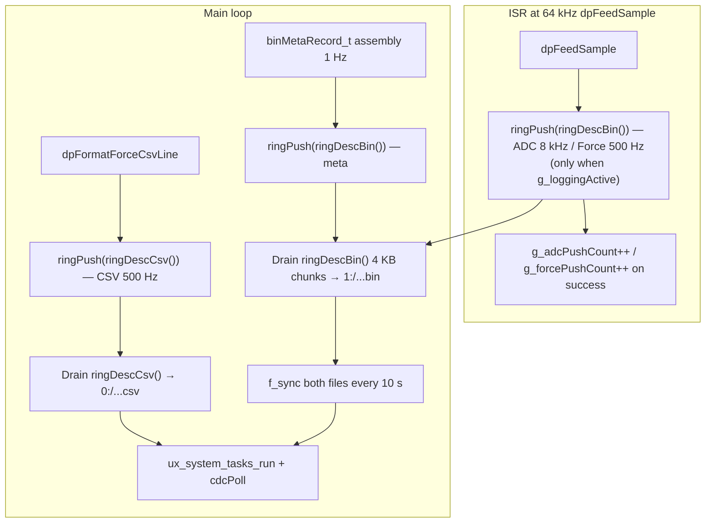

# Phase 11 Dual-File Logging — Implementation Plan

## Scope and authoritative sources

| Source | Role |
|--------|------|
| [phase_11_dual_file_logging.plan.md](c:\Users\Madhu\STM32CubeIDE\workspace_1.19.0\H562_Loadcell_Datalogger\.cursor\plans\phase_11_dual_file_logging.plan.md) | Ring buffer API, chunk sizes, flush order, gotchas (prealloc, `f_sync`, STOPPING state, EXTI layering) |
| [snazzy-petting-mountain.md](c:\Users\Madhu\STM32CubeIDE\workspace_1.19.0\H562_Loadcell_Datalogger\.cursor\plans\snazzy-petting-mountain.md) § Phase 11 (~L1218) | **Binary on `1:` (SYSCAL), CSV on `0:` (LOGGER)**; `preallocMb` from [`calibrationGet()`](c:\Users\Madhu\STM32CubeIDE\workspace_1.19.0\H562_Loadcell_Datalogger\Core\Inc\calibration.h); metadata fields; success criteria |
| [.cursor/rules/commenting-and-naming.mdc](c:\Users\Madhu\STM32CubeIDE\workspace_1.19.0\H562_Loadcell_Datalogger\.cursor\rules\commenting-and-naming.mdc) | `@file` headers, public function Doxygen, naming (`camelCase`, `camelCase_t`, `g_`, `UPPER_SNAKE_CASE`); **do not rename** HAL/FatFS types (`FIL`, `f_open`, …) |
| [phase_14_doxygen_naming_pass.plan.md](c:\Users\Madhu\STM32CubeIDE\workspace_1.19.0\H562_Loadcell_Datalogger\.cursor\plans\phase_14_doxygen_naming_pass.plan.md) | Treat **new** Phase 11 files as if Step 5 already applies: full headers + all public APIs documented; full naming audit of **the repo** waits until Phase 14 |
| [.cursor/rules/no-build.mdc](c:\Users\Madhu\STM32CubeIDE\workspace_1.19.0\H562_Loadcell_Datalogger\.cursor\rules\no-build.mdc) | Agent does **not** run compile/flash; after edits, **you** build in STM32CubeIDE and run hardware tests |

## Master-plan vs Phase 11 doc — resolved deltas (do not re-open)

1. **Dual volume paths (non-negotiable)**  
   [snazzy-petting-mountain.md](c:\Users\Madhu\STM32CubeIDE\workspace_1.19.0\H562_Loadcell_Datalogger\.cursor\plans\snazzy-petting-mountain.md) requires:
   - `LOG_YYMMDD_HHMMSS.bin` opened under **`1:`** (SYSCAL)
   - matching `LOG_YYMMDD_HHMMSS.csv` under **`0:`** (LOGGER)  
   Implement [`sdmmc_fatfs`](c:\Users\Madhu\STM32CubeIDE\workspace_1.19.0\H562_Loadcell_Datalogger) with explicit FatFS paths, e.g. `"1:/LOG_....bin"` and `"0:/LOG_....csv"` (exact string format per existing `f_open` usage elsewhere).

2. **API naming**  
   Master plan snippets use `sd_session_open` / snake_case; the codebase and Phase 11 plan use **`camelCase`** (`sdSessionOpen`, `sdSessionClose`, …). Follow **project** conventions, not the markdown snippet spellings.

3. **logStart EXTI edge**  
   [gpio.c](c:\Users\Madhu\STM32CubeIDE\workspace_1.19.0\H562_Loadcell_Datalogger\Core\Src\gpio.c) configures `logStart_Pin` as **`GPIO_MODE_IT_RISING`**. Use **`HAL_GPIO_EXTI_Rising_Callback`** for **`logStart_Pin` only** — **`ADC_DRDY` stays on the EXTI2 fast path** in [`stm32h5xx_it.c`](c:\Users\Madhu\STM32CubeIDE\workspace_1.19.0\H562_Loadcell_Datalogger\Core\Src\stm32h5xx_it.c) (see §C). Do **not** copy legacy “Falling” wording from older spec text.

4. **NeoPixel vs Phase 11 plan**  
   [`neopixel.c`/`.h`](c:\Users\Madhu\STM32CubeIDE\workspace_1.19.0\H562_Loadcell_Datalogger\Core\Inc\neopixel.h) already exist and are documented. **Extend/wire** them (init from `main`, `neoSetPixel` + `neoShow` on logging state change) rather than creating duplicate drivers. Resolve **LED0 vs LED1** priority with [`led_status.c`](c:\Users\Madhu\STM32CubeIDE\workspace_1.19.0\H562_Loadcell_Datalogger\Core\Src\led_status.c): e.g. when `STATE_LOGGING`, override or dedicate one pixel to solid green per success criteria, without breaking battery/charge semantics on the other pixel if both matter.

5. **CRC helper**  
   [`crc16Ccitt`](c:\Users\Madhu\STM32CubeIDE\workspace_1.19.0\H562_Loadcell_Datalogger\Core\Inc\log_record.h) is `static inline` in the header—included where metadata/header CRC is computed. Use **`offsetof(binMetaRecord_t, crc16)`** (and same pattern for other records) with `<stddef.h>` if needed.

## Architecture (data flow)



- **Binary stream:** `binAdcRecord_t` + `binForceRecord_t` from [`dpFeedSample`](c:\Users\Madhu\STM32CubeIDE\workspace_1.19.0\H562_Loadcell_Datalogger\Core\Src\data_processing.c) (ISR context), plus `binMetaRecord_t` from main at 1 Hz—all into one **256 KB** SPSC ring.
- **ISR gating:** **`ringPush(ringDescBin(), …)`** from `dpFeedSample` runs **only when** `g_loggingActive` is true (see §A / §D); otherwise the ring would fill at ~144 KB/s whenever the device is idle.
- **CSV stream:** After [`dpFormatForceCsvLine`](c:\Users\Madhu\STM32CubeIDE\workspace_1.19.0\H562_Loadcell_Datalogger\Core\Inc\data_processing.h), push `g_dpStagedCsv` / `g_dpStagedCsvLen` into a **separate ~1 KB** ring (main only; keeps SPI2/IMU work out of ISR as today).

### Throughput budget

| Stream | Rate | Record size | Throughput |
|--------|------|-------------|------------|
| Binary ADC | 8,000/s | 16 B | 128.0 KB/s |
| Binary Force+IMU | 500/s | 32 B | 16.0 KB/s |
| Binary Metadata | 1/s | 32 B | ~0 KB/s |
| CSV lines | 500/s | ~22 B | ~11 KB/s |
| **Total** | | | **~155 KB/s** |

~62% of the proven ~250 KB/s SD ceiling; ~95 KB/s margin for FAT stalls and USB CDC overhead (Phase 4 benchmark).

### Ring buffer hold time

- Binary data rate ~144 KB/s into the 256 KB ring → **~1.78 s** hold time at full rate.
- Worst observed SD write stall ~49 ms (Phase 4) — well inside the buffer budget when pre-allocation is used.

## Implementation sequence

### A. [`circular_buffer.c`/`.h`](c:\Users\Madhu\STM32CubeIDE\workspace_1.19.0\H562_Loadcell_Datalogger\Core) (new)

#### Ring buffer struct and sizes

**BLOCKER — `ringBuf_t` must be instantiated only once.** A second `ringBuf_t` would allocate **another 256 KB** (`buf[RING_BIN_SIZE]`), exceeding STM32H562 **640 KB SRAM** (~256 KB + ~256 KB + ~130 KB ≈ 642 KB). The CSV path must use a **1 KB** buffer only.

Binary ring (256 KB) — single instance:

```c
#define RING_BIN_SIZE  (256U * 1024U)
#define RING_BIN_MASK  (RING_BIN_SIZE - 1U)
#define CSV_BUF_SIZE   (1024U)
#define CSV_BUF_MASK   (CSV_BUF_SIZE - 1U)

typedef struct {
    uint8_t           buf[RING_BIN_SIZE];
    volatile uint32_t head;
    volatile uint32_t tail;
    volatile uint32_t overflow;
} ringBuf_t;

typedef struct {
    uint8_t           buf[CSV_BUF_SIZE];
    volatile uint32_t head;
    volatile uint32_t tail;
    volatile uint32_t overflow;
} csvRingBuf_t;
```

- `ringBuf_t g_binRing;` — file-scope in `circular_buffer.c`; **`extern ringBuf_t g_binRing`** in header.
- **`csvRingBuf_t g_csvRing;`** — **not** `ringBuf_t`; **`extern csvRingBuf_t g_csvRing`** in header.

#### Generic descriptor and public API

All ring operations use a single implementation over a **descriptor** (pointer + mask + index pointers) so one code path serves both sizes without a second 256 KB type:

```c
typedef struct {
    uint8_t           *buf;
    uint32_t           mask;       /* size - 1, power-of-2 */
    volatile uint32_t *head;
    volatile uint32_t *tail;
    volatile uint32_t *overflow;
} ringDesc_t;

/* In circular_buffer.h — static inline wrappers */
static inline ringDesc_t ringDescBin(void);
static inline ringDesc_t ringDescCsv(void);
```

```c
void     ringInit(ringDesc_t d);
uint32_t ringPush(ringDesc_t d, const void *data, uint32_t len);
uint32_t ringUsed(ringDesc_t d);
uint32_t ringDrain(ringDesc_t d, uint8_t *dst, uint32_t maxLen);
uint32_t ringDrainContiguous(ringDesc_t d, const uint8_t **ptr);
void     ringAdvanceTail(ringDesc_t d, uint32_t n);
```

- `ringDescBin()` fills `buf` from `g_binRing.buf`, `mask = RING_BIN_MASK`, pointers to `g_binRing.head` / `tail` / `overflow`.
- `ringDescCsv()` fills from `g_csvRing` with `CSV_BUF_MASK`.
- Power-of-2 mask wrap; **no locks**; `__DMB()` on index updates; `ringPush` increments `*overflow` and drops if full.

**Alternative (if descriptor indirection is undesirable):** keep `ringBuf_t` for `g_binRing` only and add parallel **`csvRingPush` / `csvRingUsed` / `csvRingDrainContiguous` / `csvRingAdvanceTail`** operating on `csvRingBuf_t *` — duplicate logic, zero extra RAM risk.

**Chosen approach for this plan:** **`ringDesc_t` + `ringDescBin()` / `ringDescCsv()`** everywhere in §A / §D / §E.

#### Logging gate and push counters

- **`volatile bool g_loggingActive`** — `extern` in header; set `true` after successful `sdSessionOpen`; set `false` **first** on LOGGING→STOPPING (§C).
- **`g_adcPushCount` / `g_forcePushCount`** — increment in `dpFeedSample` after successful **`ringPush(ringDescBin(), …)`** when `g_loggingActive` (§D); session baselines in §B.

#### Commenting

Full `@file` and public Doxygen per [commenting-and-naming.mdc](c:\Users\Madhu\STM32CubeIDE\workspace_1.19.0\H562_Loadcell_Datalogger\.cursor\rules\commenting-and-naming.mdc).

### B. [`sdmmc_fatfs.c`/`.h`](c:\Users\Madhu\STM32CubeIDE\workspace_1.19.0\H562_Loadcell_Datalogger\Core) (new)

#### `sdSession_t` (reference layout)

```c
typedef struct {
    FIL      binFile;
    FIL      csvFile;
    uint8_t  isOpen;
    char     binFilename[32];
    char     csvFilename[32];
    uint32_t binBytesWritten;
    uint32_t csvBytesWritten;
    uint32_t sessionStartTick;
    uint32_t lastSyncTick;
    uint32_t adcPushBase;
    uint32_t forcePushBase;
    uint32_t missCountBase;
    uint32_t overflowBase;
    uint32_t adcCount;
    uint32_t forceCount;
    uint32_t metaCount;
    uint32_t csvCount;
    uint32_t stallMaxMs;
    uint32_t stallCount;
    uint32_t ringPeakUsed;
    uint32_t pressureEvents;
    uint32_t usbKeepaliveCount;
    uint32_t syncCount;
} sdSession_t;
```

#### `sdSessionOpen`

1. RTC filenames; open **`1:/...bin`** and **`0:/...csv`** (`FA_CREATE_ALWAYS | FA_WRITE`); on partial failure close opened file(s) and return error.
2. Pre-allocate (`preallocMb` is `float` in [`calConfig_t`](c:\Users\Madhu\STM32CubeIDE\workspace_1.19.0\H562_Loadcell_Datalogger\Core\Inc\calibration.h)):
   ```c
   f_lseek(&s->binFile,
       (FSIZE_t)((uint32_t)cal->preallocMb * 1024UL * 1024UL));
   f_lseek(&s->binFile, 0);
   f_lseek(&s->csvFile,
       (FSIZE_t)((uint32_t)cal->preallocMb / 4U * 1024UL * 1024UL));
   f_lseek(&s->csvFile, 0);
   ```
3. **Immediately after both files confirmed open**, snapshot:
   ```c
   s->sessionStartTick = HAL_GetTick();
   s->lastSyncTick     = s->sessionStartTick;
   s->adcPushBase      = g_adcPushCount;
   s->forcePushBase    = g_forcePushCount;
   s->missCountBase    = ads131m02GetStats()->missCount;
   s->overflowBase     = g_binRing.overflow;
   ```
4. Write [`binFileHeader_t`](c:\Users\Madhu\STM32CubeIDE\workspace_1.19.0\H562_Loadcell_Datalogger\Core\Inc\log_record.h) (magic, version, cal, CLKIN, SYSCLK, LTC DAC, serial, gains, CRC16 bytes 0..61).
5. CSV header comments; emit **LOG START** (Exit Qualification).

#### `sdSessionWriteBinChunk` / `sdSessionWriteCsvChunk`

`f_write`; track byte counts; measure elapsed; update `stallMaxMs` / `stallCount`; if elapsed &gt; 10 ms → `ux_system_tasks_run()`, `cdcPoll()`, `usbKeepaliveCount++`.

#### `f_sync` (mandatory)

```c
if (HAL_GetTick() - s->lastSyncTick >= 10000U) {
    f_sync(&s->binFile);
    f_sync(&s->csvFile);
    s->lastSyncTick = HAL_GetTick();
    s->syncCount++;
}
```

#### `sdSessionClose`

`f_truncate` / `f_close`; then session totals + `sessionMiss` + `sessionOverflow` (Exit Qualification); `s->isOpen = 0`.

### C. Expand [`app_state.c`/`.h`](c:\Users\Madhu\STM32CubeIDE\workspace_1.19.0\H562_Loadcell_Datalogger\Core\Src\app_state.c)

#### States

```
STATE_IDLE → STATE_LOGGING → STATE_STOPPING → STATE_IDLE
                            ↘ STATE_ERROR
```

**`STATE_STOPPING`** is mandatory between LOGGING and IDLE (finite drain).

#### EXTI / button (logStart only)

**DRDY (EXTI2):** Handled **directly** in [`stm32h5xx_it.c`](c:\Users\Madhu\STM32CubeIDE\workspace_1.19.0\H562_Loadcell_Datalogger\Core\Src\stm32h5xx_it.c) — `EXTI2_IRQHandler` calls **`adsFastDrdyHandler()`**. That path does **not** use `HAL_GPIO_EXTI_IRQHandler()` and therefore **never** reaches `HAL_GPIO_EXTI_Rising_Callback`. **No DRDY dispatch** belongs in the HAL GPIO EXTI callback; adding an `ADC_DRDY_Pin` branch there would be dead code and a layering violation.

**logStart (EXTI4):** [`gpio.c`](c:\Users\Madhu\STM32CubeIDE\workspace_1.19.0\H562_Loadcell_Datalogger\Core\Src\gpio.c) uses **`GPIO_MODE_IT_RISING`**. `EXTI4_IRQHandler` invokes `HAL_GPIO_EXTI_IRQHandler(logStart_Pin)`, which may invoke the weak **`HAL_GPIO_EXTI_Rising_Callback`** — implement **only** for the button:

```c
void HAL_GPIO_EXTI_Rising_Callback(uint16_t GPIO_Pin)
{
    if (GPIO_Pin == logStart_Pin) {
        appStateButtonIsr();
    }
}
```

`appStateButtonIsr()` sets a volatile flag; main debounces 300 ms with `HAL_GetTick()`. **DRDY and logStart interrupt paths are completely independent.**

#### IDLE→LOGGING

1. [`appStateCanStartLogging`](c:\Users\Madhu\STM32CubeIDE\workspace_1.19.0\H562_Loadcell_Datalogger\Core\Inc\app_state.h) (`allowLogOnUsb` + USB sense); reject with UI if blocked.
2. `sdSessionOpen`; on failure → `STATE_ERROR`.
3. **`g_loggingActive = true`**.
4. `STATE_LOGGING`; NeoPixel logging indicator (e.g. LED index 1 solid green — §E / NeoPixel).

#### LOGGING→STOPPING (exact order)

1. **`g_loggingActive = false`**
2. **`STATE_STOPPING`**
3. Main drains `g_binRing` / `g_csvRing` (§E)
4. **`sdSessionClose()`**
5. **`STATE_IDLE`**; NeoPixel logging LED off

#### ERROR

SD open/write failures → `STATE_ERROR`; optional `ledStatusSetSys(LED_SYS_FAULT)`; UI/UART continue.

### D. [`data_processing.c`/`.h`](c:\Users\Madhu\STM32CubeIDE\workspace_1.19.0\H562_Loadcell_Datalogger\Core\Src\data_processing.c)

- Replace `g_dpPendingAdcRecord` / `g_dpPendingForceRecord` staging with **`ringPush(ringDescBin(), ...)`** inside `dpFeedSample` for ADC and Force records (preserve record assembly and CRC as today), **gated on `g_loggingActive`**. On successful push, increment **`g_adcPushCount`** / **`g_forcePushCount`** in `circular_buffer.c` (declared `extern` in `circular_buffer.h`)—**do not** touch `sdSession_t` here (`dpFeedSample` has no session pointer):
  ```c
  if (g_loggingActive) {
      if (ringPush(ringDescBin(), &adcRec, sizeof(adcRec))) {
          g_adcPushCount++;
      }
      /* same pattern for force record → g_forcePushCount */
  }
  ```
  Do **not** push unconditionally: at 64 kHz ISR rate the binary stream would fill the ring in ~1.8 s and corrupt the overflow counter before logging starts (see §A).
- Keep CSV staging: main still calls `dpFormatForceCsvLine` then **`ringPush(ringDescCsv(), g_dpStagedCsv, g_dpStagedCsvLen)`** (main loop only; gate on logging state if not already implied by caller). **Never** use `ringBuf_t` for CSV — only **`ringDescCsv()`** (§A).

### E. [`main.c`](c:\Users\Madhu\STM32CubeIDE\workspace_1.19.0\H562_Loadcell_Datalogger\Core\Src\main.c) (USER CODE)

#### Init

`ringInit(ringDescBin());` `ringInit(ringDescCsv());` zero or static session struct. Enable **`MX_TIM2_Init()`** if commented; **`neoInit()`** once ([`neopixel.c`](c:\Users\Madhu\STM32CubeIDE\workspace_1.19.0\H562_Loadcell_Datalogger\Core\Src\neopixel.c)).

#### Main loop flush (`STATE_LOGGING` or `STATE_STOPPING`)

1. **Binary ring:** while `session.isOpen && ringUsed(ringDescBin()) >= 4096U`, `ringDrainContiguous(ringDescBin(), &ptr)` → chunk ≤4096 → `sdSessionWriteBinChunk` → `ringAdvanceTail(ringDescBin(), chunk)`. Update `session.ringPeakUsed`. **Buffer pressure:** static `inPressure`; on transition into `used > 75%` increment `pressureEvents`, one `printf`/`uiLog`; clear when `used < 50%` (use `ringUsed(ringDescBin())` for fill ratio vs `RING_BIN_SIZE`).
2. **`STATE_STOPPING`:** drain any remainder in the binary ring (any size chunks) until `ringUsed(ringDescBin()) == 0`.
3. **CSV ring:** while `ringUsed(ringDescCsv()) > 0`, `ringDrainContiguous(ringDescCsv(), &ptr)` → `sdSessionWriteCsvChunk` → `ringAdvanceTail(ringDescCsv(), avail)`.
4. **`ux_system_tasks_run()`**; **`cdcPoll()`**.

#### 1 Hz metadata (`STATE_LOGGING`)

Example assembly ([`binMetaRecord_t`](c:\Users\Madhu\STM32CubeIDE\workspace_1.19.0\H562_Loadcell_Datalogger\Core\Inc\log_record.h)):

```c
binMetaRecord_t meta = {
    .type = REC_TYPE_META,
    .secondNum = (uint16_t)(((HAL_GetTick() - session.sessionStartTick) / 1000U) & 0xFFFFU),
    .clkinHz = diagClkinGetHz(),
    .mcuTempX10 = battGetMcuTempX10(),
    .batteryMv = (uint16_t)(batteryGetVoltage() * 1000.0f),
    .drdyTotal = ads131m02GetStats()->drdyCount,
    .missTotal = ads131m02GetStats()->missCount,
    .overflowTotal = g_binRing.overflow,
    .adsStatus = ads131m02GetLastStatus(),
};
meta.crc16 = crc16Ccitt((uint8_t*)&meta, offsetof(binMetaRecord_t, crc16));
ringPush(ringDescBin(), &meta, sizeof(meta));
session.metaCount++;
```

(Adjust field types to match [`log_record.h`](c:\Users\Madhu\STM32CubeIDE\workspace_1.19.0\H562_Loadcell_Datalogger\Core\Inc\log_record.h); add `ads131m02GetLastStatus()` if needed.)

#### Session counters

`csvCount` on successful **`ringPush(ringDescCsv(), …)`**; `metaCount` as above; ADC/force session totals come from push-count deltas at close (§B), not `session.adcCount` during the run.

#### 1 Hz diagnostic UART

See Exit Qualification — use **live** `(g_adcPushCount - session.adcPushBase)` etc.; **`session.adcCount` / `session.forceCount` stay 0 until `sdSessionClose`**.

### Exit Qualification UART Report

Two UART prints are required: one at session open, one at session close. These are the quantitative exit criteria for Phase 11. A session is considered passing only when all thresholds below are met.

#### Session open (inside sdSessionOpen, after both files are confirmed open)

```c
printf("LOG START: 1:/%s + 0:/%s\r\n", s->binFilename, s->csvFilename);
printf("LOG START: prealloc=%luMB bin, %luMB csv\r\n",
       (unsigned long)(uint32_t)cal->preallocMb,
       (unsigned long)(uint32_t)cal->preallocMb / 4U);
```

#### Session close (inside sdSessionClose, after truncate and f_close)

```c
s->adcCount   = g_adcPushCount   - s->adcPushBase;
s->forceCount = g_forcePushCount - s->forcePushBase;
uint32_t sessionMiss = ads131m02GetStats()->missCount - s->missCountBase;
uint32_t sessionOverflow = g_binRing.overflow - s->overflowBase;

uint32_t durS = (HAL_GetTick() - s->sessionStartTick) / 1000U;
uint32_t adcRate  = durS ? s->adcCount  / durS : 0U;
uint32_t forceRate = durS ? s->forceCount / durS : 0U;
uint32_t csvRate  = durS ? s->csvCount  / durS : 0U;

printf("LOG STOP: dur=%lus ADC=%lu(%lu/s) FORCE=%lu(%lu/s)"
       " META=%lu(%lu/s) CSV=%lu(%lu/s)\r\n",
       (unsigned long)durS,
       (unsigned long)s->adcCount,  (unsigned long)adcRate,
       (unsigned long)s->forceCount,(unsigned long)forceRate,
       (unsigned long)s->metaCount, (unsigned long)(durS ? s->metaCount/durS : 0U),
       (unsigned long)s->csvCount,  (unsigned long)csvRate);

printf("LOG STOP: bin=%luB csv=%luB ovf=%lu miss=%lu"
       " stall_max=%lums stall_n=%lu\r\n",
       (unsigned long)s->binBytesWritten,
       (unsigned long)s->csvBytesWritten,
       (unsigned long)sessionOverflow,
       (unsigned long)sessionMiss,
       (unsigned long)s->stallMaxMs,
       (unsigned long)s->stallCount);

printf("LOG STOP: ring_peak=%lu%% pressure_events=%lu"
       " usb_keepalive=%lu sync_count=%lu\r\n",
       (unsigned long)(s->ringPeakUsed * 100U / RING_BIN_SIZE),
       (unsigned long)s->pressureEvents,
       (unsigned long)s->usbKeepaliveCount,
       (unsigned long)s->syncCount);
```

#### Pass/fail evaluation (computed immediately after the lines above)

```c
bool pass =
    (sessionOverflow == 0U)              &&
    (sessionMiss == 0U)   &&
    (adcRate   >= 7900U && adcRate   <= 8100U) &&
    (forceRate >= 490U  && forceRate <= 510U)  &&
    (csvRate   >= 490U  && csvRate   <= 510U)  &&
    (s->stallMaxMs < 200U)                  &&
    (s->ringPeakUsed < (RING_BIN_SIZE * 3U / 4U));

if (pass) {
    printf("LOG STOP: PASS\r\n");
} else {
    if (sessionOverflow != 0U)
        printf("LOG STOP: FAIL ovf=%lu\r\n",
               (unsigned long)sessionOverflow);
    if (sessionMiss != 0U)
        printf("LOG STOP: FAIL miss=%lu\r\n",
               (unsigned long)sessionMiss);
    if (adcRate < 7900U || adcRate > 8100U)
        printf("LOG STOP: FAIL adc_rate=%lu/s\r\n",
               (unsigned long)adcRate);
    if (forceRate < 490U || forceRate > 510U)
        printf("LOG STOP: FAIL force_rate=%lu/s\r\n",
               (unsigned long)forceRate);
    if (csvRate < 490U || csvRate > 510U)
        printf("LOG STOP: FAIL csv_rate=%lu/s\r\n",
               (unsigned long)csvRate);
    if (s->stallMaxMs >= 200U)
        printf("LOG STOP: FAIL stall_max=%lums\r\n",
               (unsigned long)s->stallMaxMs);
    if (s->ringPeakUsed >= (RING_BIN_SIZE * 3U / 4U))
        printf("LOG STOP: FAIL ring_peak=%lu%%\r\n",
               (unsigned long)(s->ringPeakUsed * 100U / RING_BIN_SIZE));
}
```

Pass thresholds:

| Metric | Pass condition |
|--------|------------------|
| `sessionOverflow` | `== 0` |
| `sessionMiss` | `== 0` |
| `adcRate` | 7900–8100 /s |
| `forceRate` | 490–510 /s |
| `csvRate` | 490–510 /s |
| `stallMaxMs` | &lt; 200 ms |
| `ringPeakUsed` | &lt; 75% of `RING_BIN_SIZE` |

#### Fields to add to sdSession_t

- `uint32_t sessionStartTick` — `HAL_GetTick()` at `sdSessionOpen`, immediately after both files are confirmed open
- `uint32_t adcPushBase` — `g_adcPushCount` snapshot at session open
- `uint32_t forcePushBase` — `g_forcePushCount` snapshot at session open
- `uint32_t missCountBase` — `ads131m02GetStats()->missCount` at session open (driver total is cumulative since boot; exit report uses **delta**)
- `uint32_t overflowBase` — `g_binRing.overflow` snapshot at session open (ring overflow counter is cumulative since boot unless reset; exit report uses **delta**)
- `uint32_t adcCount` — session total ADC records (set in `sdSessionClose`: `g_adcPushCount - adcPushBase`)
- `uint32_t forceCount` — session total Force records (set in `sdSessionClose`: `g_forcePushCount - forcePushBase`)
- `uint32_t metaCount` — incremented per meta record pushed in main
- `uint32_t csvCount` — incremented per CSV line pushed to ring
- `uint32_t stallMaxMs` — max single `f_write` duration in ms
- `uint32_t stallCount` — `f_write` calls that exceeded 10 ms
- `uint32_t ringPeakUsed` — max bytes seen in ring during session
- `uint32_t pressureEvents` — times ring exceeded 75% threshold
- `uint32_t usbKeepaliveCount` — times `ux_system_tasks_run` called mid-write
- `uint32_t syncCount` — `f_sync` calls completed

`g_adcPushCount` / `g_forcePushCount` are incremented in `dpFeedSample` (via §D) when `g_loggingActive` and the corresponding `ringPush` succeeds—not `sdSession_t` fields in the ISR. `csvCount` is incremented in the main loop CSV ring push. `metaCount` is incremented in the main loop metadata assembly. All other counters are updated inside `sdSessionWriteBinChunk` or the main flush loop.

**stallMaxMs and stallCount:** before each `f_write`, snapshot `HAL_GetTick()`. After `f_write` returns, compute elapsed. If elapsed &gt; `stallMaxMs`, update `stallMaxMs`. If elapsed &gt; 10, increment `stallCount` and trigger USB keepalive.

**ringPeakUsed:** in the flush loop, after each `ringUsed()` call, update `ringPeakUsed` if the current value exceeds the stored peak.

**pressureEvents:** increment once per transition into the &gt; 75% state (use a static `bool` to track whether currently in pressure state to avoid counting the same event multiple times).

#### 1 Hz diagnostic print in main.c (during LOGGING only)

```c
printf("LOG: t=%lus adc=%lu force=%lu ovf=%lu ring=%lu%% stall=%lums\r\n",
       (unsigned long)((HAL_GetTick()-session.sessionStartTick)/1000U),
       (unsigned long)(g_adcPushCount   - session.adcPushBase),
       (unsigned long)(g_forcePushCount - session.forcePushBase),
       (unsigned long)(g_binRing.overflow - session.overflowBase),
       (unsigned long)(ringUsed(ringDescBin()) * 100U / RING_BIN_SIZE),
       (unsigned long)session.stallMaxMs);
```

This gives a live running view during the session so problems are visible in real time without waiting for the stop summary.

### F. [`debug_ui.c`](c:\Users\Madhu\STM32CubeIDE\workspace_1.19.0\H562_Loadcell_Datalogger\Core\Src\debug_ui.c) / status reporting

- Master plan deferred **status report fields** (`vbat_v`, `soc_percent`, …) until Phase 11—extend UART/VT220 when logging is active to satisfy exit criteria.
- At minimum: show logging state (IDLE / LOGGING / STOPPING), and ring-pressure / warning when active.

### G. STM32CubeIDE project

- Add `circular_buffer.c`, `sdmmc_fatfs.c` under `Core/Src` (IDE usually auto-discovers; if not: **Project → Properties → C/C++ Build → Source Location**).
- **No automated build** per [.cursor/rules/no-build.mdc](c:\Users\Madhu\STM32CubeIDE\workspace_1.19.0\H562_Loadcell_Datalogger\.cursor\rules\no-build.mdc).

## Verification (manual — you run)

1. **Build** in STM32CubeIDE (agent does not) — zero errors on new files.
2. **Map file:** `.bss` including 256 KB ring fits ~640 KB SRAM (~380 KB estimated use, ~260 KB headroom).
3. **5 min session:** `LOG START` on UART; green NeoPixel; monitor 1 Hz `LOG:` lines (ovf session-delta 0, ring % &lt; 75%); second press → **`LOG STOP: PASS`**.
4. **SD:** binary on **`1:`**, CSV on **`0:`**; 64 B header magic `LDCL`, version 2, CRC OK.
5. **Approximate counts (5 min):** ADC ~2,400,000 ± tolerance; Force ~150,000; Meta ~300; CSV lines ~150,000.
6. Files open on PC; USB CDC and VT220 (force, IMU, battery) stayed live.

## Phase 14 alignment (what happens now vs later)

- **Now:** All **new** Phase 11 modules get full Doxygen and correct naming so Phase 14 Step 5 is largely a review, not a rewrite.
- **Later (Phase 14):** Full pass on older files, naming audit Step 7, README/ARCHITECTURE docs Step 8—**out of scope** for this Phase 11 implementation unless you explicitly expand scope.
