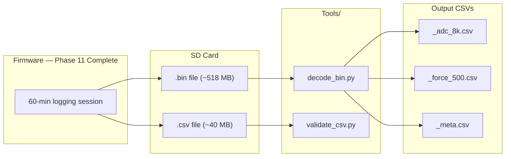

# Phase 12 — One-Hour Soak Test and Python Validator

**Reference:** [Master plan Phase 12](/.cursor/plans/snazzy-petting-mountain.md) (line 1057)

## Current State

- **Phase 11** delivers: complete dual-file logging pipeline — binary (.bin) and CSV (.csv) written simultaneously to SD at ~155 KB/s, with 256 KB ring buffer, metadata injection, and clean session lifecycle
- **No `Tools/` directory** exists in the project
- **No Python post-processing tools** exist
- **Binary format** fully specified in `log_record.h` (Phase 10)
- **Expected file sizes** for 60-minute session: ~518 MB binary, ~40 MB CSV
- **SD card**: 64 GB SanDisk, FAT32, proven at 250 KB/s ceiling

## Architecture

This phase is primarily a **validation and tooling** phase — minimal firmware changes, heavy Python scripting and manual testing.



## Naming Convention Compliance

C struct and typedef references in this plan follow the `camelCase_t` convention for types (for example, `binFileHeader_t`) and `camelCase` for C functions (for example, `crc16Ccitt`), consistent with `.cursor/rules/commenting-and-naming.mdc`. Python modules, scripts, and API names remain in their conventional `snake_case` (for example, `decode_bin.py`, `validate_csv.py`, `parse_header`, `crc16_ccitt_fast`).

## Implementation Steps

### 1. Create `Tools/decode_bin.py`

**Core Python script** for binary file post-processing. Requirements:
- Python 3.8+ (standard library only — no numpy/pandas required, but optional for plotting)
- Command-line: `python decode_bin.py LOG_260411_142300.bin`
- Progress bar for large files (simple character-based, no external dependency)

**Functionality:**

#### a. Header Parsing (64 bytes)
```python
def parse_header(data: bytes) -> dict:
    # Unpack binFileHeader_t per log_record.h
    # Verify magic == 0x4C44434C ('LDCL')
    # Verify CRC16 of bytes 0..61 == bytes 62..63
    # Print session info: CLKIN, DAC, SYSCLK, calibration, FW version, RTC time
```

#### b. Record Demultiplexing
```python
# After header, records are variable-type but fixed-size per type:
# Type 0x01 (ADC):   16 bytes → binAdcRecord_t
# Type 0x02 (Force): 32 bytes → binForceRecord_t
# Type 0x03 (Meta):  32 bytes → binMetaRecord_t
#
# Read first byte (type tag), then read remaining bytes based on type.
# Unknown type → log error, attempt resync by scanning for known type byte.
```

#### c. CRC16 Validation
```python
def crc16_ccitt(data: bytes) -> int:
    # Polynomial 0x1021, init 0xFFFF, no final XOR
    # Match the firmware crc16Ccitt implementation exactly
```

Validate CRC on every record. Report:
- Total records per type
- CRC pass count / fail count per type
- First N CRC failures (record index, expected, actual)

#### d. Output CSVs

**`_adc_8k.csv`:**
```csv
seq,sum_ch1,sum_ch2,flags,crc_ok
0,1234567,-1234567,0x01,1
1,1234568,-1234568,0x01,1
...
```

**`_force_500.csv`:**
```csv
seq,timestamp_ms,force_N,accel_x,accel_y,accel_z,gyro_x,gyro_y,gyro_z,sum_ch1_128,validity,crc_ok
0,0,+0.000,0,0,16384,0,0,0,12345678,0x0F,1
1,2,+0.001,0,0,16384,0,0,0,12345679,0x0F,1
...
```

**`_meta.csv`:**
```csv
second,clkin_hz,mcu_temp_c,battery_mv,drdy_total,miss_total,overflow_total,ads_status,crc_ok
0,8192000,25.3,3720,64000,0,0,0x0103,1
1,8192000,25.4,3720,128000,0,0,0x0103,1
...
```

#### e. Timestamp Reconstruction
- Use per-second CLKIN values from metadata records to compute precise timestamps for ADC and Force records
- ADC timestamp: `t = seq / (clkin_hz / adc_osr)` using the CLKIN from the nearest metadata record
- Force timestamp: from `timestamp_ms` field in the record (relative to session start)

#### f. Summary Report
```
=== DECODE SUMMARY ===
File: LOG_260411_142300.bin
Duration: 3600.0 s (from metadata)
Header: magic=LDCL version=1 CLKIN=8192000 Hz FW=v0.5.0

Records:
  ADC (0x01):   28,800,000  (expected 28,800,000)  CRC OK: 28,800,000  FAIL: 0
  Force (0x02):  1,800,000  (expected  1,800,000)  CRC OK:  1,800,000  FAIL: 0
  Meta (0x03):       3,600  (expected      3,600)  CRC OK:      3,600  FAIL: 0

Sequence analysis:
  ADC seq gaps: 0
  Force seq gaps: 0
  Meta second gaps: 0

CLKIN stability:
  Mean: 8,192,034 Hz  StdDev: 47 Hz  Range: [8,191,901, 8,192,167]

Overflow count (from last meta): 0

File size: 518,402,048 bytes (expected ~518,400,000)
=== END ===
```

### 2. Create `Tools/validate_csv.py` (Optional)

Validates the firmware-generated CSV file:
- Every line matches pattern `$,<integer>,<float>,#`
- Timestamps are monotonically increasing
- Line count matches expected (elapsed_seconds × 500)
- No partial/truncated lines at end of file

### 3. Soak Test Procedure

**Pre-test checklist:**
- [ ] Fresh SD card (64 GB SanDisk, FAT32)
- [ ] Battery fully charged OR USB power connected
- [ ] USB CDC connected to PC with terminal open
- [ ] `allow_log_on_usb = 1` in config.txt
- [ ] VT220 UI visible and baseline readings stable
- [ ] DRDY Hz showing ~64000, miss = 0
- [ ] Force reading stable at ~0 N (unloaded, tared)
- [ ] All Phase 11 success criteria already verified (5-minute test passed)

**Test execution:**
1. Press `logStart` — verify green NeoPixel, "LOG: started" message
2. Monitor VT220 UI every 5 minutes for:
   - Overflow count (must stay 0)
   - DRDY Hz (~64000)
   - Miss count (must stay 0)
   - SD throughput (< 200 KB/s)
   - Battery voltage (if on battery)
   - MCU temperature (should be stable, slight rise expected)
3. At 60 minutes, press `logStart` to stop logging
4. Verify "LOG: stopped" message with final counts
5. Eject SD card, copy both files to PC

**Post-test validation:**
1. Run `decode_bin.py` on the .bin file
2. Run `validate_csv.py` on the .csv file
3. Open `_force_500.csv` in Excel or matplotlib — plot force vs time
4. Check all success criteria below

## Potential Blockers / Gotchas

### BLOCKER 1: Python CRC16 Must Match Firmware Exactly

**Risk:** If the Python CRC16 implementation uses a different polynomial, initial value, or byte ordering than the firmware, every record will fail CRC validation. This would make the entire validator useless.

**Resolution:**
- Use the identical algorithm: CRC16-CCITT, polynomial 0x1021, init 0xFFFF, no final XOR, MSB-first processing
- **Test with known vectors:** Before running on real data, compute CRC16 on a known byte sequence in both Python and firmware. Compare results.
- Known test vector: `crc16_ccitt(b"\x01\x00\x00\x00\x00\x00\x00\x00\x00\x00\x00\x00\x00\x00")` should produce the same result in both implementations.
- Include a `--no-crc` flag in `decode_bin.py` to skip CRC checking and still demux records (useful for debugging CRC mismatches).

### BLOCKER 2: 518 MB Binary File Processing Speed

**Risk:** Processing 28.8 million ADC records (518 MB) in Python is slow. Naive byte-by-byte CRC computation could take 30+ minutes.

**Resolution:**
- Use `struct.unpack()` for batch unpacking (much faster than manual byte parsing)
- Use a C-extension or ctypes wrapper for CRC16 if pure Python is too slow:
  ```python
  # Fast CRC16 using a lookup table
  _crc_table = [...]  # Pre-computed 256-entry table
  def crc16_ccitt_fast(data: bytes) -> int:
      crc = 0xFFFF
      for byte in data:
          crc = ((crc << 8) & 0xFFFF) ^ _crc_table[((crc >> 8) ^ byte) & 0xFF]
      return crc
  ```
- Read the file in large chunks (e.g., 1 MB) and process records from the buffer
- Add `--skip-crc` flag for quick structural validation without CRC overhead
- Target: full decode of 518 MB in < 5 minutes on a modern PC

### BLOCKER 3: Record Alignment and Resync After Corruption

**Risk:** If a single byte is dropped or corrupted in the binary file, all subsequent records will be misaligned. The type byte will be wrong, and the decoder will read garbage.

**Resolution:**
- After a CRC failure or unknown type byte, attempt resync:
  1. Scan forward byte-by-byte looking for a valid type byte (0x01, 0x02, 0x03)
  2. Read the appropriate record size
  3. Check CRC — if valid, resume normal parsing from this point
  4. Report the sync loss: byte offset, number of bytes skipped
- This is a post-hoc recovery mechanism. The firmware should never produce corrupted data — if it does, it indicates a ring buffer overflow or SD write error.

### BLOCKER 4: SD Card Write Endurance Over 60 Minutes

**Risk:** At 155 KB/s sustained, the SD card writes ~558 MB in 60 minutes. While well within the card's lifetime capacity, some cards have thermal throttling that reduces write speed after sustained writes. If speed drops below 144 KB/s (binary data rate), the ring buffer will eventually overflow.

**Resolution:**
- The 256 KB ring buffer provides 1.78 seconds of buffering. Temporary speed drops are absorbed.
- Pre-allocation eliminates FAT table writes during the session, reducing flash wear and stall frequency.
- Monitor the `overflow_count` in metadata records and on VT220 UI. If it increases during the test, the SD card cannot sustain the write rate.
- **Mitigation:** Use a high-endurance SD card (SanDisk High Endurance or Industrial grade). Avoid cheap no-name cards.

### BLOCKER 5: USB CDC De-enumeration During Long Session

**Risk:** Over 60 minutes, the USB CDC may de-enumerate due to Windows power management (selective suspend), USB hub issues, or long SD write stalls that starve `ux_system_tasks_run()`.

**Resolution:**
- Disable USB selective suspend in Windows Device Manager for the COM port
- The main loop calls `ux_system_tasks_run()` after every SD flush cycle, ensuring USB is serviced regularly
- If CDC de-enumerates, USART1 (921600 baud) continues working as a backup debug channel
- USB de-enumeration does NOT affect logging — the SD writes continue regardless of USB state
- Check `ui_set_usb_status()` on VT220 — if it changes to `"---"` mid-session, USB was lost

### GOTCHA 6: Large Output CSV Files

**Risk:** The `_adc_8k.csv` output from `decode_bin.py` will be ~28.8 million rows. This is too large for Excel (max 1,048,576 rows). The `_force_500.csv` at 1.8 million rows also exceeds Excel's limit.

**Resolution:**
- `decode_bin.py` should support `--max-rows N` to limit output CSV size
- For plotting, use Python matplotlib directly from the parsed data (no intermediate CSV needed)
- Add a `--downsample N` flag to output every Nth record for large datasets
- For Excel analysis, generate a 10-second excerpt: `--time-range 0 10`

### GOTCHA 7: File Size Verification

**Risk:** The expected file sizes are approximate. Actual sizes depend on the exact CLKIN frequency (which determines the true sample rate) and session start/stop alignment.

**Resolution:**
- Allow ±1% tolerance on file sizes
- The precise check is record count (from `decode_bin.py`), not file size
- Binary file size should be: `64 (header) + adc_count × 16 + force_count × 32 + meta_count × 32`
- If the file size doesn't match this formula, there are alignment or padding issues

### GOTCHA 8: MCU Temperature Rise During Soak Test

**Risk:** Sustained 250 MHz operation + SPI DMA + SD writes will heat the MCU. If the die temperature exceeds the maximum operating temperature (105°C for STM32H562), the chip may enter thermal shutdown or exhibit timing errors.

**Resolution:**
- Monitor MCU temperature via metadata records and VT220 UI
- Expected equilibrium: 30–50°C at room temperature (25°C ambient), depending on PCB thermal design
- If temperature exceeds 80°C, investigate thermal management (heatsink, reduced SYSCLK)
- The metadata records will show the temperature trend over the 60-minute session

### GOTCHA 9: `decode_bin.py` Must Handle Partial Records at End of File

**Risk:** If logging is stopped mid-record (power loss, or session close races with a ring flush), the last record in the file may be truncated. The decoder must handle this gracefully.

**Resolution:**
- Before reading a record, check that enough bytes remain in the file for the full record size
- If insufficient bytes, report: `"WARNING: truncated record at offset 0x... (N bytes short), skipping"`
- Do not treat this as an error — it's expected for the very last record in any session

## Key Files

| Action | File |
|--------|------|
| **Create** | `Tools/decode_bin.py` |
| **Create** | `Tools/validate_csv.py` (optional) |
| **Create** | `Troubleshooting/soak_test_results.md` (post-test) |
| **No firmware changes** | Phase 12 is validation-only |

## Success Criteria (from master plan)

- [ ] Session duration = 60 min ± 1 s (from metadata record count)
- [ ] Binary ADC records = **28,800,000 ± 1000** (8000/s × 3600s)
- [ ] Binary Force records = **1,800,000 ± 500** (500/s × 3600s)
- [ ] Binary Metadata records = **3600 ± 2** (1/s × 3600s)
- [ ] CSV line count = **1,800,000 ± 500** (500/s × 3600s)
- [ ] **`overflow_count == 0`** for entire session (from last metadata record)
- [ ] **All binary records pass CRC16** validation via `decode_bin.py` (zero corruption)
- [ ] Binary file size approximately 518 MB (144 KB/s × 3600s)
- [ ] CSV file size approximately 40 MB (11 KB/s × 3600s)
- [ ] Both files open on PC without FAT corruption
- [ ] No SD write errors reported (no ERROR state entered)
- [ ] CLKIN values in metadata records are stable (within ± 1000 Hz of boot-trimmed value)
- [ ] MCU temperature values in metadata records are realistic and vary smoothly
- [ ] Battery voltage and SOC fields update every ~60 s on VT220 UI
- [ ] VT220 UI remained responsive and updated throughout the entire session
- [ ] USB CDC debug output did not cause any DRDY misses
- [ ] `decode_bin.py` runs without errors, produces valid output CSVs
- [ ] Force vs time plot from CSV shows physically plausible data
