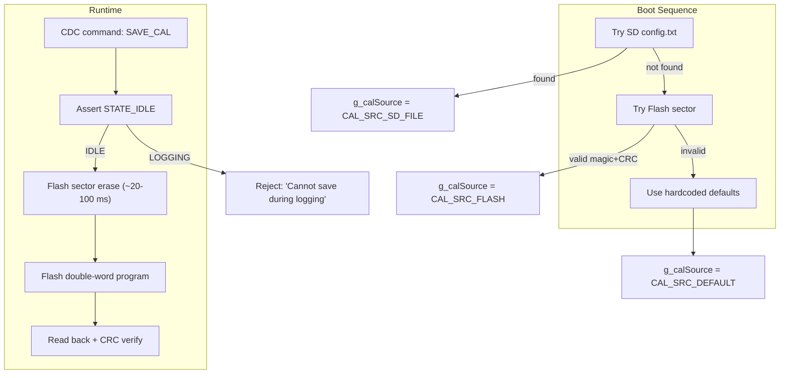

# Phase 13 — Calibration and Flash Storage (Production Readiness)

**Reference:** [Master plan Phase 13](/.cursor/plans/snazzy-petting-mountain.md) (line 1099)

## Current State

- **`calibration.c/.h`** created in Phase 10 with `calibrationLoad()` (SD config.txt parser) and `calibrationGet()`
- **`calConfig_t`** struct holds all calibration parameters (sensitivity, gains, offsets, tare, divider ratio, prealloc, flags)
- **`calSource_t`** enum has `CAL_SRC_DEFAULT`, `CAL_SRC_SD_FILE`, `CAL_SRC_FLASH` — Flash path is not yet implemented
- **Flash** on STM32H562RGT: 512 KB, organized in 8 KB sectors (RM0481 §7.3). Dual-bank capable but typically used as single-bank.
- **USB CDC** is operational with `cdc_poll()` in main loop (Phase 1 ✅) — but no command parsing exists (only TX, no RX processing)
- **`app_state.c`** has IDLE/LOGGING states — Flash write is only allowed in IDLE

## Architecture



### Flash Sector Selection

STM32H562RGT has 512 KB Flash organized as 64 sectors × 8 KB each (single-bank mode). Application code starts at 0x08000000. The linker script reserves up to `_etext + _edata` for code + initialized data.

**Use the LAST Flash sector** (sector 63, address 0x0807E000–0x0807FFFF, 8 KB) for calibration storage. Rationale:
- Application code grows from the start of Flash; the last sector is least likely to be reached
- 8 KB is vastly more than needed for `calConfig_t` (~64 bytes) — leaves room for future expansion
- Easy to verify: check the `.map` file to confirm no code/data extends past sector 62

**Storage layout within the 8 KB sector:**

| Offset | Size | Content |
|--------|------|---------|
| 0x000  | 4    | Magic: `0xCAFE1234` |
| 0x004  | 4    | Format version (1) |
| 0x008  | 4    | Write counter (incremented each save) |
| 0x00C  | 4    | Reserved (alignment) |
| 0x010  | ~48  | `calConfig_t` contents (serialized) |
| 0x040  | 2    | CRC16 of bytes 0x000–0x03F |
| 0x042  | 6    | Padding to 8-byte alignment |
| 0x048+ | —    | Unused (available for future fields) |

Total: 72 bytes used out of 8192 bytes available.

## Naming Convention Compliance

This phase follows the project naming rules for new and touched application code:

- **`#define` constants and `enum` values:** `UPPER_SNAKE_CASE` (for example `CAL_MAGIC`, `CAL_SRC_FLASH`, `CMD_BUF_SIZE`).
- **`const` variables:** `UPPER_SNAKE_CASE` where they denote fixed constants.
- **Functions:** `camelCase` with a **lowercase module prefix** on the logical module (`calibrationSaveFlash`, `calibrationLoad`, `cdcProcessRx`, `appStateGet`).
- **Local variables:** `camelCase` (for example `writeCount`, `pageError`, `cmdBuf`, `cmdLen`).
- **Global variables:** `g_` prefix plus `camelCase` (for example `g_cal`, `g_calSource`).
- **Struct and `typedef` names:** `camelCase_t` (for example `calConfig_t`, `calFlashBlock_t`, `calSource_t`).
- **Struct members:** `camelCase` (for example `writeCount` inside `calFlashBlock_t`).
- **HAL, CubeMX, and third-party APIs:** **Do not rename** identifiers such as `HAL_FLASH_Unlock`, `FLASH_EraseInitTypeDef`, `ux_device_class_cdc_acm_read_run`, or `cdc_acm_get_instance()` (USBX).
- **Existing project APIs retained as-is** where already established: for example `cdc_poll()`, `ui_print_report()`.

New C files in snippets should include a **Doxygen file banner** (`@file`, brief description, and related `@brief`/`@details` as appropriate) above the shown code.

## Implementation Steps

### 1. Linker Script Reservation

Add a `FLASH_CAL` region to the linker script to prevent the linker from placing code in the last sector:

```ld
/* STM32H562RGTX_FLASH.ld — modify MEMORY section */
MEMORY
{
  RAM    (xrw) : ORIGIN = 0x20000000, LENGTH = 640K
  FLASH  (rx)  : ORIGIN = 0x08000000, LENGTH = 504K   /* was 512K */
  FLASH_CAL (r): ORIGIN = 0x0807E000, LENGTH = 8K     /* calibration sector */
}
```

**CubeMX safety:** The linker script is not regenerated by CubeMX (confirmed — "No more CubeMX regens planned" in master plan). If a regen IS done, this change must be manually restored.

### 2. Implement Flash Read/Write in `calibration.c`

**Flash HAL usage:**

```c
/**
 * @file calibration.c
 * @brief Calibration persistence: internal Flash read/write (excerpt — file banner required on new/edited sources).
 */

#define CAL_FLASH_ADDR    0x0807E000UL
#define CAL_FLASH_SECTOR  63
#define CAL_MAGIC         0xCAFE1234UL
#define CAL_VERSION       1

typedef struct __attribute__((packed)) {
    uint32_t    magic;
    uint32_t    version;
    uint32_t    writeCount;
    uint32_t    reserved;
    calConfig_t config;
    uint16_t    crc16;
    uint8_t     pad[6];  /* align to 8 bytes for Flash double-word program */
} calFlashBlock_t;

int calibrationSaveFlash(void)
{
    if (appStateGet() != STATE_IDLE) {
        printf("CAL: cannot save during logging\r\n");
        return -1;
    }

    /* Read current write count before erase */
    const calFlashBlock_t *current = (const calFlashBlock_t *)CAL_FLASH_ADDR;
    uint32_t writeCount = (current->magic == CAL_MAGIC) ? current->writeCount + 1 : 1;

    /* Prepare new block */
    calFlashBlock_t block = {0};
    block.magic = CAL_MAGIC;
    block.version = CAL_VERSION;
    block.writeCount = writeCount;
    block.config = *calibrationGet();
    block.crc16 = crc16_ccitt((const uint8_t *)&block, offsetof(calFlashBlock_t, crc16));

    /* ── Critical section: disable DRDY ISR during Flash erase/program ── */
    __disable_irq();

    HAL_FLASH_Unlock();

    /* Erase sector 63 */
    FLASH_EraseInitTypeDef erase = {
        .TypeErase = FLASH_TYPEERASE_SECTORS,
        .Banks     = FLASH_BANK_1,
        .Sector    = CAL_FLASH_SECTOR,
        .NbSectors = 1,
    };
    uint32_t pageError = 0;
    HAL_StatusTypeDef status = HAL_FLASHEx_Erase(&erase, &pageError);

    if (status != HAL_OK) {
        HAL_FLASH_Lock();
        __enable_irq();
        printf("CAL: Flash erase FAILED (err=%lu)\r\n", (unsigned long)status);
        return -2;
    }

    /* Program in 16-byte (128-bit) chunks — STM32H5 Flash programs 128 bits at a time */
    const uint32_t *src = (const uint32_t *)&block;
    uint32_t addr = CAL_FLASH_ADDR;
    uint32_t words = (sizeof(block) + 15) / 16 * 4;  /* round up to 128-bit boundary */

    for (uint32_t i = 0; i < sizeof(block); i += 16) {
        status = HAL_FLASH_Program(FLASH_TYPEPROGRAM_QUADWORD, addr + i, (uint32_t)(src + i/4));
        if (status != HAL_OK) {
            HAL_FLASH_Lock();
            __enable_irq();
            printf("CAL: Flash program FAILED at offset %lu (err=%lu)\r\n",
                   (unsigned long)i, (unsigned long)status);
            return -3;
        }
    }

    HAL_FLASH_Lock();
    __enable_irq();

    /* Verify readback */
    if (memcmp((void *)CAL_FLASH_ADDR, &block, sizeof(block)) != 0) {
        printf("CAL: Flash verify FAILED\r\n");
        return -4;
    }

    printf("CAL: saved to Flash (write #%lu), verified OK\r\n", (unsigned long)writeCount);
    return 0;
}
```

**Flash read (in `calibrationLoad()` fallback chain):**

```c
int calibrationLoadFlash(void)
{
    const calFlashBlock_t *block = (const calFlashBlock_t *)CAL_FLASH_ADDR;

    if (block->magic != CAL_MAGIC) return -1;  /* Not programmed */
    if (block->version != CAL_VERSION) return -2;  /* Wrong version */

    uint16_t crc = crc16_ccitt((const uint8_t *)block, offsetof(calFlashBlock_t, crc16));
    if (crc != block->crc16) return -3;  /* Corrupt */

    g_cal = block->config;
    g_calSource = CAL_SRC_FLASH;
    printf("CAL: loaded from Flash (write #%lu)\r\n", (unsigned long)block->writeCount);
    return 0;
}
```

### 3. Update `calibrationLoad()` Fallback Chain

```c
int calibrationLoad(void)
{
    /* Priority 1: SD card config.txt */
    if (calibrationLoadSd() == 0) {
        printf("CAL: source = SD-FILE\r\n");
        return 0;
    }

    /* Priority 2: Internal Flash */
    if (calibrationLoadFlash() == 0) {
        printf("CAL: source = FLASH\r\n");
        return 0;
    }

    /* Priority 3: Hardcoded defaults */
    calibrationLoadDefaults();
    printf("CAL: source = DEFAULT (no SD card, no Flash data)\r\n");
    return 0;
}
```

### 4. USB CDC Command Parser

Implement simple text command processing for the CDC RX path. Commands are newline-terminated strings received via USB CDC.

**Command set:**

| Command | Action | State Req |
|---------|--------|-----------|
| `SAVE_CAL` | Write current cal to Flash | IDLE only |
| `CAL?` | Print current calibration values | Any |
| `STATUS` | Print full status report (copy-pastable) | Any |
| `TARE` | Zero the force reading | Any |
| `SET_TIME YYMMDD HHMMSS` | Set RTC time | IDLE only |

**Implementation in `debug_uart.c` or a new `cdc_commands.c`:**

```c
/**
 * @file cdc_commands.c
 * @brief USB CDC text command parsing and dispatch (newline-delimited RX).
 */

#define CMD_BUF_SIZE 64
static char cmdBuf[CMD_BUF_SIZE];
static uint8_t cmdLen = 0;

void cdcProcessRx(void)
{
    UX_SLAVE_CLASS_CDC_ACM *cdc = cdc_acm_get_instance();
    if (cdc == UX_NULL) return;

    uint8_t byte;
    ULONG actual;
    UINT status = ux_device_class_cdc_acm_read_run(cdc, &byte, 1, &actual);

    if (status == UX_STATE_NEXT && actual == 1) {
        if (byte == '\r' || byte == '\n') {
            if (cmdLen > 0) {
                cmdBuf[cmdLen] = '\0';
                cdcDispatchCommand(cmdBuf);
                cmdLen = 0;
            }
        } else if (cmdLen < CMD_BUF_SIZE - 1) {
            cmdBuf[cmdLen++] = (char)byte;
        }
    }
}

static void cdcDispatchCommand(const char *cmd)
{
    if (strcmp(cmd, "SAVE_CAL") == 0) {
        int rc = calibrationSaveFlash();
        if (rc == 0) printf("OK: calibration saved to Flash\r\n");
        else         printf("ERROR: Flash save failed (rc=%d)\r\n", rc);
    }
    else if (strcmp(cmd, "CAL?") == 0) {
        calibrationPrint();
    }
    else if (strcmp(cmd, "STATUS") == 0) {
        ui_print_report();
    }
    else if (strcmp(cmd, "TARE") == 0) {
        dpTare();
        printf("OK: tare applied\r\n");
    }
    else {
        printf("ERROR: unknown command '%s'\r\n", cmd);
    }
}
```

**Main loop integration:**
```c
/* USER CODE BEGIN 3 */
    cdcProcessRx();   /* Check for incoming CDC commands */
    cdc_poll();         /* Drain CDC TX buffer */
    ux_system_tasks_run();
/* USER CODE END 3 */
```

### 5. USBX CDC Read API (Standalone Mode)

**Important:** `ux_device_class_cdc_acm_read_run()` is the standalone-mode non-blocking read counterpart to `write_run()`. It follows the same state machine pattern:
- First call: starts a read transfer → returns `UX_STATE_WAIT`
- Subsequent calls: checks if data arrived → returns `UX_STATE_WAIT` or `UX_STATE_NEXT`
- `UX_STATE_NEXT`: data available in buffer, `actual` contains byte count

The command parser must handle the state machine correctly — it may take multiple main loop iterations to receive a full command.

## Potential Blockers / Gotchas

### BLOCKER 1: Flash Erase Stalls CPU for 20–100 ms

**Risk:** STM32H562 Flash sector erase takes 20–100 ms (RM0481 §7.3.7). During this time, the CPU stalls on any Flash read (instruction fetch). This means:
- All ISRs are delayed by 20–100 ms → **thousands of missed DRDY edges**
- SysTick stops ticking → `HAL_GetTick()` jumps after erase completes
- USB CDC times out and may de-enumerate

**Resolution:**
- **Only allow `SAVE_CAL` in IDLE state** — no ADC sampling is running, so missed DRDYs don't matter.
- `__disable_irq()` during erase/program to prevent ISRs from trying to execute from stalled Flash.
- Re-enable IRQs immediately after `HAL_FLASH_Lock()`.
- If the user accidentally tries `SAVE_CAL` during LOGGING, reject with a clear error message.
- **Alternative (advanced):** Execute the Flash erase from RAM-resident code. This allows ISRs to continue running from SRAM. However, this requires careful linker script and function attribute setup — overkill for a once-per-deployment operation.

### BLOCKER 2: STM32H5 Flash Programming Granularity

**Risk:** STM32H562 Flash programs in **128-bit (16-byte) quad-words**, not 64-bit double-words like older STM32 families. Using the wrong `FLASH_TYPEPROGRAM_*` constant will cause a programming error.

**Resolution:**
- Use `FLASH_TYPEPROGRAM_QUADWORD` (not `FLASH_TYPEPROGRAM_DOUBLEWORD`)
- The source data must be 16-byte aligned. Use `__attribute__((aligned(16)))` on the `calFlashBlock_t` or copy to an aligned buffer before programming.
- Verify: check `HAL_FLASH_Program()` return value after every quad-word write.

### BLOCKER 3: Flash Sector Number for STM32H562RGT

**Risk:** The STM32H562RGT has 512 KB Flash. In single-bank mode, this is sectors 0–63 (8 KB each). In dual-bank mode, it's Bank 1 sectors 0–31 + Bank 2 sectors 0–31. The HAL `FLASH_EraseInitTypeDef.Banks` field must match the actual configuration.

**Resolution:**
- Check `FLASH->OPTCR` register for `SWAP_BANK` bit and `OPTR` for `DUALBANK` bit at runtime.
- Default CubeMX configuration is single-bank. Use `FLASH_BANK_1` and sector 63.
- Print the bank configuration in boot diagnostics: `printf("FLASH: %s, sector count=%d\r\n", dual_bank ? "DUAL" : "SINGLE", ...)`
- If dual-bank mode is active (unlikely), use Bank 2 sector 31 instead.

### BLOCKER 4: CDC Read State Machine Complexity

**Risk:** `ux_device_class_cdc_acm_read_run()` is a non-blocking state machine like `write_run()`. It requires multiple calls to complete a single byte read. If the main loop doesn't call it frequently enough, bytes are dropped.

**Resolution:**
- Call `cdcProcessRx()` every main loop iteration (not just once per second).
- The function is lightweight — if no data is available, it returns immediately.
- Commands are short strings (< 20 characters). At USB FS speeds (12 Mbps), an entire command arrives in < 1 ms. The main loop iterates every 10–50 µs, so no bytes will be missed.
- **Alternative:** Use a simpler approach — read a full 64-byte USB packet at once (FS max packet size), then parse the buffer. This reduces the number of `read_run` calls.

### BLOCKER 5: Flash Write Count / Wear

**Risk:** Flash sectors have a limited erase/program endurance — typically 10,000 cycles for STM32H5 (RM0481 §7.1). If the user runs `SAVE_CAL` frequently during development, the sector could wear out.

**Resolution:**
- Track write count in the Flash block itself (`writeCount` field). Display it on `CAL?` command output.
- Warn if write count exceeds 1000: `"WARNING: Flash sector written %lu times (max 10000)"`
- In practice, calibration is saved once per deployment (or a few times during development). 10,000 cycles is more than sufficient.
- If wear becomes a concern, implement wear-leveling across multiple sectors (future enhancement, not needed now).

### GOTCHA 6: `calConfig_t` Size Changes Break Flash Compatibility

**Risk:** If `calConfig_t` fields are added or removed in a future firmware update, the Flash-stored calibration block becomes incompatible. Reading it with the new struct layout produces garbage values.

**Resolution:**
- The `version` field in the Flash block indicates the format version. If the firmware reads a block with `version != CAL_VERSION`, it rejects it and falls back to defaults.
- When adding fields, increment `CAL_VERSION` and add a migration path (read old version, fill new fields with defaults, re-save).
- Keep `calConfig_t` changes backward-compatible where possible (append-only).

### GOTCHA 7: Interrupts During Flash Program

**Risk:** If an interrupt fires during `HAL_FLASH_Program()` and the ISR tries to read from Flash, the read stalls until the program operation completes. This is different from the erase stall — programming a quad-word takes ~20 µs, not 20 ms.

**Resolution:**
- `__disable_irq()` is already applied during the entire erase/program sequence.
- The total time with interrupts disabled: erase (~20–100 ms) + program (~20 µs per quad-word × ~5 quad-words) + verify (~1 µs) = ~20–100 ms.
- This is acceptable because we're in IDLE state — no time-critical operations running.

### GOTCHA 8: `memcmp` Verification After Flash Program

**Risk:** After programming, the code does `memcmp((void *)CAL_FLASH_ADDR, &block, sizeof(block))` to verify. If the Flash interface has caching enabled, the verification may read stale cached data instead of the actual Flash contents.

**Resolution:**
- STM32H562 has ICACHE. After Flash programming, call `HAL_ICACHE_Invalidate()` before the verification `memcmp`.
- Alternatively, use `__DSB(); __ISB();` after `HAL_FLASH_Lock()` to ensure all pending writes are committed.
- Both approaches are cheap and safe.

## Key Files

| Action | File | CubeMX-Safe? |
|--------|------|-------------|
| **Edit** | `Core/Src/calibration.c` / `Core/Inc/calibration.h` | Yes — new file from Phase 10 |
| **Edit** | `STM32H562RGTX_FLASH.ld` (FLASH_CAL region) | Manual edit — note in plan |
| **Create** | `Core/Src/cdc_commands.c` / `Core/Inc/cdc_commands.h` (or add to debug_uart.c) | Yes — new file |
| **Edit** | `Core/Src/main.c` (USER CODE: add `cdcProcessRx()` to main loop) | Yes |
| **Edit** | `Core/Src/debug_ui.c` (status report: add g_calSource, writeCount) | Yes — new file |

## Stress Test Procedure

1. Power on, verify boot: `CAL: source = DEFAULT` (no SD, no Flash data yet)
2. Insert SD with config.txt, reboot: `CAL: source = SD-FILE`
3. Send `SAVE_CAL` via USB CDC terminal
4. Verify: `CAL: saved to Flash (write #1), verified OK`
5. Remove SD card, reboot: `CAL: source = FLASH`
6. Verify: `CAL: loaded from Flash (write #1)`
7. Repeat `SAVE_CAL` 9 more times (total 10 writes)
8. Verify: `writeCount = 10` in `CAL?` output
9. Power cycle: verify `CAL: loaded from Flash (write #10)`
10. Compare Flash-loaded values against SD-loaded values — must be identical

## Success Criteria (from master plan)

- [ ] Remove SD card, power cycle — calibration loads from Flash, `g_calSource`/report shows CAL_SRC_FLASH
- [ ] `SAVE_CAL` command writes to Flash; confirmed by power-cycle test
- [ ] Flash-loaded constants produce same `force_N` as SD-loaded constants
- [ ] Flash survives 10-cycle erase/write stress test with successful readback each time
- [ ] `SAVE_CAL` rejected during LOGGING state with clear error message
- [ ] `CAL?` command prints all calibration values including source and write count
- [ ] `STATUS` command outputs the full copy-pastable status report
- [ ] `TARE` command zeros the force reading
- [ ] Boot diagnostics show Flash bank configuration and sector allocation
