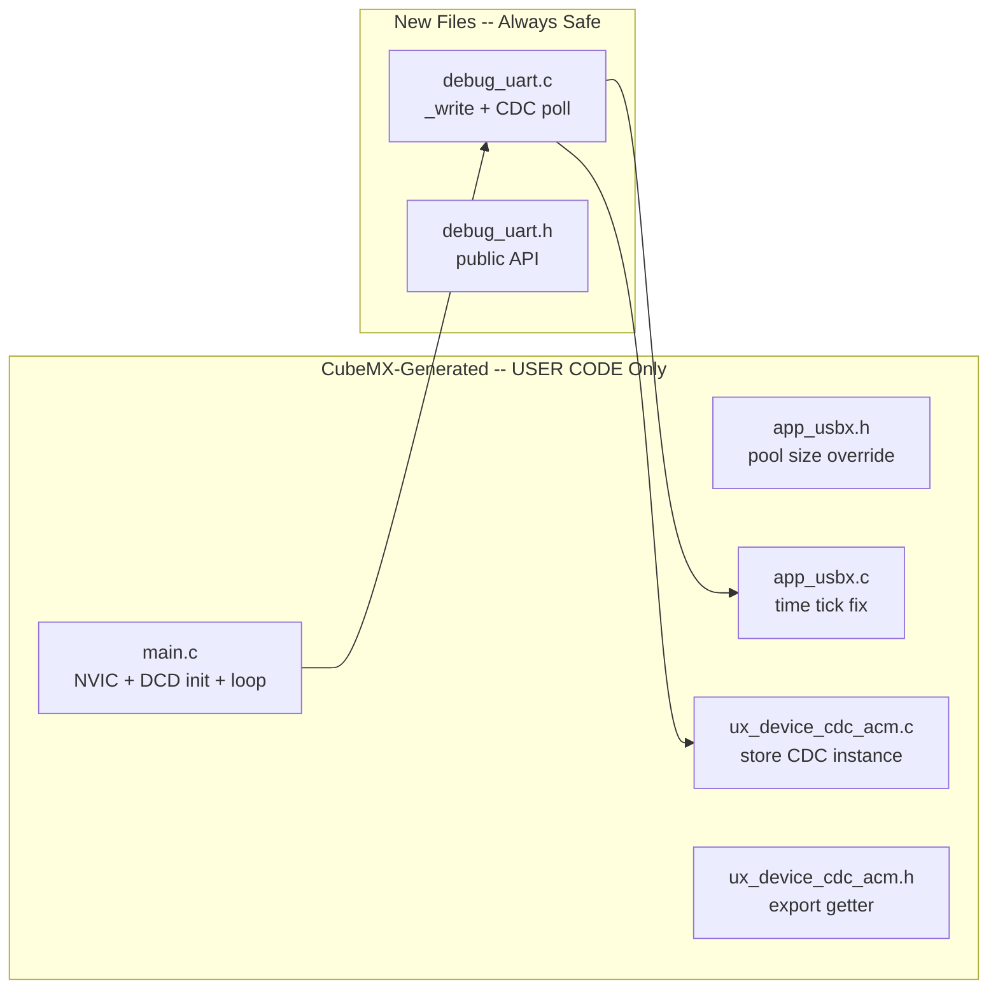

# Phase 1 -- USB CDC + Debug Printf

## Overview

Six CubeMX-generated files need USER CODE edits; two new files are created. The linker script (BLOCKER 1) was already fixed in Phase 0.



---

## Task 1: Fix USBX Memory Pool (BLOCKER 3)

**File:** [USBX/App/app_usbx.h](USBX/App/app_usbx.h) -- USER CODE BEGIN EC (line 48)

CubeMX sets `USBX_APP_MEM_POOL_SIZE` and `USBX_MEMORY_STACK_SIZE` to 1024 (outside USER CODE). Override with `#undef`/`#define` inside the USER CODE EC section:

```c
/* USER CODE BEGIN EC */
#undef USBX_APP_MEM_POOL_SIZE
#define USBX_APP_MEM_POOL_SIZE       4096
#undef USBX_MEMORY_STACK_SIZE
#define USBX_MEMORY_STACK_SIZE       4096
/* USER CODE END EC */
```

CDC ACM needs ~2.5 KB; 4096 provides margin.

---

## Task 2: Fix `_ux_utility_time_get()` (GOTCHA 7)

**File:** [USBX/App/app_usbx.c](USBX/App/app_usbx.c) -- USER CODE BEGIN _ux_utility_time_get (line 115)

```c
/* USER CODE BEGIN _ux_utility_time_get */
time_tick = (ULONG)HAL_GetTick();
/* USER CODE END _ux_utility_time_get */
```

USBX `UX_PERIODIC_RATE` = 1000 (1 tick = 1 ms); `HAL_GetTick()` also returns ms. Units match.

---

## Task 3: Store CDC Instance Pointer (BLOCKER 2)

**File:** [USBX/App/ux_device_cdc_acm.c](USBX/App/ux_device_cdc_acm.c) -- four USER CODE sections

- **USER CODE BEGIN PV:** declare `static UX_SLAVE_CLASS_CDC_ACM *g_cdc_acm = UX_NULL;`
- **USER CODE BEGIN PFP:** forward-declare `cdcAcmGetInstance()`
- **USBD_CDC_ACM_Activate:** replace `UX_PARAMETER_NOT_USED` with `g_cdc_acm = (UX_SLAVE_CLASS_CDC_ACM *)cdc_acm_instance;`
- **USBD_CDC_ACM_Deactivate:** set `g_cdc_acm = UX_NULL;`
- **USER CODE BEGIN 1:** implement `cdcAcmGetInstance()` getter

**File:** [USBX/App/ux_device_cdc_acm.h](USBX/App/ux_device_cdc_acm.h) -- USER CODE BEGIN EFP (line 59)

Export the getter:
```c
/* USER CODE BEGIN EFP */
UX_SLAVE_CLASS_CDC_ACM *cdcAcmGetInstance(void);
/* USER CODE END EFP */
```

---

## Task 4: Create `debug_uart.h`

**File:** `Core/Inc/debug_uart.h` -- NEW file (CubeMX-safe)

Add a Doxygen `@file` header at the top of the file (example):

```c
/**
 * @file    debug_uart.h
 * @brief   CDC + UART printf retarget and CDC TX polling.
 * @author  Madhu
 * @date    YYYY-MM-DD
 */
```

Public API:
- `void cdcPoll(void);` -- called from main loop, pumps CDC TX state machine
- The `_write()` syscall is automatically linked by newlib (no explicit prototype needed)

---

## Task 5: Create `debug_uart.c` (BLOCKER 4)

**File:** `Core/Src/debug_uart.c` -- NEW file (CubeMX-safe)

Add a Doxygen `@file` header at the top of the file (example):

```c
/**
 * @file    debug_uart.c
 * @brief   Printf retarget, CDC TX ring buffer, and CDC TX polling state machine.
 * @author  Madhu
 * @date    YYYY-MM-DD
 */
```

Implementation from the master plan's BLOCKER 4 pattern:
- 2048-byte ring buffer for CDC TX
- `_write()` retargets printf to:
  - USART1 via `HAL_UART_Transmit()` (blocking, 10 ms timeout -- immediate output)
  - CDC ring buffer (non-blocking enqueue -- `cdcPoll()` drains it)
- `cdcPoll()` state machine:
  - `CDC_IDLE`: dequeue up to 64 bytes, call `ux_device_class_cdc_acm_write_run()` to start transfer
  - `CDC_SENDING`: keep calling `write_run()` until `UX_STATE_NEXT` (done) or error
- If `cdcAcmGetInstance()` returns NULL (host not connected), CDC is silently skipped

Required includes: `usart.h` (for `huart1`), `ux_device_cdc_acm.h`, `ux_api.h`

---

## Task 6: Wire Up `main.c`

**File:** [Core/Src/main.c](Core/Src/main.c) -- three USER CODE sections

### USER CODE BEGIN Includes (line 40)
```c
#include "ux_dcd_stm32.h"
#include "debug_uart.h"
#include "usb.h"
```

Note: `usb.h` is already included indirectly via the generated includes but we need the extern for `hpcd_USB_DRD_FS`. Actually `app_usbx_device.h` (included via `app_usbx.h`) already includes `ux_dcd_stm32.h`, so the DCD header is available. But explicitly including `debug_uart.h` is needed.

### USER CODE BEGIN 2 (line 118) -- Init sequence

Order matters (per GOTCHA 8):
1. **Disable EXTI2** -- CubeMX's `MX_GPIO_Init()` already enabled it; suppress spurious DRDY during init
2. **NVIC priority overrides** (BLOCKER 5) -- demote non-ADC interrupts below priority 0
3. **DFU bootloader check** (Phase 3, placeholder comment only for now)
4. **USB DCD registration** (GOTCHA 9) -- `ux_dcd_stm32_initialize()` + `HAL_PCD_Start()`
5. **Re-enable EXTI2** -- clear pending edge first, then enable
6. **Startup banner** -- `printf()` with clock info

NVIC overrides (from BLOCKER 5):

| IRQn | Priority | Rationale |
|------|----------|-----------|
| EXTI2, GPDMA CH0/CH1 | 0 | Already set by CubeMX, keep |
| SPI1 | 1 | Error handler |
| SPI2 | 4 | IMU blocking SPI |
| SDMMC1 | 5 | SD card |
| USB_DRD_FS | 6 | Debug CDC |
| USART1 | 7 | Debug UART |
| EXTI4 | 8 | logStart button |
| ADC1, TIM2, TIM3 | 10 | Battery, NeoPixel, diag |
| CORDIC, FMAC | 12 | Unused peripherals |

### USER CODE BEGIN 3 (inside while(1), line 125)
```c
ux_system_tasks_run();
cdcPoll();
```

---

## CubeMX Safety Summary

| File | Edit Location | CubeMX-Safe? |
|------|--------------|--------------|
| `app_usbx.h` | USER CODE BEGIN EC | Yes |
| `app_usbx.c` | USER CODE BEGIN _ux_utility_time_get | Yes |
| `ux_device_cdc_acm.c` | USER CODE BEGIN PV/PFP/Activate/Deactivate/1 | Yes |
| `ux_device_cdc_acm.h` | USER CODE BEGIN EFP | Yes |
| `main.c` | USER CODE BEGIN Includes/2/3 | Yes |
| `debug_uart.c` | New file | Yes (not CubeMX-managed) |
| `debug_uart.h` | New file | Yes (not CubeMX-managed) |
| `STM32H562RGTX_FLASH.ld` | Direct edit (Phase 0) | Already done |

## Success Criteria

- Build compiles without errors or warnings
- Windows Device Manager shows USB COM port (VID 0x0483)
- PuTTY/TeraTerm shows startup message over USB CDC
- USART1 (PA9/PA10) simultaneously shows same output at 921600 baud
- `printf("%.3f\r\n", 3.14159f)` prints `3.142` with correct decimal and CRLF

## Naming Convention Compliance

This plan has been retroactively updated to use camelCase naming for functions and locals, `g_`-prefixed globals, `camelCase_t` for typedefs, `UPPER_SNAKE_CASE` for macros and enums, and HAL/CubeMX identifiers left unchanged, per [`.cursor/rules/commenting-and-naming.mdc`](../rules/commenting-and-naming.mdc). When Phase 14 executes, the identifiers documented here (for example `cdcPoll()`, `cdcAcmGetInstance()`) serve as the target reference for Doxygen and implementation alignment.
