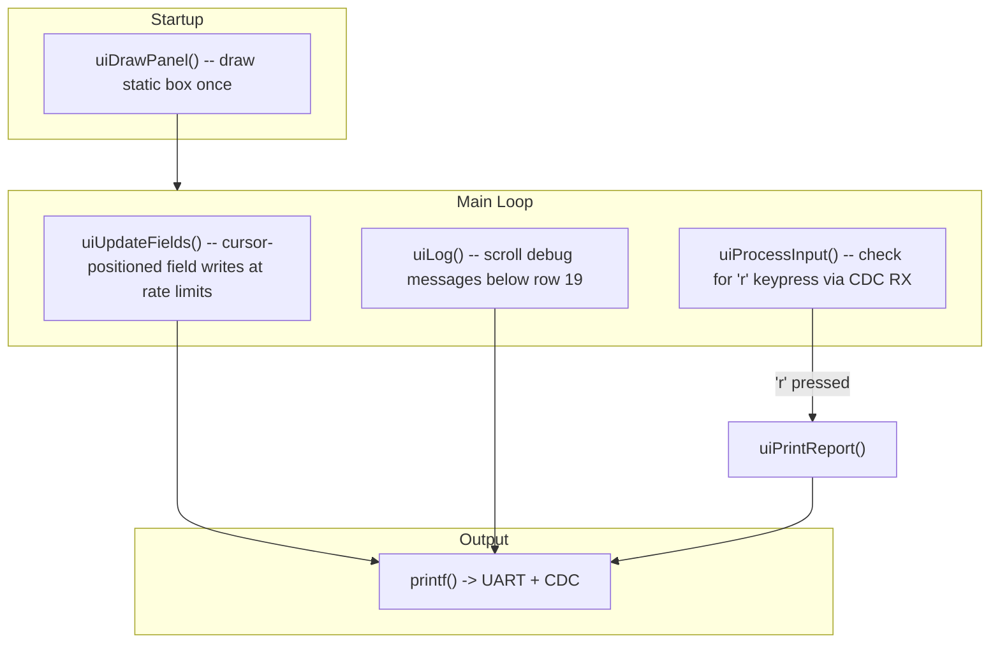

# Phase 2 -- VT220 Debug UI

## What This Phase Delivers

A live status panel rendered with ANSI escape sequences (VT220-compatible) on both USB CDC and UART terminals. The panel displays placeholders for fields not yet implemented (ADC, IMU, battery, SD) -- these will be filled in by later phases. Below the panel, a scrolling debug log captures one-shot events. Pressing `r` outputs a flat key=value status report that can be copy-pasted.

## Architecture



All output goes through the existing `printf` / `_write()` path (UART + CDC simultaneously).

## New Files

- **`Core/Src/debug_ui.c`** / **`Core/Inc/debug_ui.h`** -- the entire UI module (CubeMX-safe, new files)

## API Design (`debug_ui.h`)

```c
/**
 * @file    debug_ui.h
 * @brief   VT220 ANSI escape-code debug UI panel API.
 * @author  Madhu
 * @date    YYYY-MM-DD
 */

void uiDrawPanel(void);           // Draw full static panel (call once after CDC ready)
void uiUpdateFields(void);        // Rate-limited field updates (call every main loop)
void uiLog(const char *fmt, ...);  // Scrolling log below panel (row 19+)
void uiPrintReport(void);         // Flat key=value dump
void uiProcessInput(void);        // Check CDC RX for 'r' keypress
```

## File header (`debug_ui.c`)

```c
/**
 * @file    debug_ui.c
 * @brief   VT220 ANSI escape-code debug UI panel implementation.
 * @author  Madhu
 * @date    YYYY-MM-DD
 */
```

## Panel Layout (rows 1-18)

As specified in the master plan. All fields that lack real data (ADC, IMU, battery, SD, cal) show dashes or placeholder values. Fields update at two rates:
- **Fast fields** (ADC force, IMU accel/gyro): update cap at 10 Hz -- currently show `---` placeholders
- **Slow fields** (battery, SD, state, elapsed): update cap at 1 Hz

## Key Implementation Details

- **ANSI cursor positioning**: `\033[row;colH` to update individual fields without redrawing the entire panel. This avoids flicker.
- **Clear screen**: `\033[2J\033[H` before drawing the initial panel.
- **Rate limiting**: `uiUpdateFields()` uses `HAL_GetTick()` deltas -- fast fields gated by 100 ms, slow fields by 1000 ms.
- **Scrolling log region**: Set a scroll region `\033[19;50r` (rows 19-50) so `uiLog()` output scrolls naturally without overwriting the panel. Cursor is saved/restored around field updates.
- **CDC RX for keypress**: Use `ux_device_class_cdc_acm_read_run()` (non-blocking) to detect `r` keypress. If the CDC instance is NULL, skip silently.
- **Report format**: Flat `key : value` lines, no box drawing, no escape codes -- designed for copy-paste into chat.

## Changes to Existing Files

### `Core/Src/main.c` (USER CODE sections only)
- Replace the Phase 1 banner + heartbeat with:
  - Call `uiDrawPanel()` after the 5-second USB enumeration wait
  - Call `uiUpdateFields()`, `uiProcessInput()` in the main loop (replacing heartbeat)
- Add `#include "debug_ui.h"` in USER CODE BEGIN Includes

### `Core/Src/debug_ui.c`
- Uses `printf()` for all output (already dual UART+CDC)
- Holds cached field values (all initialized to placeholder/zero)
- Provides setter functions like `uiSetState(const char *s)`, `uiSetForce(float n)` etc. that later phases will call
- Each setter just updates a cached value; `uiUpdateFields()` handles the actual terminal writes at rate-limited intervals

## Success Criteria (from master plan)
- Terminal shows static panel with box-drawing characters (not garbled)
- Individual field updates don't cause flicker or redraw the whole screen
- Debug log scrolls naturally below row 19
- `r` keypress outputs flat key=value block (copy-pastable)
- Panel updates at 10 Hz for fast fields, 1 Hz for system fields

## Naming Convention Compliance

This plan has been retroactively updated to use camelCase naming for functions and local variables per [`.cursor/rules/commenting-and-naming.mdc`](../rules/commenting-and-naming.mdc). HAL/CubeMX identifiers are unchanged. When Phase 14 executes, the API and symbol names documented here serve as the target reference for naming alignment.
