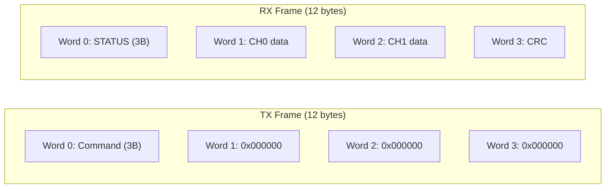

# Phase 6: ADS131M02 Basic Communication

**Reference:** [ADS131M02_CONTEXT.md](../../References/ADS131M02_CONTEXT.md) — consolidated register map, SPI frame format, command encoding, timing, and driver notes from the datasheet + TI/MikroE reference drivers.

## Context

SPI1 is already configured as Mode 1 (CPOL=0, CPHA=1), 8-bit, 12.5 MHz, MSB-first, software CS. DMA channels are linked but not used in this phase (blocking transfers only). The LTC6903 oscillator is running (Phase 5 complete), providing CLKIN at ~8.192 MHz to the ADS131M02.

**GPIO pins:**
- `ADC_CS` = PA4 (software chip select, active low)
- `ADC_DRDY` = PA2 (EXTI2, falling edge -- not used in Phase 6, stays disabled during init)
- `ADC_Reset` = PA3 (hardware reset, active low)

## SPI Frame Format (24-bit word mode)

The ADS131M02 uses **4 words per SPI frame** (CMD/STATUS + CH0 + CH1 + CRC). In 24-bit word mode, each word is 3 bytes, so **12 bytes per frame** transferred full-duplex under a single CS assertion.



**Key rule:** DOUT carries the response to the **previous** command. So register reads require two SPI frames: Frame 1 sends RREG, Frame 2 sends NULL to clock out the register data.

## Files to Create

### [`Core/Inc/adc_ads131m02.h`](Core/Inc/adc_ads131m02.h)

```c
/**
 * @file    adc_ads131m02.h
 * @brief   ADS131M02 2-channel delta-sigma ADC driver (register-level).
 * @details Blocking SPI register access, hardware reset, and diagnostic
 *          register dump. DMA continuous capture is added in Phase 7.
 * @author  Madhu
 * @date    YYYY-MM-DD
 */
```

- Register address defines (ID=0x00, STATUS=0x01, MODE=0x02, CLOCK=0x03, GAIN1=0x04, CFG=0x06, per-channel CFG/OCAL/GCAL)
- Command opcodes: NULL=0x0000, RESET=0x0011, STANDBY=0x0022, WAKEUP=0x0033, LOCK=0x0555, UNLOCK=0x0655, RREG=0xA000, WREG=0x6000
- Address encoding: `RREG | (addr << 7)` (TI convention, 6-bit address in bits [12:7])
- CLOCK register value for 64 kSPS: `0x0322` (CH0_EN + CH1_EN + TBM + OSR=128 + HR)
- ID expected mask: upper byte = 0x22 (CHANCNT=2, ID prefix=0x20), REVID in lower byte
- STATUS bit masks (LOCK, RESET, DRDY0, DRDY1, etc.)
- MODE default: `0x0510` (24-bit word length, DRDY active-low pulse)
- GAIN1: `0x0000` (PGA gain = 1 on both channels)
- Public API:
  - `int ads131m02Init(void)` -- full init sequence
  - `uint16_t ads131m02ReadReg(uint8_t addr)` -- blocking register read
  - `int ads131m02WriteReg(uint8_t addr, uint16_t data)` -- blocking register write + readback verify
  - `void ads131m02DumpRegs(void)` -- print key registers to serial
  - Sign extend helper: `static inline int32_t adsSignExtend24(uint32_t v)`

### [`Core/Src/adc_ads131m02.c`](Core/Src/adc_ads131m02.c)

```c
/**
 * @file    adc_ads131m02.c
 * @brief   ADS131M02 driver implementation (SPI frames, register I/O, init).
 * @details Blocking HAL_SPI_TransmitReceive-based access; DMA continuous capture
 *          is added in Phase 7.
 * @author  Madhu
 * @date    YYYY-MM-DD
 */
```

#### Low-level SPI helper

```c
static uint16_t adsTransferFrame(uint16_t cmd, uint16_t *statusOut)
```

- Builds 12-byte TX buffer: Word 0 = cmd (3 bytes, MSB first, zero-padded to 24 bits), Words 1-3 = zeros
- Asserts ADC_CS low
- `HAL_SPI_TransmitReceive(&hspi1, tx, rx, 12, 100)` -- blocking, 12 bytes
- Deasserts ADC_CS high
- Extracts STATUS from RX Word 0 (first 2 bytes: `(rx[0] << 8) | rx[1]`)
- Returns the response word (which is the answer to the **previous** command)

#### Register read (two-frame)

```c
uint16_t ads131m02ReadReg(uint8_t addr)
```

1. Frame 1: `adsTransferFrame(RREG | (addr << 7), &status)` -- sends RREG, response is from previous cmd
2. Frame 2: `adsTransferFrame(NULL_CMD, &status)` -- response word 0 now contains the register data
3. Extract register value from Frame 2 response (upper 16 bits of the 24-bit word 0)
4. Return the 16-bit register value

#### Register write (with verify)

```c
int ads131m02WriteReg(uint8_t addr, uint16_t data)
```

1. Build TX: Word 0 = `WREG | (addr << 7)`, Word 1 = `data` (zero-padded to 24 bits), Words 2-3 = zeros
2. Transfer 12 bytes under single CS assertion
3. Read back with `ads131m02ReadReg(addr)` and compare
4. Return 0 on match, -1 on mismatch

#### Hardware reset

```c
static void adsHwReset(void)
```

1. `HAL_GPIO_WritePin(ADC_Reset_GPIO_Port, ADC_Reset_Pin, GPIO_PIN_RESET)` -- assert low
2. `HAL_Delay(1)` -- hold for 1 ms
3. `HAL_GPIO_WritePin(ADC_Reset_GPIO_Port, ADC_Reset_Pin, GPIO_PIN_SET)` -- release
4. `HAL_Delay(50)` -- wait for device to settle (datasheet: tPOR)

#### Init sequence

```c
int ads131m02Init(void)
```

1. `adsHwReset()`
2. Send NULL command, check response for reset acknowledgment pattern `0xFF22` (0xFF20 | CHANCNT=2)
3. Send UNLOCK command (required before writing registers after reset)
4. Read ID register -- verify upper byte = 0x22 (CHANCNT=2)
5. Write MODE register = `0x0510` (24-bit words, DRDY pulse, no CRC on DIN)
6. Write CLOCK register = `0x0322` (CH0+CH1 enabled, TBM=1, OSR=128, HR mode = 64 kSPS)
7. Write GAIN1 register = `0x0000` (PGA gain 1x on both channels)
8. Read back and verify all written registers
9. Print register dump:
   ```
   ADS131M02: init OK, ID=0x22XX, STATUS=0xXXXX
   ADS131M02: MODE=0x0510 CLOCK=0x0322 GAIN=0x0000
   ```
10. Return 0 on success, negative on any failure

#### Register dump

```c
void ads131m02DumpRegs(void)
```

Reads and prints ID, STATUS, MODE, CLOCK, GAIN1, CFG to serial.

## Integration into [`Core/Src/main.c`](Core/Src/main.c)

Add `#include "adc_ads131m02.h"` to USER CODE BEGIN Includes.

Insert `ads131m02Init()` call in USER CODE BEGIN 2, **after** `ltc6903AutoTrim()` and **before** `MX_USBX_Init()`:

```
ltc6903Init();
diagClkinInit();
ltc6903AutoTrim();
ads131m02Init();          // <-- NEW: Phase 6
MX_USBX_Init();
```

This placement ensures:
- SPI1 is already in Mode 1 (restored by LTC6903 init)
- CLKIN is running and trimmed (required for ADS131M02 to operate)
- EXTI2 is still disabled (no DRDY interrupts during register config)

## Key Design Decisions

- **Word mode: 24-bit.** This is the natural mode for the ADS131M02 (24-bit ADC). 12 bytes per frame (4 words x 3 bytes).
- **CRC: disabled on DIN, read-only on DOUT.** Simplifies Phase 6. CRC validation will be added in Phase 7 if `enable_adc_crc` config flag is set.
- **Blocking SPI only.** DMA transfers are Phase 7. `HAL_SPI_TransmitReceive()` is fine for init-time register access (~1 us per byte at 12.5 MHz = ~12 us per frame).
- **TI address encoding `(addr << 7)`.** Per chip manufacturer's reference driver.
- **CLOCK = 0x0322.** Per MikroE reference (validated on ADS131M02 hardware). Breakdown: CH0_EN=1, CH1_EN=1, TBM=1, OSR=128, PWR=HR. If this doesn't work, fall back to 0x0302 (without TBM bit).

## Success Criteria (from master plan)

- [ ] ID register read returns 0x22XX (upper byte = 0x22, lower byte = silicon revision)
- [ ] STATUS register shows CH0_EN=1, CH1_EN=1 after init
- [ ] Write then read back GAIN register returns the written value
- [ ] No SPI framing errors (CS glitches visible on oscilloscope if available)
- [ ] Serial terminal shows: `ADS131M02: init OK, ID=0x22XX, STATUS=0xXXXX`
- [ ] Serial terminal shows: `ADS131M02: MODE=0x0510 CLOCK=0x0322 GAIN=0x0000`

## Naming Convention Compliance

This plan was retroactively updated to use **camelCase** for functions and local variables, consistent with `.cursor/rules/commenting-and-naming.mdc`. HAL and CubeMX-generated identifiers (for example `hspi1`, `HAL_SPI_TransmitReceive`, `HAL_GPIO_WritePin`, `HAL_Delay`) are unchanged. When Phase 14 (Doxygen and naming pass) runs, the symbols documented here are the **target reference** for the ADS131M02 driver API and helpers.
