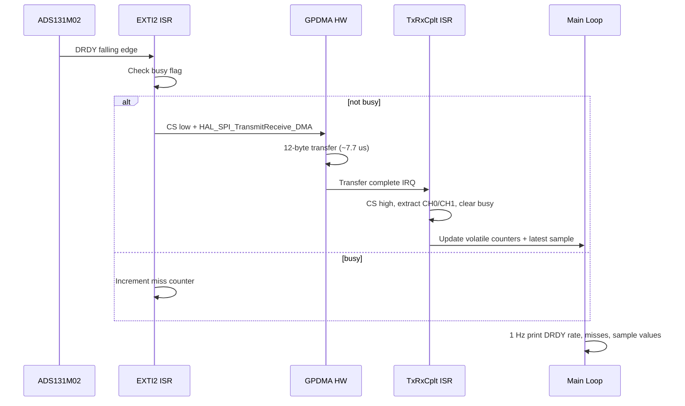

# Phase 7: ADS131M02 Continuous 64 kSPS Sampling (Zero Loss)

**Reference:** [ADS131M02_CONTEXT.md](References/ADS131M02_CONTEXT.md) | [Master plan Phase 7](/.cursor/plans/snazzy-petting-mountain.md) (line 655)

## Current State

- Phase 6 driver ([Core/Src/adc_ads131m02.c](Core/Src/adc_ads131m02.c)) uses **blocking** `HAL_SPI_TransmitReceive` for register access
- GPDMA1 CH0 (SPI1_TX) and CH1 (SPI1_RX) are configured in `DMA_NORMAL` mode in [Core/Src/spi.c](Core/Src/spi.c) but **not yet used**
- EXTI2 (DRDY falling edge) handler exists in [Core/Src/stm32h5xx_it.c](Core/Src/stm32h5xx_it.c) but has **no application callback**
- NVIC priorities already set correctly: EXTI2=0, GPDMA=0, SPI1=1
- **TIM3/PB4 (`DRDY_Reader`)** is CubeMX-configured as input capture (falling edge) on TIM3_CH1 but `MX_TIM3_Init()` is commented out in `main.c` (line 134). Prescaler=249 (300 kHz tick), 16-bit free-running. Ready to enable for hardware DRDY frequency measurement.

## Timing Budget

```
DRDY period (64 kSPS):     15.625 us
SPI DMA transfer (12B):    ~7.7 us  (hardware, CPU free)
EXTI2 ISR overhead:        ~1.5 us  (flag check, CS assert, HAL_SPI_TransmitReceive_DMA)
DMA-complete ISR overhead:  ~2.0 us  (CS deassert, extract 6 bytes, counters)
Total elapsed per sample:  ~11-12 us
Margin:                    ~3.5-4.5 us (23-29%)
```

## Data Flow



## NVIC Priority Scheme (unchanged from current)

| IRQ | Priority | Role |
|-----|----------|------|
| EXTI2 (DRDY) | 0 | Trigger DMA read |
| GPDMA1 CH0/CH1 | 0 | DMA completion |
| SPI1 | 1 | SPI error handling |
| SDMMC1 | 5 | SD card |
| USB_DRD_FS | 6 | USB |
| USART1 | 7 | Debug UART |

EXTI2 and GPDMA share priority 0 -- they cannot preempt each other. This is intentional: if DRDY fires during DMA-complete processing, it pends and fires immediately after. Since the DMA-complete callback is fast (~2 us), and total elapsed time is well within the 15.625 us budget, this is safe.

## Implementation

### 1. Add DMA state and API to [Core/Inc/adc_ads131m02.h](Core/Inc/adc_ads131m02.h)

New declarations:

```c
/* DMA continuous capture state (read from main loop) */
typedef struct {
    volatile uint32_t drdyCount;       /* EXTI2 events */
    volatile uint32_t dmaCount;        /* completed DMA transfers */
    volatile uint32_t missCount;       /* DRDY while DMA busy */
    volatile int32_t  ch0Latest;       /* last CH0 sample (sign-extended) */
    volatile int32_t  ch1Latest;       /* last CH1 sample (sign-extended) */
} adsDmaStats_t;

void ads131m02StartContinuous(void);
void ads131m02StopContinuous(void);
const adsDmaStats_t *ads131m02GetStats(void);

/* Called from ISR context -- not part of public API but needed by HAL callbacks */
void ads131m02DrdyIsr(void);
void ads131m02DmaCompleteIsr(void);
```

### 2. Add DMA logic to [Core/Src/adc_ads131m02.c](Core/Src/adc_ads131m02.c)

New static data:

```c
static uint8_t adsTxDma[ADS_FRAME_BYTES];  /* pre-filled NULL command */
static uint8_t adsRxDma[ADS_FRAME_BYTES];
static volatile uint8_t adsDmaBusy;
static adsDmaStats_t adsStats;
```

Key functions:

- **`ads131m02StartContinuous()`**: Zero-fill TX except word 0 = NULL command. Clear counters and busy flag. Pulse SYNC/RESET (PA3) briefly to clear the ADC's internal 2-sample FIFO (datasheet requirement after a pause in reading).

- **`ads131m02DrdyIsr()`**: Called from `HAL_GPIO_EXTI_Falling_Callback`. Increments `drdyCount`. Checks `adsDmaBusy` -- if set, increments `missCount` and returns. Otherwise sets `adsDmaBusy = 1`, asserts CS low, calls `HAL_SPI_TransmitReceive_DMA(&hspi1, adsTxDma, adsRxDma, ADS_FRAME_BYTES)`.

- **`ads131m02DmaCompleteIsr()`**: Called from `HAL_SPI_TxRxCpltCallback`. Deasserts CS high. Extracts CH0 and CH1 from `adsRxDma` words 1 and 2 (bytes [3:5] and [6:8]), sign-extends to int32_t. Stores in `adsStats`. Increments `dmaCount`. Clears `adsDmaBusy = 0`.

- **`ads131m02StopContinuous()`**: Sets a stop flag; DRDY ISR checks it and skips DMA start. Waits for any in-flight DMA to complete.

### 3. Wire HAL callbacks in [Core/Src/stm32h5xx_it.c](Core/Src/stm32h5xx_it.c) or a new callback file

Two HAL weak callbacks need overriding:

```c
void HAL_GPIO_EXTI_Falling_Callback(uint16_t GPIO_Pin)
{
    if (GPIO_Pin == ADC_DRDY_Pin)
        ads131m02DrdyIsr();
}

void HAL_SPI_TxRxCpltCallback(SPI_HandleTypeDef *hspi)
{
    if (hspi->Instance == SPI1)
        ads131m02DmaCompleteIsr();
}
```

Best location: a new file `Core/Src/isr_callbacks.c` to keep HAL callback overrides centralized and out of CubeMX-managed files. Alternatively, place them in `adc_ads131m02.c` directly (simpler, single file).

### 4. TIM3 hardware DRDY frequency measurement (PB4 closed-loop check)

TIM3_CH1 on PB4 (`DRDY_Reader`) captures the actual DRDY falling edges in hardware, independent of the EXTI2 software path. This mirrors how TIM8/PC6 measures CLKIN.

**CubeMX config already done** ([Core/Src/tim.c](Core/Src/tim.c) line 76): TIM3, prescaler=249 (75 MHz / 250 = 300 kHz tick), input capture on falling edge, 16-bit free-running counter.

**Approach -- external clock mode (simpler, like TIM8 for CLKIN):**

Instead of input capture timestamps, configure TIM3 in external clock mode (count DRDY edges directly). This gives us a hardware edge counter we can sample periodically:

```c
/* In diag_timers.c or a new drdy_diag.c */
void diagDrdyInit(void)
{
    MX_TIM3_Init();
    /* Reconfigure TIM3 as external clock (count DRDY edges on TI1) */
    /* TIM3->SMCR: SMS=111 (external clock mode 1), TS=101 (TI1FP1) */
    TIM3->SMCR = (0x7 << 0) | (0x5 << 4);
    TIM3->CNT = 0;
    TIM3->CR1 |= TIM_CR1_CEN;
}

uint32_t diagDrdyReadEdges(void) { return TIM3->CNT; }
```

Then in the 1 Hz diagnostic print, compare:
- `TIM3->CNT` delta over 1 second = hardware DRDY rate (should be ~64000)
- `adsStats.drdyCount` delta over 1 second = software DRDY rate
- If HW > SW, we are missing EXTI2 interrupts
- If HW == SW but `missCount > 0`, the DMA path is the bottleneck

**NVIC for TIM3:** Set to priority 8+ (low) since we only read the counter from the main loop. No ISR processing needed if using external clock mode.

### 5. Alternating polarity self-test (60 seconds)

New function in `adc_ads131m02.c`:

```c
void ads131m02PolarityTest(uint32_t durationS);
```

The test must coordinate with the running DMA path. Since we cannot do a blocking SPI register write while DMA is in flight, the MUX flip procedure is:

1. Call `ads131m02StopContinuous()` -- sets stop flag, waits for in-flight DMA to finish
2. Write `CH0_CFG` and `CH1_CFG` via blocking `ads131m02WriteReg()` (SPI1 is idle now)
3. Clear the 1-second min/max/sum accumulators
4. Call `ads131m02StartContinuous()` -- SYNC/RESET pulse + re-enable DMA capture
5. Collect for 1 second (main loop watches `HAL_GetTick`)
6. Repeat from step 1 with flipped polarity

The accumulators live inside `adsDmaStats_t` (extended with min/max/sum fields) or in a separate test struct. The DMA-complete ISR updates them when a test-mode flag is set.

**Stats collected per 1-second window (per channel):**
- `min`: smallest signed sample
- `max`: largest signed sample  
- `sum`: running int64_t sum for average calculation
- `count`: number of samples (should be ~64000)

**Serial output per flip:**
```
[TEST  1] CH0=+test CH1=-test | CH0: min=+1118200 max=+1118760 avg=+1118481 | CH1: min=-1118790 max=-1118220 avg=-1118481
[TEST  2] CH0=-test CH1=+test | CH0: min=-1118780 max=-1118210 avg=-1118481 | CH1: min=+1118190 max=+1118770 avg=+1118481
...
```

**After 60 flips, print summary:**
```
=== ADC POLARITY TEST SUMMARY (60 s) ===
CH0 +test: avg=+1118481 spread=560   (30 windows)
CH0 -test: avg=-1118481 spread=570   (30 windows)
CH1 +test: avg=+1118481 spread=555   (30 windows)
CH1 -test: avg=-1118480 spread=568   (30 windows)
Symmetry error: CH0=+0.0001%  CH1=-0.0001%
=== END TEST ===
```

After the test, revert both channels to MUX=00 (external inputs) and restart continuous capture.

### 6. Integration into [Core/Src/main.c](Core/Src/main.c)

Uncomment `MX_TIM3_Init()` (line 134), then after the existing EXTI2 re-enable block (currently line ~221), add:

```c
diagDrdyInit();              /* TIM3/PB4 hardware DRDY counter */
ads131m02StartContinuous();  /* begin DMA capture on DRDY */
ads131m02PolarityTest(60);   /* 60 s alternating MUX self-test */
/* After test, continuous capture resumes with MUX=00 (external inputs) */
```

In the main `while(1)` loop, add a 1 Hz diagnostic print using `HAL_GetTick()`:

```c
static uint32_t lastAdcPrint = 0;
static uint32_t prevDrdySw = 0, prevDrdyHw = 0;
if (HAL_GetTick() - lastAdcPrint >= 1000) {
    lastAdcPrint = HAL_GetTick();
    const adsDmaStats_t *s = ads131m02GetStats();
    uint32_t hwEdges = diagDrdyReadEdges();
    uint32_t swDelta = s->drdyCount - prevDrdySw;
    uint32_t hwDelta = hwEdges - prevDrdyHw;
    prevDrdySw = s->drdyCount;
    prevDrdyHw = hwEdges;
    printf("ADC: DRDY_SW=%lu DRDY_HW=%lu DMA=%lu miss=%lu CH0=%ld CH1=%ld\r\n",
           swDelta, hwDelta, s->dmaCount, s->missCount,
           (long)s->ch0Latest, (long)s->ch1Latest);
}
```

The `DRDY_HW` vs `DRDY_SW` comparison is the closed-loop check: if HW > SW, we are missing EXTI2 interrupts.

### 5. SYNC/RESET pulse before starting (datasheet requirement)

The ADS131M02 has a 2-sample FIFO per channel. After a gap in reading (Phase 6 blocking init -> Phase 7 DMA start), both slots are full. The datasheet recommends pulsing SYNC/RESET to clear the FIFOs and resynchronize. Add this to `ads131m02StartContinuous()`:

```c
HAL_GPIO_WritePin(ADC_Reset_GPIO_Port, ADC_Reset_Pin, GPIO_PIN_RESET);
for (volatile int i = 0; i < 100; i++) {}  /* ~1 us pulse */
HAL_GPIO_WritePin(ADC_Reset_GPIO_Port, ADC_Reset_Pin, GPIO_PIN_SET);
HAL_Delay(1);  /* wait for ADC to resync */
```

The pulse must be shorter than tw(RSL) (reset threshold) to trigger a sync rather than a full reset.

## Key Design Decisions

- **HAL DMA first, optimize later.** `HAL_SPI_TransmitReceive_DMA` adds ~1-2 us overhead per call but keeps the code maintainable. If testing shows the 3.5 us margin is insufficient, we can switch to register-level DMA restarts in a follow-up.
- **Single buffer pair (not double-buffered).** At 23-29% margin, there is no overlap between processing the previous sample and starting the next DMA. Double-buffering adds complexity for no benefit at this duty cycle.
- **Own `adsDmaBusy` flag instead of checking `hspi1.State`.** Faster (single volatile read vs HAL state machine), and decoupled from HAL internals.
- **Callbacks in `adc_ads131m02.c`** rather than a separate file. Keeps the driver self-contained. If other SPI1 slaves need DMA later, we can refactor.
- **No decimation in Phase 7.** Raw sample extraction + counters only. Decimation accumulator is Phase 10.
- **Alternating polarity test signal validation (60 s).** After DMA capture starts, run a 60-second self-test that alternates the internal MUX every 1 second:
  - **Even seconds:** CH0=+test (MUX=10), CH1=-test (MUX=11)
  - **Odd seconds:** CH0=-test (MUX=11), CH1=+test (MUX=10)
  - Each 1-second window: accumulate min, max, sum from the DMA stream (~64,000 samples), compute average
  - After 60 seconds (30 flips each polarity), print summary table with per-channel per-polarity min/max/avg
  - This validates: sign extension, channel ordering, MUX switching, offset symmetry, gain matching, no stuck bits
  - MUX writes use the existing blocking `ads131m02WriteReg()` -- safe because EXTI2 is running but the blocking write only takes ~24 us (two SPI frames), well under the 15.625 us DRDY period. The DMA ISR will detect `adsDmaBusy` (set by the blocking transfer) and count 1-2 misses per flip, which is acceptable during the test.
  - After the test, revert to MUX=00 (external inputs) on both channels

## Files Changed

| File | Change |
|------|--------|
| `Core/Inc/adc_ads131m02.h` | Add `adsDmaStats_t`, DMA API declarations |
| `Core/Src/adc_ads131m02.c` | Add DMA buffers, ISR functions, start/stop/stats, HAL callbacks |
| `Core/Inc/diag_timers.h` | Add `diagDrdyInit()`, `diagDrdyReadEdges()` declarations |
| `Core/Src/diag_timers.c` | Add TIM3 external-clock-mode init and edge counter read |
| `Core/Src/main.c` | Uncomment `MX_TIM3_Init()`, add `diagDrdyInit()` + `ads131m02StartContinuous()`, add 1 Hz HW/SW diagnostic print in loop |
| `Debug/Core/Src/subdir.mk` | No change (files already registered) |

## Success Criteria (from master plan + closed-loop check)

- Hardware DRDY counter (TIM3/PB4) = 64000 +/- 128 over any 1-second window
- Software DRDY counter (EXTI2) matches hardware counter (no missed interrupts)
- DMA complete counter equals DRDY counter (zero misses)
- Miss counter = 0 continuously for 60 s
- Alternating polarity test (60 s): both channels read ~+1,118,481 in positive test and ~-1,118,481 in negative test
- Per-channel min/max spread is small (noise only, no outliers or stuck values)
- CH0 and CH1 magnitudes symmetric within offset error (gain matching)
- Positive and negative averages symmetric per channel (sign extension correct)
- VT220 UI shows DRDY frequency field updating (if wired)
- During polarity test: per-second printout with min/max/avg per channel per polarity
- After test, serial terminal shows (every 1 s): `ADC: DRDY_SW=64000 DRDY_HW=64000 DMA=XXXXX miss=0 CH0=XXXXXX CH1=XXXXXX`
- All above verified while USB CDC is active and streaming debug output

## Fallback: If Timing Is Too Tight

If `missCount > 0` during testing, the optimization path is:

1. **Quick win:** Change GPDMA CH0/CH1 priority from 0 to 1. This lets EXTI2 preempt the DMA-complete callback to start the next transfer immediately, but requires moving the data extraction out of the ISR into a deferred path.
2. **Register-level DMA restart:** Replace `HAL_SPI_TransmitReceive_DMA` with direct GPDMA register writes (set source, dest, length, enable). Saves ~1-2 us per sample.
3. **Double-buffer:** Two RX buffers, ping-pong between them. Allows overlap of DMA transfer and data extraction.

## Naming Convention Compliance

This plan has been retroactively updated to use camelCase naming for functions, locals, struct members, and `g_`-prefixed globals where applicable, with typedefs as `camelCase_t`, per [.cursor/rules/commenting-and-naming.mdc](../rules/commenting-and-naming.mdc). HAL/CubeMX identifiers (for example `hspi1`, `HAL_SPI_TransmitReceive_DMA`, `MX_TIM3_Init`) are unchanged. When Phase 14 executes, the identifiers in this document are the target reference for naming alignment.
