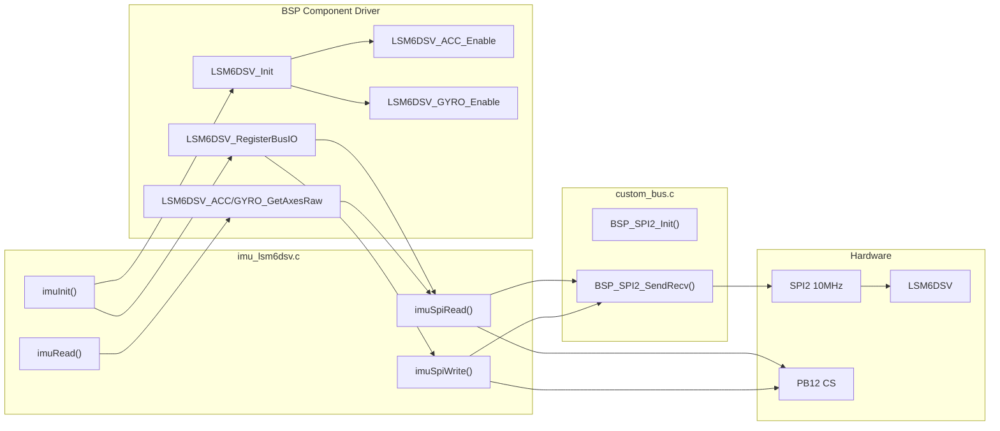

# Phase 8 -- LSM6DSV IMU Driver

## Current State

- **BSP component driver** exists at `Drivers/BSP/Components/lsm6dsv/` with full high-level API (`LSM6DSV_RegisterBusIO`, `LSM6DSV_Init`, `LSM6DSV_ReadID`, `LSM6DSV_ACC_*`, `LSM6DSV_GYRO_*`)
- **SPI2 bus** is fully implemented in [Core/Src/custom_bus.c](Core/Src/custom_bus.c) (`BSP_SPI2_Init`, `BSP_SPI2_SendRecv` -- polling, no DMA) but **never called** from main.c
- **SPI2 config**: PLL2P = 20 MHz, prescaler /2 = **10.0 MHz**, Mode 3 (CPOL=HIGH, CPHA=2EDGE) -- matches LSM6DSV max spec (DOE-validated)
- **IMU CS**: `PB12` (`IMU_CS_Pin`), already driven HIGH in main.c init
- **UI hooks ready**: `uiSetAccel()`, `uiSetGyro()` already declared in [Core/Inc/debug_ui.h](Core/Inc/debug_ui.h) and implemented in `debug_ui.c`
- **No `imu_lsm6dsv.c/.h` exists** -- must be created
- WHO_AM_I expected: `0x70` (`LSM6DSV_ID`)
- Available ODRs: 480 Hz is closest to the target 500 Hz

## Architecture

The driver is a thin wrapper over ST's BSP component library, providing SPI2 + CS glue:



## Implementation Steps

### 1. Create `Core/Inc/imu_lsm6dsv.h`

Public API:

```c
/**
 * @file    imu_lsm6dsv.h
 * @brief   LSM6DSV IMU driver — accelerometer and gyroscope over SPI2.
 * @author  Madhu
 * @date    YYYY-MM-DD
 */
#ifndef IMU_LSM6DSV_H
#define IMU_LSM6DSV_H
#include <stdint.h>

typedef struct {
    float ax, ay, az;   /* m/s^2 */
    float gx, gy, gz;   /* dps */
    int16_t rawAx, rawAy, rawAz;
    int16_t rawGx, rawGy, rawGz;
} imuData_t;

int  imuInit(void);
int  imuRead(imuData_t *out);
int  imuReadRaw(int16_t accel[3], int16_t gyro[3]);

#endif
```

### 2. Create `Core/Src/imu_lsm6dsv.c`

Key design decisions:

- **Use `LSM6DSV_Object_t`** + `LSM6DSV_RegisterBusIO` to wire SPI2 into the BSP component driver
- **SPI read/write callbacks**: assert/deassert `IMU_CS` (PB12), use `BSP_SPI2_SendRecv` for full-duplex. For SPI reads, the register address byte has bit 7 set (read flag). Static TX/RX buffers of 32 bytes (avoids VLA)
- **`imuInit()`**: calls `BSP_SPI2_Init()`, `LSM6DSV_RegisterBusIO`, `LSM6DSV_Init`, `LSM6DSV_ReadID` (verify 0x70), then configures:
  - Accel: ODR = 480 Hz, FS = 16g (sensitivity = 0.488 mg/LSB)
  - Gyro: ODR = 480 Hz, FS = 2000 dps (sensitivity = 70.0 mdps/LSB)
  - FIFO = bypass mode (already set by `LSM6DSV_Init`)
  - BDU = enabled (already set by `LSM6DSV_Init`)
- **`imuRead()`**: calls `LSM6DSV_ACC_GetAxesRaw` + `LSM6DSV_GYRO_GetAxesRaw`, converts raw to physical units:
  - `accelMss = raw * 0.488f * 9.80665f / 1000.0f`
  - `gyroDps = raw * 70.0f / 1000.0f`
- **`imuReadRaw()`**: returns raw int16 values for direct use in `binForceRecord_t` (Phase 10)

SPI callback signatures for `LSM6DSV_IO_t`:

```c
static int32_t imuSpiRead(uint16_t addr, uint16_t reg, uint8_t *data, uint16_t len)
{
    (void)addr;
    static uint8_t tx[33], rx[33];
    uint16_t total = len + 1;
    tx[0] = (uint8_t)reg | 0x80;  /* bit 7 = read */
    memset(&tx[1], 0, len);

    HAL_GPIO_WritePin(IMU_CS_GPIO_Port, IMU_CS_Pin, GPIO_PIN_RESET);
    BSP_SPI2_SendRecv(tx, rx, total);
    HAL_GPIO_WritePin(IMU_CS_GPIO_Port, IMU_CS_Pin, GPIO_PIN_SET);

    memcpy(data, &rx[1], len);
    return 0;
}

static int32_t imuSpiWrite(uint16_t addr, uint16_t reg, uint8_t *data, uint16_t len)
{
    (void)addr;
    static uint8_t tx[33];
    uint16_t total = len + 1;
    tx[0] = (uint8_t)reg;  /* bit 7 = 0 = write */
    memcpy(&tx[1], data, len);

    HAL_GPIO_WritePin(IMU_CS_GPIO_Port, IMU_CS_Pin, GPIO_PIN_RESET);
    BSP_SPI2_Send(tx, total);
    HAL_GPIO_WritePin(IMU_CS_GPIO_Port, IMU_CS_Pin, GPIO_PIN_SET);

    return 0;
}
```

### 3. Integrate into `main.c`

**USER CODE BEGIN Includes**: add `#include "imu_lsm6dsv.h"`

**USER CODE BEGIN 2** (after `ads131m02Init()`, before USB CDC init):
```c
/* ── Phase 8: LSM6DSV IMU ────────────────────────────────── */
imuInit();
```

This placement is safe -- SPI2 is independent of SPI1. EXTI2 is still disabled at this point, so no ADC DMA contention.

**USER CODE BEGIN 3** (main loop, inside the existing 1-second block or a new ~100ms block):
Add a 100 ms periodic IMU read that calls `imuRead()` and feeds `uiSetAccel()` / `uiSetGyro()`. This gives ~10 Hz display update as specified in the success criteria.

```c
{
    static uint32_t lastImuTick;
    if (now - lastImuTick >= 100) {
        lastImuTick = now;
        imuData_t imu;
        if (imuRead(&imu) == 0) {
            uiSetAccel(imu.ax, imu.ay, imu.az);
            uiSetGyro(imu.gx, imu.gy, imu.gz);
        }
    }
}
```

### 4. SPI2 NVIC Priority

The `SPI2_MspInit` in custom_bus.c sets `SPI2_IRQn` to priority 5. The master plan says priority 4. Add an override in main.c USER CODE BEGIN 2 after the existing NVIC block:

```c
HAL_NVIC_SetPriority(SPI2_IRQn, 4, 0);
```

### 5. Verification Checklist

Matches the plan's Phase 8 success criteria:
- WHO_AM_I = 0x70
- `accel_z` approx +9.81 m/s^2 when flat
- `accel_x`, `accel_y` approx 0 when flat
- Gyro XYZ approx 0 when stationary
- VT220 IMU fields update at ~10 Hz
- Serial terminal shows init and periodic IMU data
- ADC DMA still shows zero misses over 60 s

## Key Files

| Action | File |
|--------|------|
| **Create** | [Core/Inc/imu_lsm6dsv.h](Core/Inc/imu_lsm6dsv.h) |
| **Create** | [Core/Src/imu_lsm6dsv.c](Core/Src/imu_lsm6dsv.c) |
| **Edit** | [Core/Src/main.c](Core/Src/main.c) -- add include, init call, main loop polling |

## Risks and Mitigations

- **SPI2 blocking during ADC DRDY ISR**: SPI2 read takes ~14 us at 10 MHz for 14 bytes. The EXTI2/SPI1 DMA hot path has NVIC priority 0, which preempts SPI2 (priority 4). The blocking SPI2 HAL call will be interrupted transparently -- HAL_SPI_TransmitReceive uses polling (not DMA), so no DMA contention. After the EXTI2 ISR returns, SPI2 resumes. This adds ~1-2 us jitter to the IMU read, which is harmless.
- **Static TX/RX buffers in SPI callbacks**: The callbacks use `static` buffers, which means they are not reentrant. This is fine because SPI2 IMU reads only happen from the main loop (single caller).

## Naming Convention Compliance

This plan document has been retroactively updated to use camelCase naming for application-layer functions, locals, struct typedefs (`camelCase_t`), and struct members, consistent with [.cursor/rules/commenting-and-naming.mdc](.cursor/rules/commenting-and-naming.mdc). HAL/CubeMX and BSP component driver identifiers are unchanged. When Phase 14 (Doxygen and naming pass) runs, the identifiers used here are the target reference for the IMU module.
