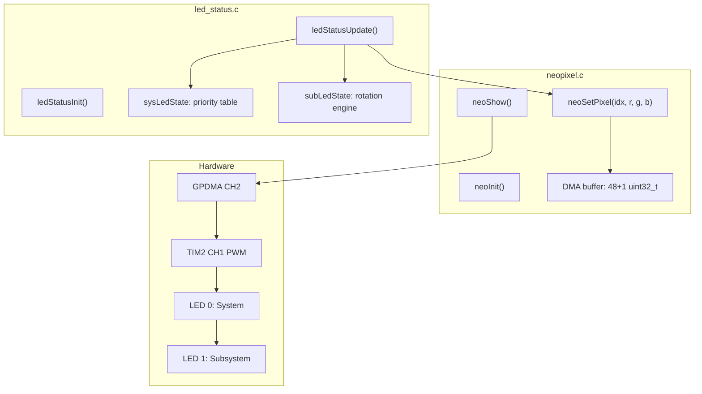

# Phase 9a — NeoPixel Status LEDs (WS2812)

**Reference:** [Master plan Phase 9a](/.cursor/plans/snazzy-petting-mountain.md)

**Prerequisite:** Phase 8 complete. Must be implemented before [Phase 9b (Battery Monitoring)](/.cursor/plans/phase_9b_battery_usb_sense.plan.md) because NeoPixels are the primary visual diagnostic channel for all subsequent phases.

## Customer Spec (Non-Negotiable)

- **Power ON** = RED LED (solid)
- **Low battery** = ORANGE LED (solid)
- **Logging** = GREEN LED (solid)

LED assignment: Power ON and Low battery map to **LED 0 (system)**. Logging maps to **LED 1 (subsystem)** — this keeps LED 0 purely for system health and LED 1 for operational/subsystem status. No color is reused with the same pattern on both LEDs simultaneously.

## Hardware

- **2x WS2812** daisy-chained on **PA0** (TIM2 CH1 PWM)
- LED 0 (first in chain) = system status
- LED 1 (second) = subsystem diagnostic
- **DMA**: add a GPDMA channel for TIM2 in the CubeMX IOC regen (combined with Phase 9b battery regen)
- **NVIC**: TIM2 priority overridden to 10 in `main.c` USER CODE BEGIN 2 (cosmetic, must never preempt ADC hot path)

## WS2812 Timing at 250 MHz SYSCLK

TIM2 runs at 250 MHz (prescaler = 0). Each WS2812 bit is 1.25 us:

- **Period** (ARR): 312 counts
- **Bit-0 duty** (CCR): 100 counts (0.4 us high)
- **Bit-1 duty** (CCR): 200 counts (0.8 us high)
- **Reset**: 50+ us low (hold data line low after last bit)

DMA buffer: 48 x `uint32_t` (2 LEDs x 24 bits) + a trailing zero for reset. TIM2 update event triggers DMA to load the next CCR1 value each period. One-shot: DMA transfer complete callback stops TIM2.

## Color Palette (Sunlight-Readable, No Pastels)

| Name | R | G | B | LED 0 usage | LED 1 usage |
|------|---|---|---|-------------|-------------|
| RED | 255 | 0 | 0 | Power ON (solid), fatal error (fast blink) | Subsystem error (fast blink) |
| GREEN | 0 | 255 | 0 | -- never used on LED 0 -- | Logging active (solid), all subsystems OK (heartbeat) |
| BLUE | 0 | 0 | 255 | Charging (slow blink) | Subsystem warning (slow blink) |
| ORANGE | 255 | 80 | 0 | Battery low (solid), battery critical (fast blink) | -- never used on LED 1 -- |
| OFF | 0 | 0 | 0 | -- | Not initialized |

**No yellow** — too close to white in sunlight.

**Disambiguation rule**: RED appears on both LEDs but always with different patterns:
- LED 0 RED = SOLID (power on) or HEARTBEAT (boot) — steady/calm
- LED 1 RED = FAST BLINK only (subsystem error) — urgent/alarming
- An observer can always tell them apart by cadence.

## Blink Patterns (IEC 60073 Industrial Standard)

| Pattern | Timing | Meaning |
|---------|--------|---------|
| **SOLID** | Always on | Normal operating condition |
| **SLOW BLINK** | 500 ms on / 500 ms off (1 Hz) | Warning, attention needed |
| **FAST BLINK** | 125 ms on / 125 ms off (4 Hz) | Error, urgent action required |
| **HEARTBEAT** | 100 ms flash, 1900 ms off | Activity / alive indicator |
| **OFF** | Always off | Not initialized or disabled |

## LED 0 — System Health (Customer-Facing)

Dedicated to overall system state: power, battery, charging, fatal errors. **Never shows logging or subsystem status.**

Priority order (highest wins):

| Priority | Condition | Color | Pattern |
|----------|-----------|-------|---------|
| 1 (highest) | Fatal error (HardFault, unrecoverable) | RED | FAST BLINK |
| 2 | Battery critical (SOC <= 5%) | ORANGE | FAST BLINK |
| 3 | Battery low (SOC <= 20%) | ORANGE | SOLID |
| 4 | Charging (USB power, BQ24012 active) | BLUE | SLOW BLINK |
| 5 | Idle, battery OK | RED | SOLID |
| 6 | Booting / initializing | RED | HEARTBEAT |

## LED 1 — Subsystem and Logging Status (Engineering + Customer)

Dedicated to subsystem health and the logging indicator. **Never shows battery or system power status.**

Four subsystems monitored, each can be OK / WARN / ERROR:

| Subsystem | OK | WARN | ERROR |
|-----------|-----|------|-------|
| ADC (DRDY running, no misses) | GREEN | BLUE slow blink | RED fast blink |
| IMU (WHO_AM_I OK, SPI healthy) | GREEN | BLUE slow blink | RED fast blink |
| SD (mounted, no write errors) | GREEN | BLUE slow blink | RED fast blink |
| Logger (state machine healthy) | GREEN | BLUE slow blink | RED fast blink |

**Display logic:**

- **Not initialized**: OFF
- **All subsystems OK, not logging**: GREEN HEARTBEAT (100 ms flash every 2 s)
- **Logging active, all OK**: GREEN SOLID (customer spec)
- **Any warnings/errors present**: Rotate through subsystems with active warnings/errors, 2 seconds each, with a 200 ms OFF gap between to mark transitions. Subsystems at OK level are skipped in the rotation. If logging is active, the rotation includes a 2-second GREEN SOLID slot labelled "LOG" to confirm logging is still running.

### Quick-Glance Guide (What the User Sees)

| LED 0 | LED 1 | Meaning |
|-------|-------|---------|
| RED solid | GREEN heartbeat | System on, all healthy, idle |
| RED solid | GREEN solid | System on, logging, all OK |
| RED solid | BLUE slow blink | System on, subsystem warning |
| RED solid | RED fast blink | System on, subsystem error |
| ORANGE solid | GREEN solid | Battery low, logging |
| ORANGE fast blink | RED fast blink | Battery critical + subsystem error |
| BLUE slow blink | GREEN heartbeat | Charging, all subsystems OK |
| RED heartbeat | OFF | Booting, subsystems not yet init |

## Naming Convention and Doxygen Compliance

Per `.cursor/rules/commenting-and-naming.mdc` and Phase 14 incremental rule. Applies to **all code touched in this phase** — both new files and any existing files that are modified.

**Scope:**
- **New files** (`neopixel.c/.h`, `led_status.c/.h`): full compliance from creation
- **Modified existing files** (`main.c`, `imu_lsm6dsv.c`, `adc_ads131m02.c`, or any other file where `ledStatusSetSub()` calls or includes are added): any USER CODE section that is edited must have its surrounding code brought into compliance — add missing Doxygen if the containing function lacks it, fix any naming violations in the lines touched

**Naming:**
- `#define` constants: `UPPER_SNAKE_CASE` — `NEO_TIM_PERIOD`, `LED_SLOW_BLINK_MS`, etc.
- `enum` values: `UPPER_SNAKE_CASE` — `LED_SYS_BOOT`, `LED_PATTERN_SOLID`, etc.
- Functions: `camelCase` — `neoInit()`, `ledStatusUpdate()`, etc.
- Typedef names: `camelCase_t` — `ledSysState_t`, `ledPattern_t`, etc.
- Static variables: `camelCase` — `dmaBuf`, `sysState`, `subLevels`
- HAL/CubeMX identifiers (`htim2`, `HAL_TIM_PWM_Start_DMA`): unchanged

**Doxygen — every new `.c` and `.h` file gets:**
- `@file` header with `@brief`, `@details` (upstream/downstream), `@author Madhu`, `@date`
- Every public function: `@brief`, `@param[in/out]`, `@return`, `@note`, `@pre`/`@post`, `@see`
- No narration comments; inline comments only for hardware quirks and datasheet references

**Doxygen — modified existing files:**
- If a function is edited (e.g., adding `ledStatusSetSub()` call inside it), check that function already has a Doxygen block. If missing, add one.
- If an `#include` is added to a file, verify the file has a `@file` header. If missing, add one.
- Do NOT reformat or re-document untouched code in the same file — keep the diff minimal. Phase 14 handles the full sweep.

## Architecture



## Files to Create

### `Core/Inc/neopixel.h` / `Core/Src/neopixel.c` — Low-Level WS2812 Driver

- `neoInit()` — configure TIM2 ARR=312, start PWM+DMA link
- `neoSetPixel(uint8_t idx, uint8_t r, uint8_t g, uint8_t b)` — encode 24 bits into DMA buffer (GRB order)
- `neoShow()` — trigger one-shot DMA transfer, return immediately
- `neoOff()` — set all pixels to (0,0,0) and show
- DMA complete callback stops TIM2 PWM until next `neoShow()`
- Static `uint32_t dmaBuf[49]` — 48 bit-periods + 1 zero for reset

### `Core/Inc/led_status.h` / `Core/Src/led_status.c` — High-Level Status Logic

- `ledStatusInit()` — called after `neoInit()`, sets LED 0 to RED HEARTBEAT (booting), LED 1 to OFF
- `ledStatusUpdate()` — called from main loop every ~50 ms (20 Hz tick):
  - **LED 0**: evaluates system priority table, picks highest-priority active state, applies pattern
  - **LED 1**: checks logging flag, evaluates subsystem health array, runs rotation engine (2 s per warning/error subsystem, skip OK), applies pattern
  - Calls `neoSetPixel()` for both LEDs, then single `neoShow()`
- `ledStatusSetSys(ledSysState_t state)` — set system-level state for LED 0 (called by battery monitor, fault handler)
- `ledStatusSetSub(ledSubSystem_t sys, ledSubLevel_t level)` — set per-subsystem health for LED 1 (called by ADC, IMU, SD drivers)
- `ledStatusSetLogging(bool active)` — set logging indicator on LED 1 (called by app_state on IDLE/LOGGING transitions)

### Constants (`UPPER_SNAKE_CASE`)

```c
/* ── neopixel.h ── */
#define NEO_LED_COUNT       2
#define NEO_BITS_PER_LED    24
#define NEO_DMA_BUF_SIZE    (NEO_LED_COUNT * NEO_BITS_PER_LED + 1)

/* ── neopixel.c (internal) ── */
/** @see WS2812B datasheet — 800 kHz bit rate, 1.25 us per bit at 250 MHz TIM clock */
#define NEO_TIM_PERIOD      312u    /**< ARR: 250 MHz / 800 kHz */
#define NEO_BIT0_DUTY       100u    /**< CCR for logic 0: 0.4 us high */
#define NEO_BIT1_DUTY       200u    /**< CCR for logic 1: 0.8 us high */

/* ── led_status.h ── */
#define LED_SLOW_BLINK_MS   500u    /**< IEC 60073: 1 Hz warning cadence */
#define LED_FAST_BLINK_MS   125u    /**< IEC 60073: 4 Hz error cadence */
#define LED_HEARTBEAT_ON_MS 100u    /**< Heartbeat flash duration */
#define LED_HEARTBEAT_PERIOD_MS 2000u /**< Heartbeat full cycle */
#define LED_ROTATE_HOLD_MS  2000u   /**< Subsystem rotation: time per slot */
#define LED_ROTATE_GAP_MS   200u    /**< OFF gap between rotation slots */
#define LED_UPDATE_INTERVAL_MS 50u  /**< ledStatusUpdate() call rate */
```

### Enums (`UPPER_SNAKE_CASE` values, `camelCase_t` typedefs)

```c
/** @brief  Blink pattern modes — IEC 60073 industrial convention. */
typedef enum {
    LED_PATTERN_OFF,            /**< Always off */
    LED_PATTERN_SOLID,          /**< Always on — normal operation */
    LED_PATTERN_SLOW_BLINK,     /**< 500 ms on / 500 ms off — warning */
    LED_PATTERN_FAST_BLINK,     /**< 125 ms on / 125 ms off — error */
    LED_PATTERN_HEARTBEAT,      /**< 100 ms flash, 1900 ms off — alive */
} ledPattern_t;

/** @brief  LED 0 system states — evaluated by priority (ERROR highest). */
typedef enum {
    LED_SYS_BOOT,               /**< RED heartbeat — initializing */
    LED_SYS_IDLE,               /**< RED solid — power ON (customer spec) */
    LED_SYS_CHARGING,           /**< BLUE slow blink — BQ24012 active */
    LED_SYS_BATT_LOW,           /**< ORANGE solid (customer spec) */
    LED_SYS_BATT_CRIT,          /**< ORANGE fast blink — urgent */
    LED_SYS_ERROR,              /**< RED fast blink — fatal */
} ledSysState_t;

/** @brief  LED 1 subsystem identifiers — rotation order. */
typedef enum {
    LED_SUB_ADC,
    LED_SUB_IMU,
    LED_SUB_SD,
    LED_SUB_LOGGER,
    LED_SUB_COUNT,              /**< Sentinel — number of subsystems */
} ledSubSystem_t;

/** @brief  Per-subsystem health level for LED 1. */
typedef enum {
    LED_LEVEL_OK,               /**< GREEN (heartbeat if idle, solid if logging) */
    LED_LEVEL_WARN,             /**< BLUE slow blink */
    LED_LEVEL_ERROR,            /**< RED fast blink */
} ledSubLevel_t;
```

### File Headers (templates for implementation)

**`neopixel.h`:**
```c
/**
 * @file    neopixel.h
 * @brief   Low-level WS2812 NeoPixel driver — public API.
 * @details TIM2 CH1 PWM + GPDMA one-shot transfer for 2 daisy-chained WS2812 LEDs on PA0.
 *          Upstream: TIM2 HAL, GPDMA CH2.
 *          Downstream: led_status.c (high-level pattern engine).
 * @author  Madhu
 * @date    YYYY-MM-DD
 */
```

**`neopixel.c`:**
```c
/**
 * @file    neopixel.c
 * @brief   Low-level WS2812 NeoPixel driver — TIM2 PWM + DMA implementation.
 * @details Encodes RGB values into a DMA buffer of TIM2 CCR duty-cycle values
 *          (GRB byte order, MSB first). neoShow() triggers a one-shot GPDMA
 *          transfer; DMA TC callback stops TIM2 until next neoShow().
 * @author  Madhu
 * @date    YYYY-MM-DD
 * @see     WS2812B datasheet (800 kHz, T0H=0.4us, T1H=0.8us).
 */
```

**`led_status.h`:**
```c
/**
 * @file    led_status.h
 * @brief   High-level LED status engine — public API.
 * @details Maps system health and subsystem states to LED 0/1 colors and blink patterns.
 *          LED 0 = system (power, battery, charging, error).
 *          LED 1 = subsystems + logging (ADC, IMU, SD, Logger with rotation).
 *          Upstream: battery_monitor, imu_lsm6dsv, adc_ads131m02, app_state.
 *          Downstream: neopixel.c (low-level driver).
 * @author  Madhu
 * @date    YYYY-MM-DD
 */
```

**`led_status.c`:**
```c
/**
 * @file    led_status.c
 * @brief   High-level LED status engine — pattern timing and rotation logic.
 * @details Evaluates LED 0 priority table and LED 1 subsystem rotation every
 *          LED_UPDATE_INTERVAL_MS, applying IEC 60073 blink patterns. All timing
 *          is software-driven from HAL_GetTick(); no ISR involvement.
 * @author  Madhu
 * @date    YYYY-MM-DD
 */
```

### Public Function Documentation (Doxygen on prototypes in `.h` files)

**`neopixel.h` prototypes:**

```c
/**
 * @brief  Initialise TIM2 PWM + DMA for WS2812 output on PA0.
 * @details Configures TIM2 ARR, links GPDMA CH2 for memory-to-CCR1 transfers.
 *          All LEDs set to OFF after init.
 * @return 0 on success, -1 on DMA/TIM configuration failure.
 * @pre    MX_TIM2_Init() must have been called. GPDMA CH2 must be configured.
 * @post   TIM2 stopped. DMA ready for neoShow() trigger.
 * @see    WS2812B datasheet timing table.
 */
int neoInit(void);

/**
 * @brief  Set one pixel's color in the DMA buffer (not yet transmitted).
 * @param[in] idx  Pixel index (0 = LED 0 system, 1 = LED 1 subsystem).
 * @param[in] r    Red intensity 0-255.
 * @param[in] g    Green intensity 0-255.
 * @param[in] b    Blue intensity 0-255.
 * @note   WS2812 expects GRB byte order; this function handles the reorder.
 */
void neoSetPixel(uint8_t idx, uint8_t r, uint8_t g, uint8_t b);

/**
 * @brief  Trigger one-shot DMA transfer to push the pixel buffer to the LEDs.
 * @details Starts TIM2 PWM + DMA; DMA TC callback stops TIM2 automatically.
 *          Returns immediately — transfer completes in ~60 us for 2 LEDs.
 * @pre    neoInit() must have succeeded.
 */
void neoShow(void);

/**
 * @brief  Turn all LEDs off immediately.
 */
void neoOff(void);
```

**`led_status.h` prototypes:**

```c
/**
 * @brief  Initialise the LED status engine. Sets LED 0 to RED HEARTBEAT (boot).
 * @pre    neoInit() must have succeeded.
 * @post   LED 0 = RED HEARTBEAT, LED 1 = OFF.
 */
void ledStatusInit(void);

/**
 * @brief  Evaluate states and update both LEDs. Call from main loop at ~20 Hz.
 * @details Evaluates LED 0 priority table, runs LED 1 rotation engine,
 *          applies blink pattern timing, and calls neoShow().
 * @note   All timing derived from HAL_GetTick(); no ISR involvement.
 */
void ledStatusUpdate(void);

/**
 * @brief  Set the system-level state for LED 0.
 * @param[in] state  New system state (priority evaluated in ledStatusUpdate).
 */
void ledStatusSetSys(ledSysState_t state);

/**
 * @brief  Set per-subsystem health level for LED 1.
 * @param[in] sys    Which subsystem (ADC, IMU, SD, Logger).
 * @param[in] level  Health level (OK, WARN, ERROR).
 */
void ledStatusSetSub(ledSubSystem_t sys, ledSubLevel_t level);

/**
 * @brief  Set the logging-active flag for LED 1.
 * @param[in] active  true = logging (GREEN SOLID), false = idle.
 * @note   When logging + warnings coexist, rotation includes a GREEN SOLID slot.
 */
void ledStatusSetLogging(bool active);
```

## Integration into `main.c`

**USER CODE BEGIN 2** (early, before IMU/ADC init so LEDs are visible during boot):

```c
MX_TIM2_Init();              /* <-- uncomment existing line */
HAL_NVIC_SetPriority(TIM2_IRQn, 10, 0);  /* cosmetic, lowest tier */
neoInit();
ledStatusInit();              /* LED 0 = RED HEARTBEAT, LED 1 = OFF */
```

**After each subsystem init:**

```c
imuInit();
ledStatusSetSub(LED_SUB_IMU, LED_LEVEL_OK);  /* or ERROR if init failed */
```

**After boot complete:**

```c
ledStatusSetSys(LED_SYS_IDLE);  /* LED 0 = RED SOLID (Power ON) */
/* LED 1 transitions from OFF to GREEN HEARTBEAT once all subs report OK */
```

**When logging starts/stops (Phase 11, app_state.c):**

```c
ledStatusSetLogging(true);    /* LED 1 = GREEN SOLID */
ledStatusSetLogging(false);   /* LED 1 = back to heartbeat / rotation */
```

**When battery status changes (Phase 9b, battery_monitor.c):**

```c
ledStatusSetSys(LED_SYS_BATT_LOW);   /* LED 0 = ORANGE SOLID */
ledStatusSetSys(LED_SYS_CHARGING);   /* LED 0 = BLUE SLOW BLINK */
```

**Main loop (50 ms tick):**

```c
static uint32_t lastLed;
if (now - lastLed >= 50) {
    lastLed = now;
    ledStatusUpdate();
}
```

## IOC Changes (Combined with Phase 9b Battery Regen)

Add to the CubeMX session that also configures the battery GPIOs:

1. **GPDMA1 Channel 2** (or next free): Request = `TIM2_UP`, Direction = Memory-to-Peripheral, Data Width = Word (32-bit), Mode = Normal (not circular)
2. **Uncomment** `MX_TIM2_Init()` in `main.c` (already exists but commented out)
3. **TIM2 config**: Prescaler = 0, ARR = 312, CH1 PWM mode 1 (already configured in IOC, just verify)

## Key Constraints

- `neoShow()` DMA transfer for 2 LEDs takes ~60 us (48 bits x 1.25 us) — negligible
- TIM2 DMA uses GPDMA CH2 (CH0/CH1 reserved for SPI1 ADC hot path) — no contention
- `ledStatusUpdate()` at 20 Hz in main loop — no ISR involvement for pattern timing
- All blink timing is software-driven (compare `HAL_GetTick()` against pattern period)
- WS2812 GRB byte order (not RGB) — handled in `neoSetPixel()`

## Success Criteria

### Build
- [x] Build compiles with zero warnings
- [x] All new code follows Doxygen and naming conventions per `.cursor/rules/commenting-and-naming.mdc`
- [x] Modified existing code has Doxygen on touched functions

### Hardware Verification (bench test after flash)

1. **LED 0 boot sequence**
   - [x] After reset, LED 0 shows RED HEARTBEAT (100 ms flash every ~2 s) during init
   - [x] LED 0 transitions to RED SOLID once boot completes (`LED_SYS_IDLE`)

2. **LED 1 subsystem status**
   - [x] LED 1 is OFF during boot (before subsystems report in)
   - [x] LED 1 shows GREEN HEARTBEAT after all subsystems (ADC, IMU, SD) report OK

3. **Blink pattern timing**
   - [x] Heartbeat cadence is visually ~2 s cycle (100 ms flash, 1900 ms off)
   - [x] SOLID means truly steady (no flicker)

4. **DRDY integrity (60 s soak test)**
   - [x] Run for at least 60 s with NeoPixel updates at 20 Hz
   - [x] UART health report (`IMU: t=... err=0`) shows zero DRDY misses / SPI errors
   - [x] `neoShow()` DMA on GPDMA CH2 does not contend with SPI1 ADC DMA on CH0/CH1

5. **Stability**
   - [x] No HardFault or crash over the 60 s soak
   - [x] System runs stably with NeoPixel DMA coexisting with 64 kHz ADC hot path

### Deferred (verified in later phases)
- [ ] Subsystem warning/error states produce correct colour and blink pattern on LED 1 (requires injecting faults)
- [ ] LED 1 rotation engine cycles through multiple warnings with 200 ms OFF gap (requires multiple subsystem errors)
- [ ] `neoShow()` DMA transfer completes in ~60 us (requires timing instrumentation or logic analyser)

---

**Phase 9a COMPLETE** (2026-04-12)
