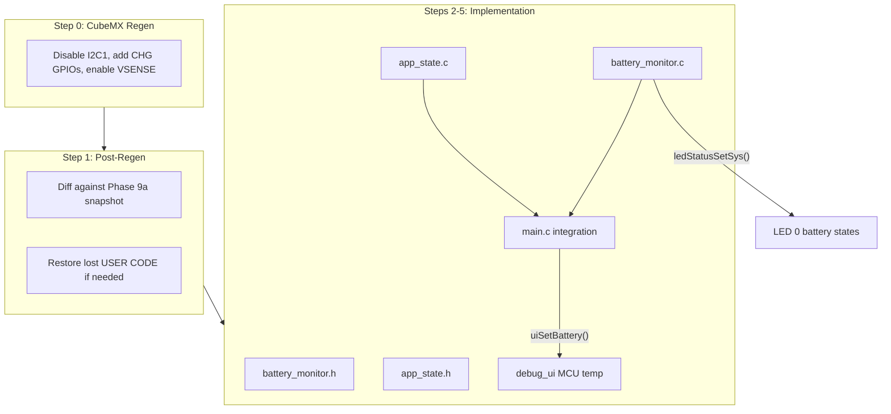

# Phase 9b — Battery Monitoring Implementation

Reference: [phase_9b_battery_usb_sense.plan.md](c:\Users\Madhu\STM32CubeIDE\workspace_1.19.0\H562_Loadcell_Datalogger\.cursor\plans\phase_9b_battery_usb_sense.plan.md)

## Step 0: CubeMX IOC Regen (User — Manual)

This is the first CubeMX regen since project start. The [Phase 9a snapshot](c:\Users\Madhu\STM32CubeIDE\workspace_1.19.0\H562_Loadcell_Datalogger\.cursor\snapshots\phase_9a_pre_build.md) protects against USER CODE loss.

**Changes in CubeMX:**

1. **Disable I2C1** entirely (Connectivity -> I2C1 -> Disable) — frees PB6
2. **PB6** -> GPIO_Input, No pull, Label: `CHG_STAT2`
3. **PC14** -> GPIO_Input, Pull-up, Label: `CHG_PG`
4. **PC15** -> GPIO_Input, No pull, Label: `CHG_STAT1`
5. **ADC1** -> verify PA1/Channel 1 enabled; enable **Temperature Sensor Channel** (VSENSE)
6. **Generate Code**

After regen, I will diff against the snapshot and verify all USER CODE sections survived (NVIC overrides, EXTI2 handling, GPDMA CH0/CH1/CH2 handlers, NeoPixel includes, Phase 9a LED calls, etc.).

## Step 1: Post-Regen Verification

- Verify `main.h` has new defines: `CHG_PG_Pin`, `CHG_STAT1_Pin`, `CHG_STAT2_Pin`
- Verify `gpio.c` initialises PC14 (pull-up), PC15, PB6 as inputs
- Verify I2C1 init removed from `main.c` call sequence
- Diff `main.c`, `stm32h5xx_it.c`, `tim.c`, `gpdma.c` USER CODE sections against snapshot
- Restore any lost sections from the snapshot

## Step 2: Create `battery_monitor.h` / `battery_monitor.c`

**Header** (`Core/Inc/battery_monitor.h`):
- `chargeState_t` enum: `CHG_BATTERY`, `CHG_CHARGING`, `CHG_FULL`, `CHG_STANDBY`
- Public API: `batteryInit()`, `batteryPoll()`, `batteryGetVoltage()`, `batteryGetSocPercent()`, `batteryGetChargeState()`, `batteryGetChargeStateStr()`, `batteryIsUsbConnected()`, `battGetMcuTempX10()`
- Full Doxygen on all prototypes per [commenting-and-naming.mdc](c:\Users\Madhu\STM32CubeIDE\workspace_1.19.0\H562_Loadcell_Datalogger\.cursor\rules\commenting-and-naming.mdc)

**Implementation** (`Core/Src/battery_monitor.c`):
- `batteryInit()`: call `HAL_ADCEx_Calibration_Start(&hadc1, ADC_SINGLE_ENDED)`, initial poll
- `adc1ReadChannel(channel)`: reconfigure channel with `ADC_SAMPLETIME_247CYCLES_5`, start, poll (10 ms timeout), stop, return raw value
- `batteryPoll()`: read PA1 (battery), read VSENSE (MCU temp), decode BQ24012 GPIOs, compute voltage/SOC, update LED 0 via `ledStatusSetSys()`
- SOC: 11-point piecewise-linear OCV table (3.0V=0% to 4.2V=100%)
- BQ24012 decode: PC14(PG)/PC15(STAT1)/PB6(STAT2) -> `chargeState_t`
- MCU temp: dual-point calibration using `TEMPSENSOR_CAL1_ADDR`/`TEMPSENSOR_CAL2_ADDR`
- All values cached as module-static variables

**LED 0 integration** inside `batteryPoll()`:

```c
if (chargeState == CHG_CHARGING)
    ledStatusSetSys(LED_SYS_CHARGING);
else if (socPercent <= 5)
    ledStatusSetSys(LED_SYS_BATT_CRIT);
else if (socPercent <= 20)
    ledStatusSetSys(LED_SYS_BATT_LOW);
else
    ledStatusSetSys(LED_SYS_IDLE);
```

## Step 3: Create `app_state.h` / `app_state.c` (Minimal Stub)

Phase 11 builds the full state machine. For now:
- `appState_t` enum: `STATE_IDLE`, `STATE_LOGGING`, `STATE_ERROR`
- `appStateGet()` returns current state (defaults to `STATE_IDLE`)
- `appStateCanStartLogging()` checks USB logging gate: if `allowLogOnUsb == 0` and USB connected, returns false
- `allowLogOnUsb` defaults to 1 (dev mode, overridden in Phase 10 from config.txt)

## Step 4: Integrate into `main.c`

- Add `#include "battery_monitor.h"` and `#include "app_state.h"` to USER CODE Includes
- **Uncomment** `MX_ADC1_Init();` at line 152
- Call `batteryInit()` in USER CODE BEGIN 2 (after IMU init, before USB CDC)
- In the existing 1-second ADC stats block in the main loop, add:

```c
batteryPoll();
uiSetBattery(batteryGetVoltage(), batteryGetSocPercent(),
             batteryGetChargeStateStr());
uiSetUsbStatus(batteryIsUsbConnected() ? "CONNECTED" : "---");
```

## Step 5: Add MCU Temperature to VT220 UI

The existing `uiSetBattery()` already drives row 20 with voltage, SOC%, and charge state string. USB status is also on row 20 via `uiSetUsbStatus()`.

- Add `uiSetMcuTemp(float degC)` to [debug_ui.h](c:\Users\Madhu\STM32CubeIDE\workspace_1.19.0\H562_Loadcell_Datalogger\Core\Inc\debug_ui.h) and [debug_ui.c](c:\Users\Madhu\STM32CubeIDE\workspace_1.19.0\H562_Loadcell_Datalogger\Core\Src\debug_ui.c)
- Add MCU temp field to row 20's slow-update format string
- Target row: `Vbat: 3.72V (65%)  CHG: BATTERY  USB: ---  MCU: 25.3C`
- In main loop: `uiSetMcuTemp(battGetMcuTempX10() / 10.0f);`

## Step 6: Update `subdir.mk`

Add `battery_monitor.c` and `app_state.c` to `Debug/Core/Src/subdir.mk` (will be overwritten on next IDE refresh, but needed for immediate build).

## Key Risks

- **IOC regen USER CODE loss** — mitigated by Phase 9a snapshot; will diff and restore
- **ADC VSENSE sampling time** — CubeMX sets 2.5 cycles (too short for temp sensor); overridden at runtime in `adc1ReadChannel()` with 247.5 cycles
- **PC14/PC15 parasitic caps** from LSE pads — internal pull-up on PC14 should suffice; debounce not needed at 1 Hz polling
- **BQ24012 PG open-drain** — internal pull-up on PC14; if insufficient, external 10k needed (test on hardware)


