# Phase 9b — Battery Monitoring, SOC Estimation, Charger Status, MCU Temperature, and USB Sense

**Reference:** [Master plan Phase 9b](/.cursor/plans/snazzy-petting-mountain.md)

**Prerequisite:** [Phase 9a (NeoPixel Status LEDs)](/.cursor/plans/phase_9a_neopixel_status_leds.plan.md) must be complete. Phase 9a provides `ledStatusSetSys()` which this phase calls to drive LED 0 for battery/charge states.

## Doxygen and Naming Compliance

Per `.cursor/rules/commenting-and-naming.mdc` and Phase 14 incremental rule. Applies to **all code touched in this phase** — both new files and any existing files that are modified.

- **New files** (`battery_monitor.c/.h`, `app_state.c/.h`): full Doxygen and naming compliance from creation
- **Modified existing files** (`main.c`, `debug_ui.c`): any USER CODE section that is edited must have its surrounding code brought into compliance — add missing Doxygen if the containing function lacks it, fix naming violations in lines touched
- Do NOT reformat or re-document untouched code — keep the diff minimal. Phase 14 handles the full sweep.

## Current State

- **ADC1** is CubeMX-configured (`MX_ADC1_Init()` exists in `adc.c`) but the call is **commented out** in `main.c` (labelled as Phase 9 future work)
- **PA1 (battMon)**: already assigned as ADC1 analog input in IOC
- **PB1 (USB_SENSE)**: already configured as `GPIO_Input` with pull-down — no IOC change needed
- **PC14, PC15**: freed when LSE was disabled — currently unassigned
- **PB6**: currently assigned to I2C1_SCL — I2C1 must be disabled in IOC to reclaim
- **VT220 UI**: `ui_set_battery(float voltage, uint8_t soc_percent)` and `ui_set_usb_status(const char *status)` already exist in `debug_ui.h`
- **No `battery_monitor.c/.h` exists** — must be created
- **No `app_state.c/.h` exists** — a minimal stub is needed for the USB logging gate

## Architecture

```mermaid
flowchart LR
    subgraph batt [battery_monitor.c]
        init["batteryInit()"]
        poll["batteryPoll()"]
        getV["batteryGetVoltage()"]
        getSOC["batteryGetSocPercent()"]
        getCHG["batteryGetChargeState()"]
        getUSB["batteryIsUsbConnected()"]
        getTemp["battGetMcuTempX10()"]
    end
    subgraph hw [Hardware]
        ADC1["ADC1: PA1 + VSENSE"]
        PG["PC14 CHG_PG"]
        S1["PC15 CHG_STAT1"]
        S2["PB6 CHG_STAT2"]
        USB["PB1 USB_SENSE"]
    end
    subgraph ui [debug_ui.c]
        setBatt["ui_set_battery()"]
        setUSB["ui_set_usb_status()"]
    end
    subgraph leds [led_status.c]
        setSys["ledStatusSetSys()"]
    end
    poll --> ADC1
    poll --> PG & S1 & S2
    getUSB --> USB
    getV & getSOC --> setBatt
    getUSB --> setUSB
    poll --> setSys
```



## Naming Convention and Doxygen Compliance

Per `.cursor/rules/commenting-and-naming.mdc` and Phase 14 incremental rule. Applies to **all code touched in this phase** — both new files and any existing files that are modified.

**New files:** Full Doxygen and naming compliance from creation. `@file` headers, public function Doxygen (`@brief`, `@param`, `@return`, `@note`, `@pre`/`@post`, `@see`). `camelCase` functions, `camelCase_t` typedefs, `UPPER_SNAKE_CASE` for `#define`/`enum` values and `const` data (including static `const` tables such as `SOC_TABLE` and string tables such as `CHARGE_STATE_STR`), `g_`-prefixed globals where applicable, and `camelCase` struct members.

**Modified existing files:** Any USER CODE section that is edited must have its surrounding code brought into compliance — add missing Doxygen if the containing function lacks it, fix naming violations in lines touched. Do NOT reformat or re-document untouched code.

HAL/CubeMX-generated identifiers (for example `hadc1`, `HAL_ADC_Start`) are left unchanged. Module-oriented prefixes remain lowercase where used (for example `battery` / future `batteryMonitor_`-style internal helpers) alongside the camelCase public names listed in this plan.

## IOC Change (Pre-Code Requirement)

This IOC regeneration is **combined with Phase 9a** (NeoPixel GPDMA CH2 for TIM2_UP). Do both in a single CubeMX session.

**Changes in STM32CubeMX:**

1. **Disable I2C1** peripheral entirely (Connectivity -> I2C1 -> Disable)
2. **PB6** -> Mode: `GPIO_Input`, No pull, User Label: `CHG_STAT2`
3. **PC14** -> Mode: `GPIO_Input`, Pull-up enabled, User Label: `CHG_PG`
4. **PC15** -> Mode: `GPIO_Input`, No pull, User Label: `CHG_STAT1`
5. **ADC1**: verify PA1 channel is enabled; enable internal VSENSE (Temperature Sensor) channel
6. **Generate Code**

**Post-regen verification checklist:**

- [ ] `gpio.c` now contains `CHG_PG`, `CHG_STAT1`, `CHG_STAT2` init lines
- [ ] `main.h` contains the new pin label defines
- [ ] I2C1 init function removed from `main.c`
- [ ] All USER CODE sections in `main.c`, `gpio.c`, `stm32h5xx_it.c`, `spi.c`, `sdmmc.c` survived
- [ ] NVIC priority overrides in USER CODE BEGIN 2 intact
- [ ] EXTI2 disable/re-enable in USER CODE BEGIN 2 intact
- [ ] Linker script heap/stack sizes intact (16 KB / 8 KB)

## Implementation Steps

### 1. Create `Core/Inc/battery_monitor.h`

```c
/**
 * @file    battery_monitor.h
 * @brief   Public API for battery voltage, SOC estimate, charger GPIO decode, USB sense, and MCU temperature.
 * @details Declares types and functions consumed by main, debug_ui, and app_state; implementation in battery_monitor.c; upstream HAL ADC/GPIO, downstream UI and logging gate.
 * @author  Madhu
 * @date    YYYY-MM-DD
 */
#ifndef BATTERY_MONITOR_H
#define BATTERY_MONITOR_H

#include <stdint.h>
#include <stdbool.h>

typedef enum {
    CHG_BATTERY,    /* No input power — running on battery */
    CHG_CHARGING,   /* Input power present, charging */
    CHG_FULL,       /* Input power present, charge complete */
    CHG_STANDBY,    /* Input power present, standby or fault */
} chargeState_t;

int             batteryInit(void);
void            batteryPoll(void);

float           batteryGetVoltage(void);
uint8_t         batteryGetSocPercent(void);
chargeState_t   batteryGetChargeState(void);
const char     *batteryGetChargeStateStr(void);
bool            batteryIsUsbConnected(void);
int16_t         battGetMcuTempX10(void);

#endif
```

### 2. Create `Core/Src/battery_monitor.c`

**Key design decisions:**

- **ADC1 single-conversion polling**: Use `HAL_ADC_Start()` / `HAL_ADC_PollForConversion()` / `HAL_ADC_GetValue()` — no DMA, no interrupts. Each conversion takes ~10 us, called once per second. No contention with SPI1 DMA.
- **Two sequential conversions per poll**: first PA1 (battery voltage), then VSENSE (MCU temperature). Reconfigure channel between reads using `HAL_ADC_ConfigChannel()`.
- **Voltage divider ratio**: Stored in `batt_divider_ratio` (default 0.5, loaded from config.txt in Phase 10).
- **SOC lookup**: Piecewise-linear interpolation from 11-point OCV table (`SOC_TABLE`). Returns `0xFF` while charging (displayed as `"--% (charging)"` on UI).
- **BQ24012 decode**: Three GPIO reads -> `chargeState_t` enum.
- **Cache**: All readings cached as module-static variables, updated on each `batteryPoll()` call.

**ADC1 channel configuration pattern:**

```c
static uint32_t adc1ReadChannel(uint32_t channel)
{
    ADC_ChannelConfTypeDef cfg = {0};
    cfg.Channel = channel;
    cfg.Rank = ADC_REGULAR_RANK_1;
    cfg.SamplingTime = ADC_SAMPLETIME_247CYCLES_5;
    cfg.SingleDiff = ADC_SINGLE_ENDED;
    cfg.OffsetNumber = ADC_OFFSET_NONE;
    HAL_ADC_ConfigChannel(&hadc1, &cfg);

    HAL_ADC_Start(&hadc1);
    HAL_ADC_PollForConversion(&hadc1, 10);
    uint32_t raw = HAL_ADC_GetValue(&hadc1);
    HAL_ADC_Stop(&hadc1);
    return raw;
}
```

**MCU temperature calculation:**

```c
int16_t battGetMcuTempX10(void)
{
    uint16_t cal1 = *TEMPSENSOR_CAL1_ADDR;   /* 30 C calibration point */
    uint16_t cal2 = *TEMPSENSOR_CAL2_ADDR;   /* 130 C calibration point */
    int32_t temp = 300 + (1300 - 300) * (int32_t)(g_temp_raw - cal1)
                                       / (int32_t)(cal2 - cal1);
    return (int16_t)temp;
}
```

**SOC table** (11-point OCV curve for typical Li-ion 1S):

| Voltage | SOC% |
|---------|------|
| 4.20 V  | 100  |
| 4.10 V  |  90  |
| 4.00 V  |  80  |
| 3.90 V  |  70  |
| 3.80 V  |  60  |
| 3.70 V  |  50  |
| 3.60 V  |  35  |
| 3.50 V  |  20  |
| 3.40 V  |  10  |
| 3.30 V  |   5  |
| 3.00 V  |   0  |

**BQ24012 decode table:**

| PG (PC14) | STAT1 (PC15) | STAT2 (PB6) | State |
|-----------|-------------|-------------|-------|
| LOW       | LOW         | HIGH        | CHG_CHARGING |
| LOW       | HIGH        | LOW         | CHG_FULL |
| LOW       | HIGH        | HIGH        | CHG_STANDBY |
| HIGH      | x           | x           | CHG_BATTERY |

### 3. Create minimal `Core/Src/app_state.c` / `Core/Inc/app_state.h`

Stub for the USB logging gate. Full state machine built in Phase 11.

```c
/* app_state.h */
typedef enum { STATE_IDLE, STATE_LOGGING, STATE_ERROR } appState_t;

appState_t appStateGet(void);
bool       appStateCanStartLogging(void);
```

`appStateCanStartLogging()` checks:
- If `allow_log_on_usb == 0` and `batteryIsUsbConnected()` -> return false, log message
- Otherwise -> return true

The `allow_log_on_usb` flag defaults to `1` (dev mode). Phase 10 will load it from config.txt.

### 4. Integrate into `main.c`

**USER CODE BEGIN Includes:**
```c
#include "battery_monitor.h"
#include "app_state.h"
```

**USER CODE BEGIN 2** (after IMU init, before USB DCD):
```c
/* ── Phase 9b: Battery + charger + MCU temp ──────────────── */
batteryInit();
```

**USER CODE BEGIN 3** (main loop, 1-second block):
```c
/* Battery + charger + temp polling (1 Hz) */
batteryPoll();
ui_set_battery(batteryGetVoltage(), batteryGetSocPercent());
ui_set_usb_status(batteryIsUsbConnected() ? "CONNECTED" : "---");
printf("BATT: %.2fV (%u%%) CHG:%s USB:%s TEMP:%.1fC\r\n",
       batteryGetVoltage(),
       batteryGetSocPercent(),
       batteryGetChargeStateStr(),
       batteryIsUsbConnected() ? "YES" : "NO",
       battGetMcuTempX10() / 10.0f);
```

### 5. Update VT220 UI

Add MCU temperature to the system status row. The existing `ui_set_battery()` already handles voltage and SOC. Charge state string can be appended to the battery display. The USB status field is already wired.

Row 14 target:
```
║    Vbat: 3.72V (65%)  CHG: BATTERY  USB: ---  MCU: 25.3C  ║
```

### 6. NeoPixel LED 0 Integration (Phase 9a dependency)

Wire `ledStatusSetSys()` calls into `batteryPoll()` to update LED 0 based on battery/charge state:

```c
#include "led_status.h"

/* Inside batteryPoll(), after updating cached SOC and charge state: */
if (chargeState == CHG_CHARGING)
    ledStatusSetSys(LED_SYS_CHARGING);      /* LED 0 = BLUE SLOW BLINK */
else if (socPercent <= 5)
    ledStatusSetSys(LED_SYS_BATT_CRIT);     /* LED 0 = ORANGE FAST BLINK */
else if (socPercent <= 20)
    ledStatusSetSys(LED_SYS_BATT_LOW);       /* LED 0 = ORANGE SOLID (customer spec) */
else
    ledStatusSetSys(LED_SYS_IDLE);           /* LED 0 = RED SOLID (power ON) */
```

This is the primary consumer of the Phase 9a NeoPixel status engine for system-level states.

## Potential Blockers / Gotchas

### BLOCKER 1: IOC Regeneration Overwrites USER CODE Sections

**Risk:** CubeMX regeneration may clobber USER CODE sections if the project `.ioc` file has drifted from the generated code. This is the first regen since Phase 0.

**Resolution:**
1. **Before regenerating:** Make a full backup of `Core/Src/main.c`, `Core/Src/gpio.c`, `Core/Src/stm32h5xx_it.c`, `Core/Src/spi.c`, `Core/Src/sdmmc.c`
2. **After regenerating:** Diff every CubeMX-managed file against the backup. Verify each USER CODE section survived.
3. **If lost:** Restore from backup — the USER CODE markers should be preserved, but CubeMX bugs exist.
4. **Specific risk areas:**
   - NVIC priority overrides in `main.c` USER CODE BEGIN 2
   - EXTI2 disable/re-enable in `main.c` USER CODE BEGIN 2
   - `HAL_GPIO_EXTI_Falling_Callback` in `adc_ads131m02.c`
   - GPDMA interrupt handlers in `stm32h5xx_it.c`
   - SDMMC MspInit GPIO overrides in `sdmmc.c`

### BLOCKER 2: ADC1 Calibration Addresses May Differ on STM32H562

**Risk:** `TEMPSENSOR_CAL1_ADDR` and `TEMPSENSOR_CAL2_ADDR` are defined in the HAL headers, but the actual calibration reference voltage (`VREFINT_CAL_VREF`) may differ from the ADC VREF+ used in the circuit. If VREF+ != 3.3V, the raw ADC value must be scaled before applying the calibration formula.

**Resolution:**
- Check `stm32h5xx_ll_adc.h` for the calibration defines. STM32H562 calibration is done at VDDA=3.3V.
- If the board VDDA is 3.3V (which it is — powered from LDO), the formula works as-is.
- Add a sanity check: if `battGetMcuTempX10()` returns values outside 100-600 (10C-60C), print a warning.

### BLOCKER 3: ADC1 and SPI1 DMA Priority Contention

**Risk:** If ADC1 polling blocks for too long (e.g., `HAL_ADC_PollForConversion` hangs), it could delay the main loop, causing the ring buffer (Phase 11) to overflow. Not a DRDY miss risk (that's ISR-driven), but a data-loss risk.

**Resolution:**
- Use a short timeout on `HAL_ADC_PollForConversion(&hadc1, 10)` — 10 ms max
- If timeout, skip the reading, log a warning, use the previous cached value
- ADC1 single conversion at 247.5 sample cycles + 12-bit = ~10 us at the ADC clock — well within 10 ms timeout
- ADC1 NVIC priority is already set to 10 (lowest tier) — cannot preempt DRDY path

### BLOCKER 4: PC14/PC15 May Have Parasitic Capacitance from LSE Pads

**Risk:** PC14 and PC15 are the LSE oscillator pins (OSC32_IN/OSC32_OUT). Even with LSE disabled, the PCB may have crystals or caps soldered to these pads. The external capacitance could cause slow GPIO transitions or floating readings.

**Resolution:**
- PC14 has internal pull-up enabled (for active-low PG signal) — this will fight any external pull-down
- If readings are unstable, add a 100 ms debounce to the charge state decode (poll every second anyway, so not an issue)
- Verify on hardware: if PC14/PC15 always read the same value, check for solder bridges to the LSE crystal pads

### BLOCKER 5: BQ24012 PG Pin Is Open-Drain — Needs Pull-Up

**Risk:** The PG (Power Good) output is open-drain active-low. Without a pull-up, it floats when the BQ24012 is not asserting it. The MCU internal pull-up (~40 kOhm typical) may be too weak if there's significant capacitance on the trace.

**Resolution:**
- Enable GPIO internal pull-up on PC14 in the IOC (already specified in the plan)
- If the internal pull-up is insufficient (slow rise times), add an external 10 kOhm pull-up to 3.3V on the PCB
- Test by reading PC14 with no USB power connected — should read HIGH (no input power). If it floats, the pull-up is too weak.

### GOTCHA 6: `MX_ADC1_Init()` May Need Post-Init Tweaks

**Risk:** CubeMX-generated `MX_ADC1_Init()` configures ADC1 with whatever settings were in the IOC. The internal temperature sensor channel (VSENSE) requires a minimum sampling time of 5 us (per RM0481). If CubeMX sets a shorter sampling time, temperature readings will be inaccurate.

**Resolution:**
- After calling `MX_ADC1_Init()`, the `batteryInit()` function reconfigures the channel with `ADC_SAMPLETIME_247CYCLES_5` (the longest available) before each conversion
- This override is CubeMX-safe because it happens at runtime via `HAL_ADC_ConfigChannel()`
- Run ADC self-calibration in `batteryInit()`: `HAL_ADCEx_Calibration_Start(&hadc1, ADC_SINGLE_ENDED)`

### GOTCHA 7: USB_SENSE (PB1) Reading During Boot

**Risk:** At power-on with USB connected, `PB1` reads HIGH immediately. If the app_state logging gate checks USB before the UI is drawn, it may print a rejection message that scrolls off before the user sees it.

**Resolution:**
- Don't check the logging gate at boot — only check on explicit `logStart` button press
- The `appStateCanStartLogging()` function is only called from the button ISR handler (`appStateButtonIsr`, Phase 11)
- During boot, just display the USB status on the VT220 panel

### GOTCHA 8: ADC1 Clock Source

**Risk:** ADC1 clock source may not be configured in the IOC, or may be too fast/slow. STM32H562 ADC requires a clock between 0.14 MHz and 80 MHz. If using SYSCLK/4 as ADC clock = 62.5 MHz, that's within spec but at the faster end.

**Resolution:**
- Check `MX_ADC1_Init()` for the clock prescaler (`ADC_CLOCK_ASYNC_DIV4` or similar)
- If the ADC clock is too fast, add a prescaler override in `batteryInit()` before starting conversions
- A slower ADC clock just means slightly longer conversion time — acceptable for once-per-second polling

## Key Files

| Action | File | CubeMX-Safe? |
|--------|------|-------------|
| **IOC regen** | `H562_Loadcell_Datalogger.ioc` | N/A — this IS CubeMX |
| **Create** | `Core/Inc/battery_monitor.h` | Yes — new file |
| **Create** | `Core/Src/battery_monitor.c` | Yes — new file |
| **Create** | `Core/Inc/app_state.h` | Yes — new file |
| **Create** | `Core/Src/app_state.c` | Yes — new file |
| **Edit** | `Core/Src/main.c` (USER CODE sections only) | Yes |
| **Edit** | `Core/Src/debug_ui.c` (MCU temp display) | Yes — new file |
| **Verify** | `Core/Src/gpio.c` (post-regen) | CubeMX-managed — verify only |
| **Verify** | `Core/Inc/main.h` (new pin defines) | CubeMX-managed — verify only |

## Success Criteria (from master plan)

- [x] `batteryGetVoltage()` returns realistic value — verified ~2.1V with no battery (floating ADC)
- [x] `batteryGetSocPercent()` returns 0-100 via OCV lookup; 8x oversampled ADC
- [x] SOC display shows `---` while charging (OCV unreliable under charge current)
- [ ] Plugging in USB: charge state changes from `BATTERY` to `CHARGING` *(deferred — no charger board)*
- [ ] After full charge: charge state shows `FULL` *(deferred — no charger board)*
- [ ] Unplugging USB: charge state returns to `BATTERY` *(deferred — no charger board)*
- [ ] `batteryIsUsbConnected()` returns true when USB cable plugged in *(deferred — USB_SENSE trace not validated)*
- [ ] With `allow_log_on_usb=0`: logging rejected *(deferred — Phase 11)*
- [ ] With `allow_log_on_usb=1`: logging starts normally *(deferred — Phase 11)*
- [ ] With USB disconnected: logging always starts *(deferred — Phase 11)*
- [x] VT220 UI shows voltage, SOC%, charge state, USB status, MCU temperature
- [ ] Status report includes battery fields *(deferred — Phase 11 logging)*
- [x] `battGetMcuTempX10()` returns realistic value — 35-43 C at 250 MHz (V_30=620mV, Slope=2.0mV/C)
- [x] MCU temperature updates once per second on VT220 UI
- [x] Serial terminal shows: `BATT: 2.15V 0% CHG:BATTERY [PG=1 S1=1 S2=1] USB:NO MCU:40.0C VDDA:3289mV VCORE:1355mV`
- [x] ADC1 conversion (battery + temperature + VREFINT) does not interfere with SPI1 DMA — zero DRDY misses
- [ ] LED 0 shows ORANGE SOLID when SOC <= 20% *(deferred — needs battery at 3.3-3.5V)*
- [x] LED 0 shows ORANGE FAST BLINK (BCRT) when SOC <= 5% — confirmed with no battery
- [ ] LED 0 shows BLUE SLOW BLINK when charging *(deferred — needs charger board)*
- [ ] LED 0 returns to RED SOLID when on battery with SOC > 20% *(deferred — needs battery)*
- [x] All new and modified code follows Doxygen and naming conventions per `.cursor/rules/commenting-and-naming.mdc`
- [x] VDDA measured via VREFINT: 3273-3293 mV (stable)
- [x] VDDCORE measured via ADC2: 1347-1361 mV (healthy for VOS0)

---

**Phase 9b COMPLETE** (2026-04-12) — core firmware verified, hardware-dependent items deferred until charger/battery connected.
