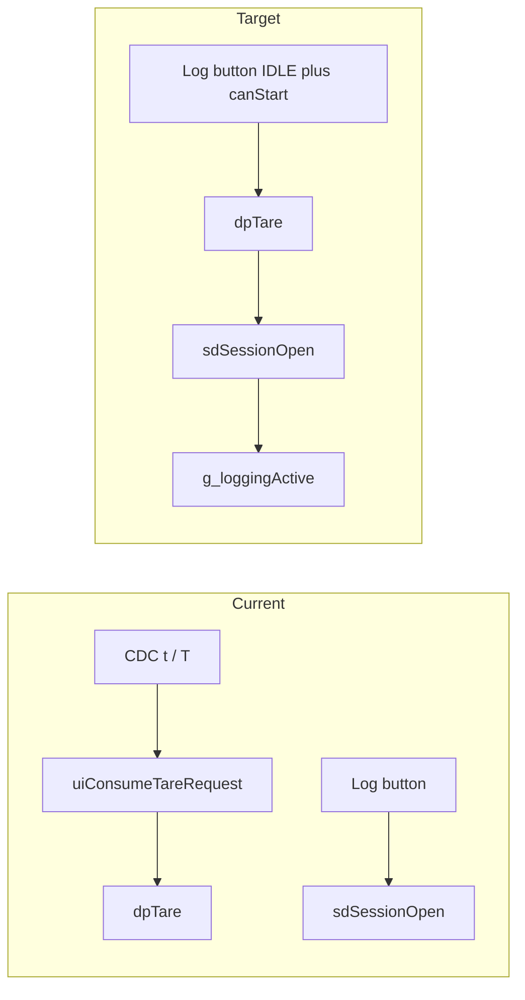

# Tare on LOG START (every session)

## Why order matters

[`sdWriteBinHeader`](c:\Users\Madhu\STM32CubeIDE\workspace_1.19.0\H562_Loadcell_Datalogger\Core\Src\sdmmc_fatfs.c) sets `hdr.tareOffset = cal->tareOffsetN` when the session file is created. [`dpTare()`](c:\Users\Madhu\STM32CubeIDE\workspace_1.19.0\H562_Loadcell_Datalogger\Core\Src\data_processing.c) updates `g_cal.tareOffsetN` via `calibrationSetTare()`. So **`dpTare()` must run before `sdSessionOpen()`**, not after, or the on-card header would disagree with the force stream.

## Behaviour change

- **Every new logging session:** each transition from `STATE_IDLE` (with `appStateCanStartLogging()` true) through successful debounce runs `dpTare()` then opens the session. Stopping logging (`STATE_LOGGING` branch) does not tare.
- **USB CDC:** remove the `t`/`T` request path so tare is no longer driven by [`uiProcessInput()`](c:\Users\Madhu\STM32CubeIDE\workspace_1.19.0\H562_Loadcell_Datalogger\Core\Src\debug_ui.c) + [`main.c`](c:\Users\Madhu\STM32CubeIDE\workspace_1.19.0\H562_Loadcell_Datalogger\Core\Src\main.c) polling.

## Implementation steps

1. **[`Core/Src/main.c`](c:\Users\Madhu\STM32CubeIDE\workspace_1.19.0\H562_Loadcell_Datalogger\Core\Src\main.c)** — In the block that handles `appStateConsumeButtonPress()` when `stLog == STATE_IDLE && appStateCanStartLogging()` (around lines 531–547), insert **`dpTare();` immediately before** `sdSessionOpen(&g_session)`. Keep it inside the same `calLoaded && sdReady` guard (cal is already required for meaningful force / logging).
2. **Same file** — Remove the post-`uiProcessInput()` block:
   - `if (calLoaded && uiConsumeTareRequest()) dpTare();` (lines 731–732).
3. **[`Core/Src/debug_ui.c`](c:\Users\Madhu\STM32CubeIDE\workspace_1.19.0\H562_Loadcell_Datalogger\Core\Src\debug_ui.c)** — Remove `sUiTareRequest`, the `'t'/'T'` branch in `uiProcessInput()`, and `uiConsumeTareRequest()`. Update the file header / module bullets that mention CDC tare.
4. **[`Core/Inc/debug_ui.h`](c:\Users\Madhu\STM32CubeIDE\workspace_1.19.0\H562_Loadcell_Datalogger\Core\Inc\debug_ui.h)** — Remove the declaration and Doxygen for `uiConsumeTareRequest`.

No change to [`dpTare()`](c:\Users\Madhu\STM32CubeIDE\workspace_1.19.0\H562_Loadcell_Datalogger\Core\Src\data_processing.c) logic unless you later want quieter UART at session start (it already prints via `calibrationSetTare` and its own `printf`).

## Edge case (document only)

If `dpTare()` runs and `sdSessionOpen()` **fails**, the tare offset in RAM is already updated (display / force math reflect the snap). That is a small UX tradeoff versus rolling back tare on failure; the plan keeps the simple single ordering (tare → open) and matches “tare when I press log start.”

## Verification

Build and flash in STM32CubeIDE (per project rule: agent does not run the build). After load, confirm: pressing log start prints the existing tare messages and the new session’s binary header `tareOffset` matches a quick check against calibration; CDC `t`/`T` no longer changes tare.
